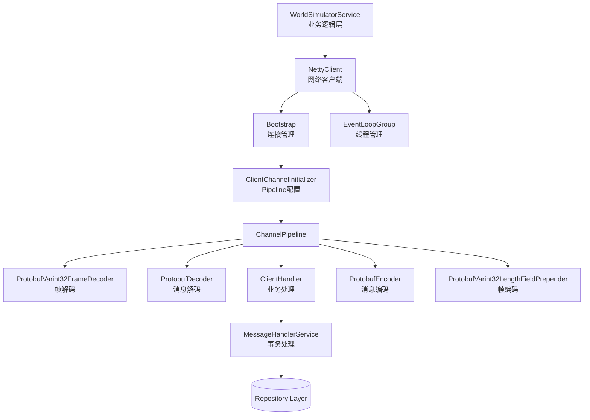
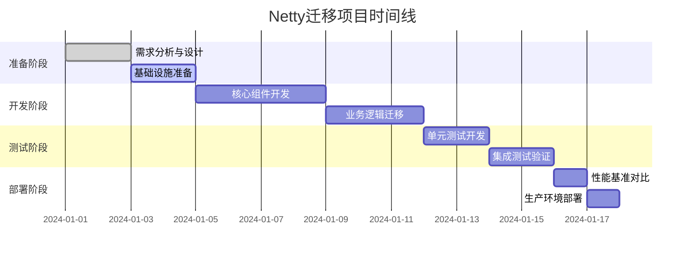

# TCP连接Netty替换方案

## 📋 执行摘要

本文档详细描述了将Mini-UPS项目中的TCP连接实现从原生Java Socket迁移到Netty框架的技术方案。经过深入分析，我们认为这是一个高价值的重构项目，将用工业级的网络框架替换当前复杂的手工实现。

## 🎯 项目目标

### 主要目标
- **简化网络代码**：用Netty的标准组件替换手工实现的I/O循环、编解码和线程管理
- **提高可靠性**：利用Netty经过大规模验证的错误处理和边界条件管理
- **改善性能**：通过非阻塞I/O和优化的内存管理提升资源利用率
- **增强可维护性**：通过模块化架构分离网络逻辑和业务逻辑

### 量化指标
- 代码复杂度降低：减少50%的网络相关代码行数
- 资源利用率：减少线程数从3个到1-2个EventLoop线程
- 可靠性提升：处理更多网络边界情况，提高连接恢复能力

## 🔍 当前实现分析

### 现状评估
当前的`WorldSimulatorService`实现了一个完整的TCP客户端，包含：

```java
// 当前架构的核心组件
private Socket socket;                           // 原生Socket连接
private ExecutorService executorService;         // 3线程池管理
private BlockingQueue<UCommands> messageQueue;   // 消息发送队列
private Map<Long, CompletableFuture<Object>> pendingResponses; // 请求-响应映射
```

### 问题识别
1. **复杂性过高**：1039行代码处理网络+业务逻辑，职责耦合
2. **资源效率低**：阻塞I/O模式，固定线程池占用
3. **错误处理复杂**：手工实现的异常检测和恢复逻辑
4. **维护成本高**：自实现的Varint32编解码容易出错

## 🏗️ 目标架构设计

### 整体架构图



### 组件职责划分

#### 1. WorldSimulatorService (重构)
```java
@Service
public class WorldSimulatorService {
    private NettyClient nettyClient;
    private MessageHandlerService messageHandler;
    
    // 保持现有公共API不变
    public CompletableFuture<Boolean> sendTruckToPickup(Integer truckId, Integer warehouseId);
    public CompletableFuture<Boolean> sendTruckToDeliver(Integer truckId, Map<Long, int[]> deliveries);
    
    // 连接管理委托给NettyClient
    public boolean connect(Long worldId);
    public void disconnect();
}
```

#### 2. NettyClient (新组件)
```java
@Component
public class NettyClient {
    private Bootstrap bootstrap;
    private EventLoopGroup workerGroup;
    private Channel channel;
    
    public CompletableFuture<Void> connect(String host, int port);
    public ChannelFuture sendCommand(UCommands command);
    public void disconnect();
}
```

#### 3. ClientHandler (新组件)
```java
public class ClientHandler extends ChannelInboundHandlerAdapter {
    private final Map<Long, CompletableFuture<Object>> pendingResponses;
    private final MessageHandlerService messageHandler;
    
    @Override
    public void channelRead(ChannelHandlerContext ctx, Object msg);
    
    @Override
    public void channelInactive(ChannelHandlerContext ctx); // 重连触发点
}
```

#### 4. MessageHandlerService (新组件)
```java
@Service
@Transactional
public class MessageHandlerService {
    // 从WorldSimulatorService迁移过来的事务方法
    public void handleTruckCompletion(WorldUpsProto.UFinished completion);
    public void handleDeliveryMade(WorldUpsProto.UDeliveryMade delivery);
    public void handleTruckStatus(WorldUpsProto.UTruck truckStatus);
}
```

## 🛠️ 技术实现方案

### Phase 1: 基础设施准备 (1-2天)

#### 1.1 添加依赖
```xml
<dependency>
    <groupId>io.netty</groupId>
    <artifactId>netty-all</artifactId>
    <version>4.1.100.Final</version>
</dependency>
```

#### 1.2 创建配置类
```java
@Configuration
@EnableConfigurationProperties(NettyProperties.class)
public class NettyConfig {
    
    @Bean
    public EventLoopGroup eventLoopGroup() {
        return new NioEventLoopGroup(2); // 2个I/O线程
    }
    
    @Bean
    @ConditionalOnProperty(name = "world.simulator.client.type", havingValue = "netty")
    public WorldSimulatorClient nettyWorldSimulatorClient() {
        return new NettyWorldSimulatorClient();
    }
}
```

### Phase 2: 核心组件开发 (3-4天)

#### 2.1 NettyClient实现
```java
@Component
public class NettyClient {
    
    @PostConstruct
    public void initialize() {
        bootstrap = new Bootstrap()
            .group(workerGroup)
            .channel(NioSocketChannel.class)
            .option(ChannelOption.CONNECT_TIMEOUT_MILLIS, connectionTimeout)
            .option(ChannelOption.SO_KEEPALIVE, true)
            .handler(new ClientChannelInitializer(messageHandler, pendingResponses));
    }
    
    public CompletableFuture<Void> connect(String host, int port) {
        CompletableFuture<Void> connectFuture = new CompletableFuture<>();
        
        bootstrap.connect(host, port).addListener((ChannelFuture future) -> {
            if (future.isSuccess()) {
                this.channel = future.channel();
                connectFuture.complete(null);
                logger.info("Connected to {}:{}", host, port);
            } else {
                connectFuture.completeExceptionally(future.cause());
                logger.error("Failed to connect to {}:{}", host, port, future.cause());
            }
        });
        
        return connectFuture;
    }
}
```

#### 2.2 Channel Pipeline配置
```java
public class ClientChannelInitializer extends ChannelInitializer<SocketChannel> {
    
    @Override
    protected void initChannel(SocketChannel ch) {
        ChannelPipeline pipeline = ch.pipeline();
        
        // 入站处理器 (接收)
        pipeline.addLast("frameDecoder", new ProtobufVarint32FrameDecoder());
        pipeline.addLast("protobufDecoder", 
            new ProtobufDecoder(WorldUpsProto.UResponses.getDefaultInstance()));
        
        // 出站处理器 (发送)  
        pipeline.addLast("frameEncoder", new ProtobufVarint32LengthFieldPrepender());
        pipeline.addLast("protobufEncoder", new ProtobufEncoder());
        
        // 业务处理器
        pipeline.addLast("clientHandler", 
            new ClientHandler(messageHandlerService, pendingResponses));
        pipeline.addLast("reconnectionHandler", 
            new ReconnectionHandler(bootstrap, reconnectionConfig));
    }
}
```

#### 2.3 重连机制实现
```java
public class ReconnectionHandler extends ChannelInboundHandlerAdapter {
    
    @Override
    public void channelInactive(ChannelHandlerContext ctx) throws Exception {
        if (reconnectionEnabled && attempts < maxAttempts) {
            attempts++;
            long delay = calculateDelay();
            
            logger.warn("Connection lost. Reconnecting in {} ms (attempt {}/{})", 
                       delay, attempts, maxAttempts);
            
            // 使用EventLoop调度，避免阻塞I/O线程
            ctx.channel().eventLoop().schedule(this::doConnect, delay, TimeUnit.MILLISECONDS);
        }
        ctx.fireChannelInactive();
    }
    
    private void doConnect() {
        bootstrap.connect().addListener((ChannelFuture future) -> {
            if (future.isSuccess()) {
                attempts = 0; // 重置计数器
                logger.info("Reconnection successful");
            }
        });
    }
}
```

### Phase 3: 业务逻辑迁移 (2-3天)

#### 3.1 抽取事务业务逻辑
```java
@Service
@Transactional
public class MessageHandlerService {
    
    @Autowired
    private TruckRepository truckRepository;
    
    @Autowired
    private ShipmentRepository shipmentRepository;
    
    public void handleTruckCompletion(WorldUpsProto.UFinished completion) {
        // 原handleTruckCompletion逻辑迁移到此处
        Optional<Truck> truckOpt = truckRepository.findByTruckId(completion.getTruckid());
        // ... 其他业务逻辑
    }
}
```

#### 3.2 实现ClientHandler
```java
public class ClientHandler extends ChannelInboundHandlerAdapter {
    
    @Override
    public void channelRead(ChannelHandlerContext ctx, Object msg) {
        if (msg instanceof WorldUpsProto.UResponses) {
            UResponses responses = (UResponses) msg;
            
            // 处理各种响应类型
            responses.getCompletionsList()
                .forEach(completion -> {
                    messageHandlerService.handleTruckCompletion(completion);
                    completeFuture(completion.getSeqnum(), completion);
                });
                
            responses.getDeliveredList()
                .forEach(delivery -> {
                    messageHandlerService.handleDeliveryMade(delivery);
                    completeFuture(delivery.getSeqnum(), delivery);
                });
        }
    }
    
    private void completeFuture(long seqNum, Object result) {
        CompletableFuture<Object> future = pendingResponses.remove(seqNum);
        if (future != null) {
            future.complete(result);
        }
    }
}
```

### Phase 4: 测试与验证 (2-3天)

#### 4.1 单元测试策略
```java
@ExtendWith(MockitoExtension.class)
class NettyClientTest {
    
    @Test
    @DisplayName("Should handle message encoding/decoding correctly")
    void testProtobufPipeline() {
        EmbeddedChannel channel = new EmbeddedChannel(
            new ProtobufVarint32LengthFieldPrepender(),
            new ProtobufEncoder(),
            new ProtobufVarint32FrameDecoder(),
            new ProtobufDecoder(WorldUpsProto.UCommands.getDefaultInstance())
        );
        
        // 测试出站编码
        UCommands command = UCommands.newBuilder()
            .addQueries(UQuery.newBuilder().setTruckid(1).build())
            .build();
            
        channel.writeOutbound(command);
        ByteBuf encoded = channel.readOutbound();
        assertThat(encoded).isNotNull();
        
        // 测试入站解码
        channel.writeInbound(encoded);
        UCommands decoded = channel.readInbound();
        assertThat(decoded).isEqualTo(command);
    }
}
```

#### 4.2 集成测试
```java
@SpringBootTest
@Testcontainers
class NettyWorldSimulatorIntegrationTest {
    
    @Container
    static GenericContainer<?> worldSimulator = new GenericContainer<>("mock-world-simulator:latest")
        .withExposedPorts(12345);
        
    @Test
    void testFullCommunicationFlow() {
        // 使用Testcontainers模拟World Simulator进行完整流程测试
    }
}
```

## 📊 性能基准与预期改进

### 当前性能基线
在迁移前建立以下基准指标：

| 指标类型 | 当前实现 | 测量方法 |
|---------|---------|----------|
| 请求延迟 | P95: ~50ms | `pendingResponses`计时 |
| 吞吐量 | ~100 msg/sec | 60秒压测 |
| 线程数 | 3个固定线程 | JVM监控 |
| 内存使用 | ~10MB heap | JProfiler |
| CPU使用率 | ~5-15% | 系统监控 |

### 预期改进
| 指标类型 | 预期改进 | 原因 |
|---------|---------|------|
| 请求延迟 | P95: ~30-40ms | 非阻塞I/O减少线程切换 |
| 吞吐量 | ~200-300 msg/sec | EventLoop高效处理 |
| 线程数 | 1-2个EventLoop | NIO模型 |
| 内存使用 | ~8MB heap | ByteBuf池化 |
| CPU使用率 | ~3-10% | 减少上下文切换 |

## ⚠️ 风险评估与缓解策略

### 高风险项目
| 风险 | 影响 | 概率 | 缓解策略 |
|-----|------|------|---------|
| 事务管理失效 | 高 | 中 | 创建独立的MessageHandlerService |
| 异步调试困难 | 中 | 高 | 完善日志记录，使用监控工具 |
| 学习曲线陡峭 | 低 | 高 | 团队培训，逐步迁移 |

### 具体缓解措施

#### 1. 事务管理风险
**问题**：Netty Handler不在Spring容器管理下，`@Transactional`失效
**解决方案**：
```java
// ❌ 错误：直接在Handler中使用@Transactional
public class ClientHandler extends ChannelInboundHandlerAdapter {
    @Transactional // 这不会生效！
    public void channelRead(ChannelHandlerContext ctx, Object msg) {
        // 数据库操作
    }
}

// ✅ 正确：通过Spring Service保持事务边界
public class ClientHandler extends ChannelInboundHandlerAdapter {
    private final MessageHandlerService messageHandler; // Spring Bean
    
    public void channelRead(ChannelHandlerContext ctx, Object msg) {
        messageHandler.handleMessage(msg); // 在Spring管理的Bean中处理
    }
}
```

#### 2. 回滚策略
实现功能开关，允许运行时在新旧实现间切换：
```java
@ConditionalOnProperty(name = "world.simulator.client.type", havingValue = "socket", matchIfMissing = true)
@Primary
public class SocketWorldSimulatorService implements WorldSimulatorClient {
    // 当前实现保持不变
}

@ConditionalOnProperty(name = "world.simulator.client.type", havingValue = "netty")
public class NettyWorldSimulatorClient implements WorldSimulatorClient {
    // 新的Netty实现
}
```

## 📅 实施计划

### 时间线（总计10-12天）


### 里程碑检查点
- [ ] **M1 (Day 2)**：基础设施搭建完成，依赖添加，配置类创建
- [ ] **M2 (Day 6)**：核心Netty组件开发完成，基本连接建立成功
- [ ] **M3 (Day 9)**：业务逻辑完全迁移，功能测试通过
- [ ] **M4 (Day 11)**：性能测试完成，指标达到预期
- [ ] **M5 (Day 12)**：生产部署完成，监控正常

### 团队配置
- **主开发者 1名**：负责Netty核心组件开发
- **业务开发者 1名**：负责业务逻辑迁移和测试
- **测试工程师 1名**：负责测试用例编写和性能验证
- **预计总工时**：25-30人日

## 🔧 开发规范

### 代码风格
```java
// 命名约定
NettyWorldSimulatorClient    // 主要实现类
ClientChannelInitializer    // Pipeline配置
ReconnectionHandler         // 重连处理器
MessageHandlerService      // 业务处理服务

// 包结构
com.miniups.network.netty.client.NettyClient
com.miniups.network.netty.handler.ClientHandler
com.miniups.network.netty.config.NettyConfig
```

### 日志规范
```java
// 统一使用SLF4J
private static final Logger logger = LoggerFactory.getLogger(NettyClient.class);

// 日志级别规范
logger.debug("Channel read: {} bytes", msgSize);        // 详细调试信息
logger.info("Connected to World Simulator: {}", worldId); // 重要状态变更
logger.warn("Connection lost, attempting reconnection"); // 警告但可恢复
logger.error("Failed to reconnect after {} attempts", maxAttempts); // 严重错误
```

### 异常处理
```java
// 统一异常处理
public class NettyConnectionException extends RuntimeException {
    public NettyConnectionException(String message, Throwable cause) {
        super(message, cause);
    }
}

// Handler中的异常处理
@Override
public void exceptionCaught(ChannelHandlerContext ctx, Throwable cause) {
    logger.error("Unexpected exception in channel", cause);
    ctx.close(); // 关闭连接，触发重连
}
```

## 📈 监控与运维

### 关键监控指标
```java
@Component
public class NettyMetrics {
    
    private final Counter connectionsTotal = Counter.build()
        .name("netty_connections_total")
        .help("Total number of connection attempts")
        .register();
        
    private final Gauge activeConnections = Gauge.build()
        .name("netty_active_connections")
        .help("Number of active connections")
        .register();
        
    private final Histogram messageLatency = Histogram.build()
        .name("netty_message_latency_seconds")
        .help("Message processing latency")
        .register();
}
```

### 健康检查端点
```java
@Component("nettyHealthIndicator")
public class NettyHealthIndicator implements HealthIndicator {
    
    @Override
    public Health health() {
        if (nettyClient.isConnected()) {
            return Health.up()
                .withDetail("worldId", nettyClient.getWorldId())
                .withDetail("connectedAt", nettyClient.getConnectedTime())
                .build();
        } else {
            return Health.down()
                .withDetail("lastError", nettyClient.getLastError())
                .withDetail("reconnectionAttempts", nettyClient.getReconnectionAttempts())
                .build();
        }
    }
}
```

## 🏁 结论

TCP到Netty的迁移是一个高价值的技术改进项目。通过用工业级框架替换复杂的手工实现，我们将获得：

✅ **更简洁的代码结构** - 网络逻辑与业务逻辑分离  
✅ **更高的可靠性** - 利用Netty经过验证的错误处理  
✅ **更好的性能** - 非阻塞I/O和优化的内存管理  
✅ **更强的可扩展性** - 为未来的功能扩展打下基础  

**推荐立即开始实施**，按照本文档的渐进式方案进行迁移，风险可控且收益显著。

---
*本文档基于Mini-UPS项目的深入技术分析，结合Netty最佳实践制定。如有技术疑问，请联系架构团队。*