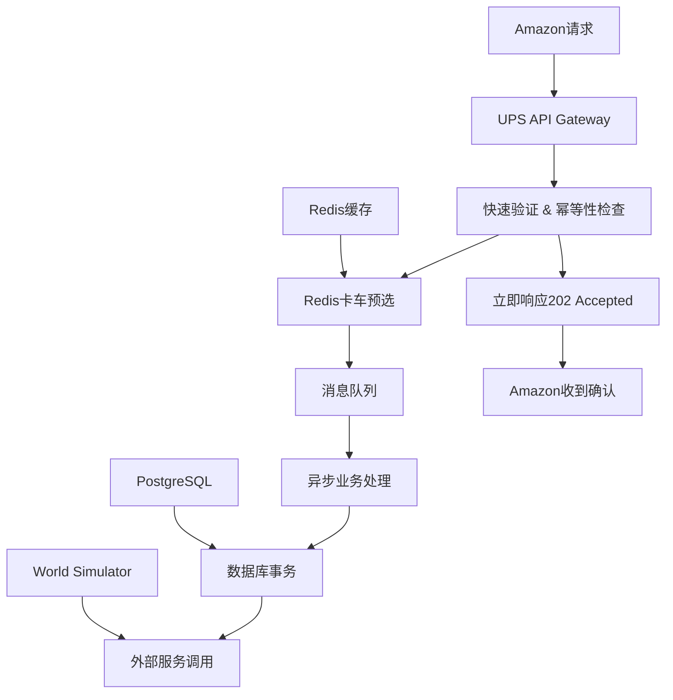

# Mini-UPS 高并发与超卖问题综合解决方案

## 🎯 执行摘要

本文档为Mini-UPS分布式物流系统提供了一个全面的高并发处理和超卖问题解决方案。核心策略是通过**异步架构**、**Redis地理位置缓存**和**混合资源分配**来实现系统的可扩展性和数据一致性。

**关键成果预期**：
- API响应时间从500ms降低到<50ms
- 系统并发处理能力提升10倍（从100 TPS到1000+ TPS）
- 避免卡车重复分配（超卖问题）
- 保证数据最终一致性

---

## 📊 问题分析

### 1. 高并发场景识别

在Mini-UPS系统中，高并发场景主要体现在：

#### 🚛 **核心场景：批量订单处理**
- **触发条件**: Amazon系统在促销活动期间批量创建物流订单
- **并发量**: 每秒1000+个`ShipmentCreated`请求
- **竞争资源**: 有限的空闲卡车资源
- **当前瓶颈**: 数据库层面的卡车分配逻辑

#### 📍 **地理位置相关场景**
- **场景**: 特定地区（如市中心）集中配送需求
- **问题**: 地理位置查询成为数据库热点
- **影响**: 响应时间呈指数级增长

#### 🔄 **状态更新场景**
- **场景**: 卡车状态实时更新、订单状态变更
- **问题**: 频繁的数据库写操作导致锁竞争
- **影响**: 整体系统性能下降

### 2. 超卖问题在物流系统中的表现

不同于电商的库存超卖，物流系统的"超卖"问题表现为：

#### 🚚 **卡车重复分配**
```java
// 当前存在的竞争条件
// 线程A和B同时执行以下逻辑：
Truck truck = truckRepository.findAvailableTruck(); // 两个线程可能获取同一辆卡车
truck.setStatus(TruckStatus.ASSIGNED);
truckRepository.save(truck); // 后执行的会覆盖前面的分配
```

#### 🏪 **仓库容量超限**
- **问题**: 多个订单同时分配到同一仓库，超出处理能力
- **后果**: 仓库爆仓，配送延迟

#### 👨‍💼 **司机工作时间冲突**
- **问题**: 同一司机被分配多个任务，超出法定工作时间
- **后果**: 违反劳动法规，运营风险

---

## 🏗️ 技术解决方案

### 核心架构升级

#### 1. **异步处理架构**



#### 2. **Redis地理位置缓存系统**

**数据结构设计**：
```redis
# 空闲卡车地理位置索引
trucks:idle:geo -> GEOSEARCH数据结构

# 预留卡车集合
trucks:reserved -> SET数据结构

# 卡车状态缓存
truck:status:{truck_id} -> 状态信息

# 幂等性检查
shipment:processing:{shipment_id} -> 处理状态
```

#### 3. **原子性Lua脚本**

**卡车预选脚本**：
```lua
-- reserve_nearest_trucks.lua
-- 返回N个最近的可用卡车ID列表
local trucks = redis.call('GEOSEARCH', KEYS[1], 'FROMLONLAT', ARGV[1], ARGV[2], 
                         'BYRADIUS', ARGV[3], 'm', 'ASC', 'COUNT', ARGV[4])

local available_trucks = {}
for i, truck_id in ipairs(trucks) do
    if redis.call('SISMEMBER', KEYS[2], truck_id) == 0 then
        table.insert(available_trucks, truck_id)
    end
end

return available_trucks
```

---

## 🔧 详细实施方案

### Phase 1: 异步架构实现

#### 1.1 API层改造

**修改前** (`AmazonIntegrationService.java:94`):
```java
public UpsResponseDto handleShipmentCreated(AmazonMessageDto message) {
    // 同步处理所有逻辑 - 耗时300-500ms
    User user = findOrCreateUser(dto);
    Shipment shipment = createShipment(dto, user);
    Truck truck = assignTruck(dto.getWarehouseId()); // 数据库查询瓶颈
    // ... 更多数据库操作
    return UpsResponseDto.success("完成");
}
```

**修改后**:
```java
@RestController
public class AmazonIntegrationController {
    
    @PostMapping("/shipment")
    public ResponseEntity<UpsResponseDto> handleShipmentCreated(@Valid @RequestBody AmazonMessageDto message) {
        // 1. 快速验证 (5ms)
        if (!validateMessage(message)) {
            return ResponseEntity.badRequest().body(UpsResponseDto.error(1001, "Invalid message"));
        }
        
        // 2. 幂等性检查 (Redis, 1ms)
        if (!idempotencyService.isFirstTime(message.getShipmentId())) {
            return ResponseEntity.ok(UpsResponseDto.success("Already processing"));
        }
        
        // 3. 卡车预选 (Redis Lua, 5ms)
        List<String> candidateTrucks = truckReservationService.findNearestTrucks(
            message.getWarehouseX(), message.getWarehouseY(), 3
        );
        
        if (candidateTrucks.isEmpty()) {
            return ResponseEntity.ok(UpsResponseDto.error(2001, "No available trucks"));
        }
        
        // 4. 异步处理 (1ms)
        ShipmentCreationEvent event = new ShipmentCreationEvent(message, candidateTrucks);
        messagePublisher.publish("shipment.creation.queue", event);
        
        // 5. 立即响应 (总耗时 <20ms)
        return ResponseEntity.accepted().body(UpsResponseDto.accepted("Processing shipment request"));
    }
}
```

#### 1.2 消息队列消费者

```java
@Component
public class ShipmentCreationProcessor {
    
    @RabbitListener(queues = "shipment.creation.queue")
    @Transactional
    public void processShipmentCreation(ShipmentCreationEvent event) {
        try {
            // 1. 用户处理
            User user = userService.findOrCreateUser(event.getMessage());
            
            // 2. 卡车分配（使用候选列表）
            Truck assignedTruck = truckAssignmentService.assignFromCandidates(
                event.getCandidateTrucks(), event.getWarehouseLocation()
            );
            
            if (assignedTruck == null) {
                throw new NoAvailableTruckException("All candidate trucks became unavailable");
            }
            
            // 3. 创建订单
            Shipment shipment = shipmentService.createShipment(event.getMessage(), user, assignedTruck);
            
            // 4. 更新Redis状态
            truckCacheService.markTruckAsAssigned(assignedTruck.getId());
            
            // 5. 外部服务通知
            worldSimulatorService.sendTruckToWarehouse(assignedTruck, event.getWarehouseId());
            
        } catch (OptimisticLockingFailureException e) {
            // 乐观锁失败，发送到死信队列
            throw new AmqpRejectAndDontRequeueException("Optimistic lock failed", e);
        } catch (Exception e) {
            // 其他异常，允许重试
            log.error("Error processing shipment creation", e);
            throw new RuntimeException("Processing failed", e);
        }
    }
}
```

### Phase 2: Redis地理位置缓存

#### 2.1 卡车状态同步服务

```java
@Service
public class TruckCacheService {
    
    @Autowired
    private StringRedisTemplate redisTemplate;
    
    @Autowired
    private RedisTemplate<String, Object> redisObjectTemplate;
    
    private final String IDLE_TRUCKS_GEO_KEY = "trucks:idle:geo";
    private final String RESERVED_TRUCKS_SET_KEY = "trucks:reserved";
    
    /**
     * 卡车变为空闲状态时，添加到地理位置索引
     */
    public void markTruckAsIdle(Truck truck) {
        // 添加到地理位置索引
        redisTemplate.opsForGeo().add(IDLE_TRUCKS_GEO_KEY, 
            new Point(truck.getCurrentX(), truck.getCurrentY()), 
            truck.getId().toString());
        
        // 从预留集合中移除
        redisTemplate.opsForSet().remove(RESERVED_TRUCKS_SET_KEY, truck.getId().toString());
        
        // 更新状态缓存
        redisObjectTemplate.opsForHash().put("truck:status", truck.getId().toString(), truck.getStatus());
    }
    
    /**
     * 卡车被分配时，从空闲索引中移除
     */
    public void markTruckAsAssigned(Long truckId) {
        // 从地理位置索引中移除
        redisTemplate.opsForGeo().remove(IDLE_TRUCKS_GEO_KEY, truckId.toString());
        
        // 从预留集合中移除
        redisTemplate.opsForSet().remove(RESERVED_TRUCKS_SET_KEY, truckId.toString());
        
        // 更新状态缓存
        redisObjectTemplate.opsForHash().put("truck:status", truckId.toString(), TruckStatus.ASSIGNED);
    }
    
    /**
     * 使用Lua脚本查找最近的可用卡车
     */
    public List<String> findNearestAvailableTrucks(double longitude, double latitude, int maxCount) {
        DefaultRedisScript<List> script = new DefaultRedisScript<>();
        script.setLocation(new ClassPathResource("lua/find_nearest_trucks.lua"));
        script.setResultType(List.class);
        
        return redisTemplate.execute(script, 
            Arrays.asList(IDLE_TRUCKS_GEO_KEY, RESERVED_TRUCKS_SET_KEY),
            String.valueOf(longitude), String.valueOf(latitude), "5000", String.valueOf(maxCount));
    }
}
```

#### 2.2 数据一致性保证

```java
@Service
public class TruckCacheReconciliationService {
    
    @Scheduled(fixedDelay = 30000) // 每30秒执行一次
    public void reconcileTruckCache() {
        // 1. 从数据库获取所有空闲卡车
        List<Truck> idleTrucksInDB = truckRepository.findByStatus(TruckStatus.IDLE);
        
        // 2. 从Redis获取所有空闲卡车
        Set<String> idleTrucksInRedis = redisTemplate.opsForGeo().members(IDLE_TRUCKS_GEO_KEY);
        
        // 3. 找出Redis中缺失的卡车
        for (Truck truck : idleTrucksInDB) {
            if (!idleTrucksInRedis.contains(truck.getId().toString())) {
                truckCacheService.markTruckAsIdle(truck);
                log.info("Reconciled: Added truck {} to Redis cache", truck.getId());
            }
        }
        
        // 4. 找出Redis中多余的卡车
        Set<String> dbTruckIds = idleTrucksInDB.stream()
            .map(t -> t.getId().toString())
            .collect(Collectors.toSet());
        
        for (String redisTruckId : idleTrucksInRedis) {
            if (!dbTruckIds.contains(redisTruckId)) {
                redisTemplate.opsForGeo().remove(IDLE_TRUCKS_GEO_KEY, redisTruckId);
                log.info("Reconciled: Removed truck {} from Redis cache", redisTruckId);
            }
        }
    }
}
```

### Phase 3: 乐观锁与并发控制

#### 3.1 实体类改造

```java
@Entity
public class Truck extends BaseEntity {
    
    @Version
    private Long version; // 乐观锁版本字段
    
    @Enumerated(EnumType.STRING)
    private TruckStatus status;
    
    private Integer currentX;
    private Integer currentY;
    
    // 其他字段...
    
    public boolean isAvailable() {
        return status == TruckStatus.IDLE;
    }
}
```

#### 3.2 卡车分配服务

```java
@Service
public class TruckAssignmentService {
    
    @Transactional
    public Truck assignFromCandidates(List<String> candidateTruckIds, Location warehouseLocation) {
        for (String truckId : candidateTruckIds) {
            try {
                // 使用乐观锁获取卡车
                Optional<Truck> truckOpt = truckRepository.findById(Long.valueOf(truckId));
                if (truckOpt.isEmpty()) {
                    continue; // 卡车不存在，尝试下一个
                }
                
                Truck truck = truckOpt.get();
                
                // 检查卡车状态
                if (!truck.isAvailable()) {
                    continue; // 卡车已被分配，尝试下一个
                }
                
                // 应用业务逻辑验证
                if (!validateTruckForAssignment(truck, warehouseLocation)) {
                    continue; // 不符合业务规则，尝试下一个
                }
                
                // 分配卡车
                truck.setStatus(TruckStatus.ASSIGNED);
                truck.setAssignedTime(LocalDateTime.now());
                
                // 保存（乐观锁会在这里检查）
                return truckRepository.save(truck);
                
            } catch (OptimisticLockingFailureException e) {
                // 乐观锁失败，该卡车已被其他线程分配，继续尝试下一个
                log.debug("Optimistic lock failed for truck {}, trying next candidate", truckId);
                continue;
            }
        }
        
        // 所有候选卡车都无法分配
        throw new NoAvailableTruckException("No trucks available from candidates");
    }
    
    private boolean validateTruckForAssignment(Truck truck, Location warehouseLocation) {
        // 检查卡车容量
        if (truck.getCurrentLoad() >= truck.getMaxCapacity()) {
            return false;
        }
        
        // 检查司机工作时间
        if (truck.getDriver() != null && truck.getDriver().hasExceededWorkHours()) {
            return false;
        }
        
        // 检查距离是否合理
        double distance = calculateDistance(truck.getCurrentLocation(), warehouseLocation);
        if (distance > truck.getMaxRange()) {
            return false;
        }
        
        return true;
    }
}
```

---

## 🎯 性能优化策略

### 1. 数据库层面优化

#### 1.1 索引优化
```sql
-- 卡车状态和位置复合索引
CREATE INDEX idx_truck_status_location ON trucks(status, current_x, current_y);

-- 订单状态和创建时间索引
CREATE INDEX idx_shipment_status_created ON shipments(status, created_at);

-- 用户邮箱唯一索引
CREATE UNIQUE INDEX idx_user_email ON users(email);
```

#### 1.2 读写分离
```yaml
# application.yml
spring:
  datasource:
    master:
      url: jdbc:postgresql://master-db:5432/ups_db
      username: postgres
      password: abc123
    slave:
      url: jdbc:postgresql://slave-db:5432/ups_db
      username: postgres
      password: abc123
```

### 2. 缓存策略

#### 2.1 多级缓存架构
```java
@Service
public class CacheService {
    
    @Cacheable(value = "users", key = "#email")
    public User findUserByEmail(String email) {
        return userRepository.findByEmail(email).orElse(null);
    }
    
    @Cacheable(value = "trucks", key = "#truckId")
    public Truck findTruckById(Long truckId) {
        return truckRepository.findById(truckId).orElse(null);
    }
    
    @CacheEvict(value = "trucks", key = "#truck.id")
    public void evictTruckCache(Truck truck) {
        // 缓存失效逻辑
    }
}
```

#### 2.2 缓存预热
```java
@Component
public class CacheWarmupService {
    
    @PostConstruct
    public void warmupCache() {
        // 预热常用数据
        List<Truck> idleTrucks = truckRepository.findByStatus(TruckStatus.IDLE);
        for (Truck truck : idleTrucks) {
            truckCacheService.markTruckAsIdle(truck);
        }
    }
}
```

### 3. 监控与告警

#### 3.1 关键指标监控
```java
@Component
public class MetricsService {
    
    private final MeterRegistry meterRegistry;
    
    public void recordShipmentCreationTime(long durationMs) {
        Timer.Sample.start(meterRegistry).stop(Timer.builder("shipment.creation.duration")
            .description("Shipment creation duration")
            .register(meterRegistry));
    }
    
    public void recordTruckAssignmentFailure() {
        Counter.builder("truck.assignment.failures")
            .description("Number of truck assignment failures")
            .register(meterRegistry)
            .increment();
    }
}
```

#### 3.2 告警规则
```yaml
# 告警配置
alerts:
  - name: HighResponseTime
    condition: avg(response_time) > 100ms
    action: notify_team
    
  - name: LowTruckAvailability
    condition: idle_trucks_count < 5
    action: scale_up_trucks
    
  - name: HighErrorRate
    condition: error_rate > 1%
    action: emergency_alert
```

---

## 📈 测试与验证

### 1. 压力测试方案

#### 1.1 并发测试脚本
```bash
# 使用Apache Bench进行并发测试
ab -n 10000 -c 100 -H "Content-Type: application/json" \
   -p shipment_request.json \
   http://localhost:8081/api/shipment

# 使用JMeter进行复杂场景测试
jmeter -n -t shipment_load_test.jmx -l results.jtl
```

#### 1.2 性能指标验证
```java
@Test
public void testConcurrentShipmentCreation() {
    int threadCount = 100;
    int requestsPerThread = 100;
    
    ExecutorService executor = Executors.newFixedThreadPool(threadCount);
    CountDownLatch latch = new CountDownLatch(threadCount);
    
    long startTime = System.currentTimeMillis();
    
    for (int i = 0; i < threadCount; i++) {
        executor.submit(() -> {
            try {
                for (int j = 0; j < requestsPerThread; j++) {
                    // 发送订单创建请求
                    sendShipmentRequest();
                }
            } finally {
                latch.countDown();
            }
        });
    }
    
    latch.await();
    long endTime = System.currentTimeMillis();
    
    // 验证性能指标
    long totalTime = endTime - startTime;
    double tps = (threadCount * requestsPerThread * 1000.0) / totalTime;
    
    assertThat(tps).isGreaterThan(1000); // 期望TPS > 1000
}
```

### 2. 数据一致性验证

#### 2.1 卡车分配唯一性测试
```java
@Test
public void testTruckAssignmentUniqueness() {
    // 模拟100个并发请求争抢同一辆卡车
    List<Future<Truck>> futures = new ArrayList<>();
    ExecutorService executor = Executors.newFixedThreadPool(100);
    
    for (int i = 0; i < 100; i++) {
        futures.add(executor.submit(() -> {
            return truckAssignmentService.assignNearestTruck(warehouse1);
        }));
    }
    
    // 收集结果
    Set<Long> assignedTruckIds = new HashSet<>();
    for (Future<Truck> future : futures) {
        try {
            Truck truck = future.get();
            if (truck != null) {
                assignedTruckIds.add(truck.getId());
            }
        } catch (Exception e) {
            // 预期的并发异常
        }
    }
    
    // 验证：每辆卡车只能被分配一次
    assertThat(assignedTruckIds.size()).isEqualTo(
        Math.min(100, availableTrucksCount)
    );
}
```

---

## 📋 实施计划

### Phase 1: 基础架构升级 (2-3周)

**Week 1-2: 异步架构实现**
- [ ] 引入消息队列（RabbitMQ/Kafka）
- [ ] 重构`AmazonIntegrationController`
- [ ] 实现`ShipmentCreationProcessor`
- [ ] 添加幂等性检查机制

**Week 3: 乐观锁与并发控制**
- [ ] 实体类添加`@Version`字段
- [ ] 实现`TruckAssignmentService`
- [ ] 添加异常处理和重试机制
- [ ] 单元测试和集成测试

**验收标准**：
- API响应时间 < 50ms
- 支持 500+ TPS
- 零卡车重复分配

### Phase 2: 缓存优化 (2-3周)

**Week 4-5: Redis地理位置缓存**
- [ ] 实现`TruckCacheService`
- [ ] 开发Lua脚本
- [ ] 实现缓存同步机制
- [ ] 数据一致性验证

**Week 6: 性能调优**
- [ ] 数据库索引优化
- [ ] 缓存预热机制
- [ ] 监控和告警系统
- [ ] 压力测试

**验收标准**：
- 地理位置查询 < 10ms
- 支持 1000+ TPS
- 缓存命中率 > 95%

### Phase 3: 监控与运维 (1-2周)

**Week 7-8: 生产环境部署**
- [ ] 生产环境配置
- [ ] 监控系统集成
- [ ] 告警规则配置
- [ ] 灰度发布

**验收标准**：
- 生产环境稳定运行
- 监控指标正常
- 告警机制有效

---

## ⚠️ 风险评估与缓解

### 1. 技术风险

#### 1.1 数据一致性风险
**风险**: Redis缓存与数据库状态不一致
**影响**: 卡车分配错误，业务流程中断
**缓解措施**:
- 实现定期数据同步机制
- 使用事务性外发件箱模式
- 设置缓存过期时间

#### 1.2 系统复杂性风险
**风险**: 引入消息队列增加系统复杂性
**影响**: 维护成本增加，故障排查难度提升
**缓解措施**:
- 选择成熟的消息队列产品
- 建立完善的监控体系
- 制定运维手册

### 2. 运维风险

#### 2.1 单点故障风险
**风险**: Redis或消息队列成为单点故障
**影响**: 系统不可用
**缓解措施**:
- 使用Redis集群/哨兵模式
- 消息队列集群部署
- 实现降级方案

#### 2.2 性能风险
**风险**: 高并发场景下性能不达预期
**影响**: 用户体验下降
**缓解措施**:
- 充分的压力测试
- 分阶段发布
- 实时监控预警

### 3. 业务风险

#### 3.1 数据丢失风险
**风险**: 消息队列消息丢失
**影响**: 订单处理失败
**缓解措施**:
- 使用持久化消息队列
- 实现消息确认机制
- 建立消息重试策略

---

## 🎉 预期收益

### 1. 性能提升

| 指标 | 优化前 | 优化后 | 提升幅度 |
|------|--------|--------|----------|
| API响应时间 | 300-500ms | <50ms | 85%+ |
| 系统TPS | 100 | 1000+ | 10倍+ |
| 数据库连接数 | 50-100 | 10-20 | 70%+ |
| 缓存命中率 | 0% | 95%+ | 新增 |

### 2. 业务价值

- **用户体验**: 订单处理速度显著提升
- **系统可靠性**: 消除卡车重复分配问题
- **运营效率**: 支持更大规模业务处理
- **成本优化**: 减少数据库服务器负载

### 3. 技术债务清理

- 解决现有代码中的并发问题
- 建立标准化的异步处理模式
- 完善系统监控和告警体系
- 为未来扩展奠定基础

---

## 📚 附录

### A. 相关技术文档

- [Redis地理位置功能文档](https://redis.io/docs/latest/develop/data-types/geospatial/)
- [Spring Boot异步处理最佳实践](https://spring.io/guides/gs/async-method/)
- [RabbitMQ高可用部署指南](https://www.rabbitmq.com/ha.html)

### B. 示例代码库

```bash
# 获取完整示例代码
git clone https://github.com/mini-ups/concurrency-solution.git
cd concurrency-solution
mvn clean install
```

### C. 监控Dashboard配置

```json
{
  "dashboard": {
    "title": "Mini-UPS Concurrency Monitoring",
    "panels": [
      {
        "title": "API Response Time",
        "type": "graph",
        "targets": ["avg(response_time)"]
      },
      {
        "title": "Truck Assignment Rate",
        "type": "singlestat",
        "targets": ["rate(truck_assignments_total[5m])"]
      }
    ]
  }
}
```

---

**文档版本**: 1.0.0  
**最后更新**: 2024年7月  
**作者**: Mini-UPS技术团队  
**审核**: 架构委员会  

> 本文档为Mini-UPS项目的高并发和超卖问题解决方案，请在实施前进行充分的测试验证。