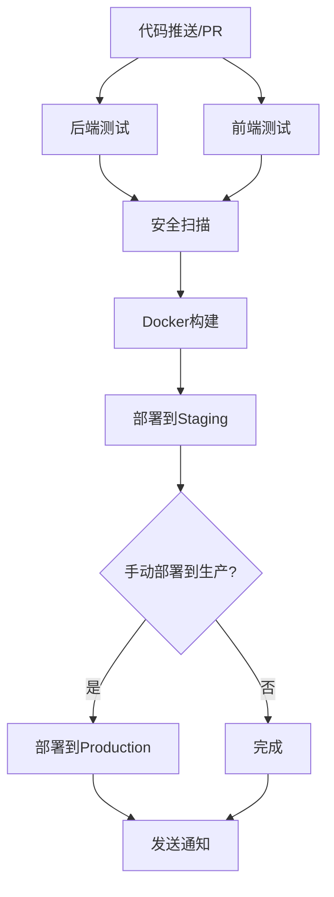

# GitHub Actions CI/CD 完整教程

## 📚 目录
1. [概述](#概述)
2. [基础概念](#基础概念)
3. [项目现状分析](#项目现状分析)
4. [配置步骤详解](#配置步骤详解)
5. [secrets配置](#secrets配置)
6. [工作流程解析](#工作流程解析)
7. [故障排除](#故障排除)
8. [最佳实践](#最佳实践)

## 概述

这个教程将带你一步步了解和配置GitHub Actions CI/CD，基于你的Mini-UPS项目。你的项目已经有一个完整的CI/CD配置，我们将逐步分析它如何工作。

## 基础概念

### 什么是CI/CD？
- **CI (持续集成)**: 自动化构建和测试代码
- **CD (持续部署)**: 自动化部署到不同环境

### GitHub Actions核心概念
- **Workflow**: 工作流程，定义在`.github/workflows/`目录下
- **Job**: 任务，一个workflow包含多个jobs
- **Step**: 步骤，每个job包含多个steps
- **Action**: 可重用的代码块
- **Runner**: 执行workflow的虚拟机

## 项目现状分析

你的项目已经有一个相当完整的CI/CD配置：

### 📁 现有文件结构
```
.github/
├── DEPLOYMENT_SECRETS.md          # 部署密钥文档
├── workflows/
│   ├── ci-cd.yml                  # 主要CI/CD流程 ⭐
│   ├── frontend-deploy.yml        # 前端部署
│   └── frontend-pr.yml            # 前端PR检查
```

### 🔄 主要工作流程 (`ci-cd.yml`)

你的workflow包含以下阶段：

1. **Backend Testing** - 后端测试
2. **Frontend Testing** - 前端测试
3. **Security Scanning** - 安全扫描
4. **Docker Build** - 构建Docker镜像
5. **Deploy Staging** - 部署到预发环境
6. **Deploy Production** - 部署到生产环境
7. **Notification** - 通知

## 配置步骤详解

### 步骤1: 理解触发条件

```yaml
on:
  push:
    branches: [ main ]           # main分支推送时触发
  pull_request:
    branches: [ main ]           # 对main的PR时触发
  workflow_dispatch:             # 手动触发
    inputs:
      deploy_environment:
        description: 'Environment to deploy to'
        required: true
        default: 'staging'
        type: choice
        options:
        - staging
        - production
```

**解释**：
- 当你推送代码到main分支时，自动运行CI/CD
- 创建PR时运行测试
- 可以手动选择部署环境

### 步骤2: 理解环境变量

```yaml
env:
  JAVA_VERSION: '17'       # Java版本
  NODE_VERSION: '20'       # Node.js版本
  DOCKER_BUILDKIT: 1       # Docker构建优化
  AWS_REGION: us-east-1    # AWS区域
```

### 步骤3: 后端测试作业解析

```yaml
backend-test:
  name: Backend Tests
  runs-on: ubuntu-latest    # 运行环境
  
  services:                 # 服务依赖
    postgres:               # PostgreSQL数据库
      image: postgres:15
      env:
        POSTGRES_PASSWORD: abc123
        POSTGRES_USER: postgres
        POSTGRES_DB: ups_db_test
    redis:                  # Redis缓存
      image: redis:7-alpine
```

**关键步骤**：
1. 检出代码
2. 设置Java 17环境
3. 缓存Maven依赖
4. 运行测试
5. 上传测试结果

### 步骤4: 前端测试作业解析

```yaml
frontend-test:
  name: Frontend Tests
  runs-on: ubuntu-latest
  
  steps:
  - name: Install frontend dependencies
    working-directory: ./frontend
    run: npm ci --legacy-peer-deps
  
  - name: Run TypeScript type checking
    working-directory: ./frontend
    run: npm run type-check:ci
    
  - name: Build frontend
    working-directory: ./frontend
    run: npm run build:ci
```

### 步骤5: Docker构建和推送

```yaml
docker-build:
  needs: [backend-test, frontend-test, security-scan]  # 依赖前面的作业
  if: (github.ref == 'refs/heads/main' || github.event_name == 'workflow_dispatch')
  
  steps:
  - name: Log in to Container Registry
    uses: docker/login-action@v3
    with:
      registry: ghcr.io                    # GitHub Container Registry
      username: ${{ github.actor }}
      password: ${{ secrets.GITHUB_TOKEN }}
```

## Secrets配置

### 需要配置的密钥

根据你的workflow，需要在GitHub仓库设置中配置以下secrets：

#### 1. 访问仓库设置
1. 进入你的GitHub仓库
2. 点击 "Settings" 标签
3. 在左侧菜单中找到 "Secrets and variables"
4. 点击 "Actions"

#### 2. 配置部署相关密钥

**Staging环境密钥**：
```
STAGING_HOST        # 预发环境服务器IP
STAGING_USER        # SSH用户名 (通常是ec2-user)
STAGING_SSH_KEY     # SSH私钥内容
```

**Production环境密钥**：
```
PRODUCTION_HOST     # 生产环境服务器IP
PRODUCTION_USER     # SSH用户名 (通常是ec2-user)
PRODUCTION_SSH_KEY  # SSH私钥内容
```

**应用密钥**：
```
POSTGRES_PASSWORD   # 数据库密码
REDIS_PASSWORD      # Redis密码 (可选)
JWT_SECRET          # JWT签名密钥
```

#### 3. SSH密钥生成和配置

```bash
# 1. 在本地生成SSH密钥对
ssh-keygen -t rsa -b 4096 -C "your-email@example.com" -f ~/.ssh/deploy_key

# 2. 将公钥添加到服务器
cat ~/.ssh/deploy_key.pub | ssh user@your-server "mkdir -p ~/.ssh && cat >> ~/.ssh/authorized_keys"

# 3. 将私钥内容复制到GitHub Secrets
cat ~/.ssh/deploy_key
```

### 配置GitHub Container Registry

你的workflow使用GitHub Container Registry (ghcr.io)，需要：

1. 确保仓库有包写入权限
2. `GITHUB_TOKEN` 会自动提供，无需手动配置

## 工作流程解析

### 完整执行流程



### 环境部署策略

1. **自动部署到Staging**
   - main分支推送时自动触发
   - 使用测试通过的Docker镜像
   - 运行烟雾测试

2. **手动部署到Production**
   - 需要手动触发workflow_dispatch
   - 必须先成功部署到Staging
   - 更严格的健康检查

### 部署健康检查

```yaml
# 等待应用启动并检查健康状态
for i in {1..20}; do
  if curl -f http://localhost:8081/api/health >/dev/null 2>&1; then
    echo "✅ Application is healthy!"
    break
  fi
  echo "⏳ Waiting for health check... (Attempt $i/20)"
  sleep 5
done
```

## 如何使用你的CI/CD

### 1. 日常开发流程

```bash
# 1. 创建功能分支
git checkout -b feature/new-feature

# 2. 开发代码
# ... 编写代码 ...

# 3. 创建PR
git push origin feature/new-feature
# 在GitHub上创建PR到main分支

# 4. CI自动运行测试
# 等待测试通过后合并PR

# 5. 合并到main后自动部署到staging
git checkout main
git pull origin main
```

### 2. 手动部署到生产环境

1. 访问GitHub仓库的"Actions"标签
2. 找到"Mini-UPS CI/CD Pipeline"
3. 点击"Run workflow"
4. 选择"production"环境
5. 点击"Run workflow"确认

### 3. 监控部署状态

- 在Actions页面查看实时日志
- 检查各个步骤的执行状态
- 查看部署后的健康检查结果

## 故障排除

### 常见问题和解决方案

#### 1. 测试失败

**Java版本不匹配**：
```yaml
# 确保使用正确的Java版本
- name: Set up JDK ${{ env.JAVA_VERSION }}
  uses: actions/setup-java@v4
  with:
    java-version: '17'
    distribution: 'temurin'
```

**依赖缓存问题**：
```bash
# 在本地测试
./scripts/test-java17.sh
```

#### 2. Docker构建失败

**检查Dockerfile**：
```bash
# 本地测试构建
docker build -t test-backend ./backend
docker build -t test-frontend ./frontend
```

#### 3. 部署失败

**SSH连接问题**：
- 检查服务器SSH密钥配置
- 验证服务器防火墙设置
- 确认服务器Docker安装

**健康检查失败**：
- 检查应用启动日志
- 验证数据库连接
- 确认端口配置

#### 4. 权限问题

**Container Registry权限**：
```bash
# 检查包权限设置
# Settings > Packages > Package settings > Manage Actions access
```

## 最佳实践

### 1. 分支策略
```
main        ← 生产代码，受保护分支
├── staging ← 预发分支
└── feature/xxx ← 功能分支
```

### 2. 环境管理
- **开发环境**: 本地Docker
- **测试环境**: CI中的临时环境
- **预发环境**: Staging服务器
- **生产环境**: Production服务器

### 3. 安全实践
- 使用GitHub Secrets管理敏感信息
- 定期轮换SSH密钥和数据库密码
- 启用分支保护规则

### 4. 性能优化
- 使用缓存加速构建
- 并行运行独立的作业
- 优化Docker镜像大小

### 5. 监控和日志
- 设置构建失败通知
- 监控部署后的应用健康状态
- 保留构建产物用于调试

## 下一步

1. **配置所有必需的Secrets**
2. **测试完整的CI/CD流程**
3. **根据实际需要调整配置**
4. **设置监控和告警**
5. **文档化团队工作流程**

## 总结

你的Mini-UPS项目已经有一个相当完整和专业的CI/CD配置！主要需要：

1. ✅ **理解现有配置** - 已完成
2. 🔧 **配置GitHub Secrets** - 需要手动配置
3. 🚀 **测试部署流程** - 推送代码到main分支测试
4. 📊 **监控和优化** - 根据实际使用情况调整

你的CI/CD已经包含了：
- ✅ 自动化测试 (后端+前端)
- ✅ 安全扫描
- ✅ Docker构建和推送
- ✅ 多环境部署
- ✅ 健康检查
- ✅ 失败通知

这是一个企业级的CI/CD配置，非常适合学习和实际使用！