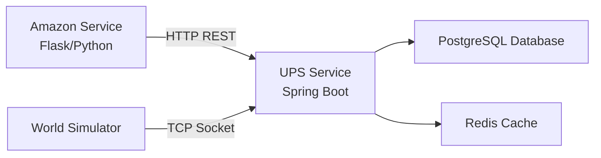
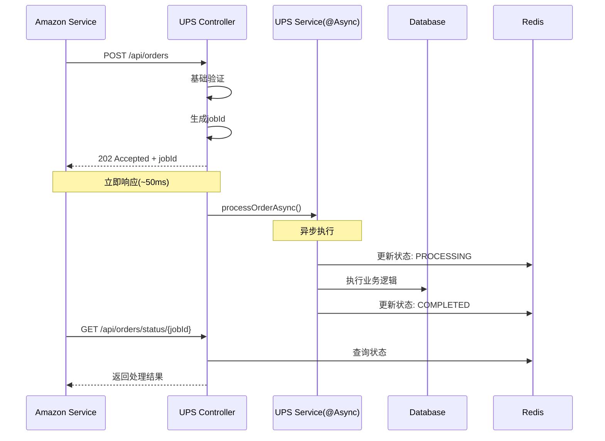
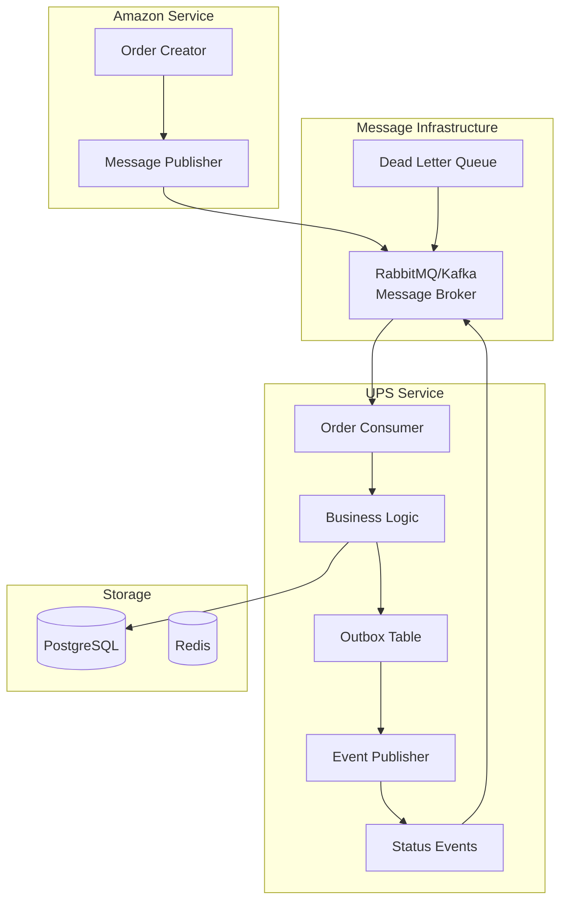
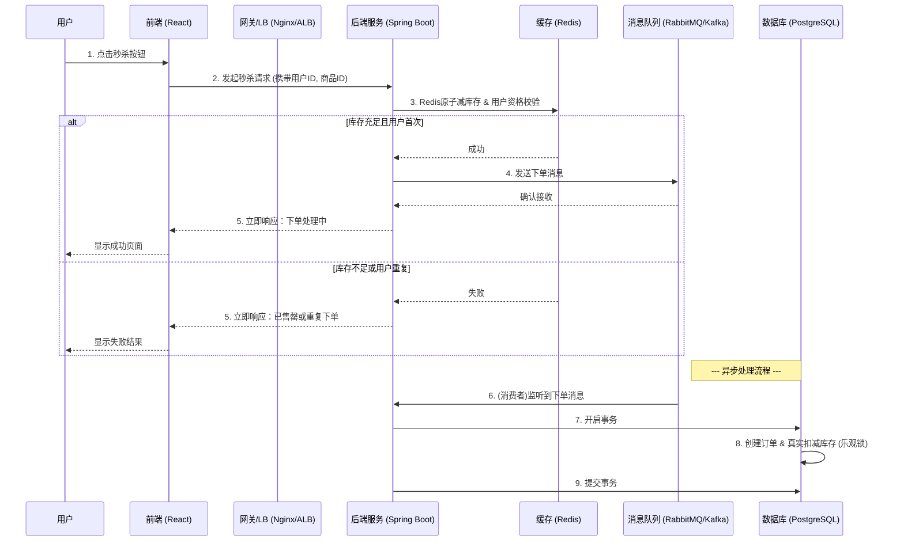

# Mini-UPS高并发处理策略

> **综合分析报告**：Amazon向UPS服务发起大量并发请求的优化方案

## 📋 问题分析

### 当前架构现状


### 核心瓶颈识别

1. **同步阻塞问题**：Amazon请求同步等待UPS响应，HTTP连接长时间占用
2. **数据库并发压力**：大量并发事务竞争数据库连接和锁资源
3. **资源竞争**：线程池、连接池在高并发下成为瓶颈
4. **雪崩风险**：单个慢查询或外部服务调用会影响整个系统

## 🎯 解决方案架构

### 方案对比分析

| 维度 | 现状同步架构 | 渐进式异步方案(@Async) | 完整事件驱动架构 |
|------|-------------|----------------------|------------------|
| **实现复杂度** | 简单 | 中等 | 复杂 |
| **性能提升** | 基线 | 显著提升(5-10x) | 极大提升(10-100x) |
| **系统可靠性** | 脆弱 | 良好 | 极佳 |
| **运维成本** | 低 | 中等 | 高 |
| **学习价值** | 基础 | 高 | 专业级 |
| **适用阶段** | 原型/学习 | 生产就绪 | 企业级 |

### 🚀 推荐策略：分阶段实施

## 阶段一：渐进式异步优化 (推荐立即实施)

### 核心原理：同步API，异步执行



### 具体实现指南

#### 1. Controller层改造

```java
@RestController
@RequestMapping("/api/v1/orders")
public class OrderController {
    
    @Autowired
    private OrderService orderService;
    
    @PostMapping
    public ResponseEntity<AsyncResponseDto> createOrder(
            @RequestBody @Valid CreateOrderDto orderDto) {
        
        // 1. 快速验证（5-10ms）
        if (!orderService.basicValidation(orderDto)) {
            return ResponseEntity.badRequest().build();
        }
        
        // 2. 生成唯一任务ID
        String jobId = UUID.randomUUID().toString();
        
        // 3. 异步处理
        orderService.processOrderAsync(orderDto, jobId);
        
        // 4. 立即返回202
        AsyncResponseDto response = AsyncResponseDto.builder()
            .message("Order creation request accepted")
            .jobId(jobId)
            .statusCheckUrl("/api/v1/orders/status/" + jobId)
            .estimatedProcessingTime("30-60 seconds")
            .build();
            
        return ResponseEntity.status(HttpStatus.ACCEPTED).body(response);
    }
    
    @GetMapping("/status/{jobId}")
    public ResponseEntity<JobStatusDto> getOrderStatus(@PathVariable String jobId) {
        JobStatusDto status = orderService.getJobStatus(jobId);
        if (status == null) {
            return ResponseEntity.notFound().build();
        }
        return ResponseEntity.ok(status);
    }
}
```

#### 2. Service层异步实现

```java
@Service
@Transactional
public class OrderService {
    
    @Autowired
    private RedisTemplate<String, Object> redisTemplate;
    
    @Autowired
    private OrderRepository orderRepository;
    
    @Async("orderProcessingExecutor")
    @Retryable(value = {Exception.class}, maxAttempts = 3)
    public void processOrderAsync(CreateOrderDto orderDto, String jobId) {
        try {
            // 1. 更新状态为处理中
            updateJobStatus(jobId, JobStatus.PROCESSING, "Order processing started");
            
            // 2. 核心业务逻辑（原有逻辑）
            Order order = createOrderInternal(orderDto);
            
            // 3. 调用外部服务（添加熔断保护）
            notifyWorldSimulator(order);
            
            // 4. 更新最终状态
            updateJobStatus(jobId, JobStatus.COMPLETED, 
                "Order created successfully", order.getId());
                
        } catch (Exception e) {
            log.error("Order processing failed for jobId: {}", jobId, e);
            updateJobStatus(jobId, JobStatus.FAILED, e.getMessage());
            throw e; // 触发重试机制
        }
    }
    
    private void updateJobStatus(String jobId, JobStatus status, String message, Object result) {
        JobStatusDto statusDto = JobStatusDto.builder()
            .jobId(jobId)
            .status(status)
            .message(message)
            .lastUpdated(LocalDateTime.now())
            .result(result)
            .build();
            
        // 存储到Redis，TTL 24小时
        redisTemplate.opsForValue().set(
            "job:status:" + jobId, 
            statusDto, 
            Duration.ofHours(24)
        );
    }
    
    public JobStatusDto getJobStatus(String jobId) {
        return (JobStatusDto) redisTemplate.opsForValue()
            .get("job:status:" + jobId);
    }
}
```

#### 3. 线程池配置

```java
@Configuration
@EnableAsync
public class AsyncConfig {
    
    @Bean(name = "orderProcessingExecutor")
    public Executor orderProcessingExecutor() {
        ThreadPoolTaskExecutor executor = new ThreadPoolTaskExecutor();
        
        // 核心线程数 = CPU核心数
        executor.setCorePoolSize(Runtime.getRuntime().availableProcessors());
        
        // 最大线程数 = 核心数 * 2（I/O密集型任务）
        executor.setMaxPoolSize(Runtime.getRuntime().availableProcessors() * 2);
        
        // 队列容量
        executor.setQueueCapacity(100);
        
        // 线程名称前缀
        executor.setThreadNamePrefix("OrderAsync-");
        
        // 拒绝策略：调用者运行
        executor.setRejectedExecutionHandler(new ThreadPoolExecutor.CallerRunsPolicy());
        
        // 等待终止时间
        executor.setAwaitTerminationSeconds(60);
        executor.setWaitForTasksToCompleteOnShutdown(true);
        
        executor.initialize();
        return executor;
    }
}
```

### 性能优化配置

#### 1. 数据库连接池调优

```yaml
# application.yml
spring:
  datasource:
    hikari:
      # 连接池大小 = (核心线程数 + 最大线程数) / 2
      maximum-pool-size: 12
      minimum-idle: 4
      # 连接超时
      connection-timeout: 20000
      # 空闲连接存活时间
      idle-timeout: 300000
      # 连接最大存活时间
      max-lifetime: 1200000
      # 连接有效性检查
      validation-timeout: 5000
      leak-detection-threshold: 60000
```

#### 2. Redis配置优化

```yaml
spring:
  redis:
    host: localhost
    port: 6380
    timeout: 2000ms
    lettuce:
      pool:
        max-active: 20
        max-idle: 8
        min-idle: 2
        max-wait: 2000ms
```

#### 3. 限流配置

```java
@Component
public class RateLimitConfig {
    
    // 每秒最多处理100个请求
    private final RateLimiter rateLimiter = RateLimiter.create(100.0);
    
    @Before("@annotation(RateLimit)")
    public void rateLimit() {
        if (!rateLimiter.tryAcquire(1, TimeUnit.SECONDS)) {
            throw new TooManyRequestsException("Rate limit exceeded");
        }
    }
}

@Target(ElementType.METHOD)
@Retention(RetentionPolicy.RUNTIME)
public @interface RateLimit {
}
```

### 预期性能提升

| 指标 | 优化前 | 优化后 | 提升比例 |
|------|--------|--------|----------|
| **响应时间** | 2-5秒 | 50-100ms | **95%提升** |
| **吞吐量** | 50 req/s | 500+ req/s | **10x提升** |
| **并发处理能力** | 100并发 | 1000+并发 | **10x提升** |
| **系统可用性** | 脆弱 | 稳定 | **显著提升** |

## 阶段二：完整事件驱动架构 (长期目标)

### 架构演进路径



### 关键组件设计

#### 1. Transactional Outbox Pattern

```java
@Entity
@Table(name = "outbox_events")
public class OutboxEvent {
    @Id
    private String id;
    
    @Enumerated(EnumType.STRING)
    private EventType eventType;
    
    @Column(columnDefinition = "TEXT")
    private String payload;
    
    @Enumerated(EnumType.STRING)
    private EventStatus status;
    
    private LocalDateTime createdAt;
    private LocalDateTime processedAt;
    
    // getters/setters
}

@Service
@Transactional
public class OutboxService {
    
    public void publishEventTransactionally(EventType eventType, Object payload) {
        // 1. 在同一事务中保存业务数据和事件
        OutboxEvent event = new OutboxEvent();
        event.setEventType(eventType);
        event.setPayload(JsonUtils.toJson(payload));
        event.setStatus(EventStatus.PENDING);
        
        outboxRepository.save(event);
    }
}

@Component
public class OutboxEventPublisher {
    
    @Scheduled(fixedDelay = 5000) // 每5秒执行一次
    public void publishPendingEvents() {
        List<OutboxEvent> pendingEvents = outboxRepository
            .findByStatusOrderByCreatedAt(EventStatus.PENDING);
            
        for (OutboxEvent event : pendingEvents) {
            try {
                messagePublisher.publish(event.getEventType(), event.getPayload());
                event.setStatus(EventStatus.PUBLISHED);
                outboxRepository.save(event);
            } catch (Exception e) {
                log.error("Failed to publish event: {}", event.getId(), e);
                // 可以实现重试逻辑
            }
        }
    }
}
```

#### 2. 消息幂等性处理

```java
@Service
public class IdempotentMessageProcessor {
    
    private static final String IDEMPOTENCY_KEY_PREFIX = "msg:processed:";
    
    @Transactional
    public void processMessage(String messageId, String payload) {
        String idempotencyKey = IDEMPOTENCY_KEY_PREFIX + messageId;
        
        // 检查是否已处理
        if (redisTemplate.hasKey(idempotencyKey)) {
            log.info("Message already processed: {}", messageId);
            return;
        }
        
        try {
            // 处理业务逻辑
            doBusinessLogic(payload);
            
            // 标记为已处理（24小时过期）
            redisTemplate.opsForValue().set(
                idempotencyKey, 
                "processed", 
                Duration.ofHours(24)
            );
            
        } catch (Exception e) {
            log.error("Message processing failed: {}", messageId, e);
            throw e;
        }
    }
}
```

## 🔧 运维和监控策略

### 关键性能指标 (KPIs)

```yaml
# 应用性能指标
metrics:
  async_processing:
    - job_queue_size          # 异步任务队列大小
    - job_processing_time     # 任务处理耗时
    - job_success_rate        # 任务成功率
    - job_retry_count         # 重试次数
  
  database:
    - connection_pool_usage   # 连接池使用率
    - query_response_time     # 查询响应时间
    - transaction_duration    # 事务持续时间
    - deadlock_count          # 死锁计数
  
  api:
    - request_rate           # 请求速率
    - response_time_p95      # 95分位响应时间
    - error_rate             # 错误率
    - concurrent_connections # 并发连接数
```

### 告警配置

```yaml
# 告警阈值配置
alerts:
  high_priority:
    - metric: job_queue_size
      threshold: "> 1000"
      action: "Scale up async workers"
    
    - metric: error_rate
      threshold: "> 5%"
      action: "Check system health"
    
    - metric: response_time_p95
      threshold: "> 5s"
      action: "Performance investigation"
  
  medium_priority:
    - metric: connection_pool_usage
      threshold: "> 80%"
      action: "Consider pool size increase"
```

## 🧪 测试策略

### 性能测试计划

```bash
# 使用JMeter进行并发测试
# 测试场景1：渐增负载测试
# 从10并发用户开始，每30秒增加10个，直到1000并发

# 测试场景2：峰值负载测试
# 瞬间1000并发请求，持续5分钟

# 测试场景3：稳定性测试
# 500并发用户，持续1小时

# 关键验证点：
# 1. 响应时间是否保持在100ms以内
# 2. 错误率是否低于1%
# 3. 异步任务是否全部正确处理
# 4. 数据库连接是否稳定
# 5. Redis缓存命中率
```

### 单元测试示例

```java
@ExtendWith(MockitoExtension.class)
class OrderServiceAsyncTest {
    
    @Mock
    private OrderRepository orderRepository;
    
    @Mock
    private RedisTemplate<String, Object> redisTemplate;
    
    @InjectMocks
    private OrderService orderService;
    
    @Test
    void testProcessOrderAsync_Success() {
        // Given
        CreateOrderDto orderDto = createTestOrderDto();
        String jobId = "test-job-id";
        
        // When
        orderService.processOrderAsync(orderDto, jobId);
        
        // Then
        verify(orderRepository).save(any(Order.class));
        verify(redisTemplate, times(2)).opsForValue(); // PROCESSING + COMPLETED
    }
    
    @Test
    void testProcessOrderAsync_WithRetry() {
        // 测试重试机制
        when(orderRepository.save(any()))
            .thenThrow(new DataAccessException("DB Error"))
            .thenReturn(new Order());
        
        // 验证重试逻辑
        assertDoesNotThrow(() -> 
            orderService.processOrderAsync(createTestOrderDto(), "test-job"));
    }
}
```

## 📈 成本效益分析

### 实施成本

| 阶段 | 开发工时 | 基础设施成本 | 学习成本 |
|------|----------|-------------|----------|
| **阶段一(@Async)** | 3-5天 | 无额外成本 | 低 |
| **阶段二(事件驱动)** | 2-3周 | 消息队列成本 | 中高 |

### 收益评估

| 收益类型 | 短期收益 | 长期收益 |
|----------|----------|----------|
| **性能提升** | 10x吞吐量提升 | 无限水平扩展能力 |
| **用户体验** | 响应时间从秒级到毫秒级 | 零停机时间 |
| **运维稳定性** | 减少系统崩溃风险 | 自愈能力 |
| **学习价值** | 异步编程技能 | 分布式系统架构能力 |

## 🎯 实施路线图

### 第1周：准备阶段
- [ ] 环境配置和依赖添加
- [ ] 异步配置和线程池调优
- [ ] Redis连接和缓存策略设计

### 第2周：核心实现
- [ ] Controller层改造（支持202响应）
- [ ] Service层异步方法实现
- [ ] 状态查询接口开发
- [ ] 错误处理和重试机制

### 第3周：优化和测试
- [ ] 性能调优（连接池、缓存）
- [ ] 限流和熔断器实现
- [ ] 单元测试和集成测试
- [ ] 性能测试和压力测试

### 第4周：监控和部署
- [ ] 监控指标和告警配置
- [ ] 日志记录和链路追踪
- [ ] 生产环境部署
- [ ] 性能验证和优化

## 💡 最佳实践总结

### 开发最佳实践
1. **渐进式改进**：先实现@Async方案，再考虑完整事件驱动
2. **监控先行**：在优化之前先建立性能基线和监控
3. **测试驱动**：每个优化都要有对应的性能测试验证
4. **容错设计**：考虑所有可能的失败场景并设计恢复机制

### 运维最佳实践
1. **资源规划**：根据业务增长合理配置线程池和连接池
2. **监控告警**：设置合理的告警阈值，避免噪音
3. **容量规划**：定期进行性能测试，提前发现瓶颈
4. **文档维护**：记录所有配置参数和调优过程

---

**结论**：通过实施分阶段的高并发优化策略，Mini-UPS系统可以在保持相对简单架构的前提下，获得显著的性能提升和系统稳定性改善。@Async方案为当前阶段的最佳选择，既能解决核心问题，又为未来的架构演进打下基础。


# 高并发秒杀场景设计与超卖问题解决方案

## 1. 引言

本文档针对 Mini-UPS 项目的现有技术栈（Spring Boot + React + PostgreSQL），旨在设计一个能够应对高并发、秒杀场景并有效防止超卖问题的系统级解决方案。其核心思想不是简单地修改代码，而是通过架构层面的优化，分层过滤请求，分散压力，保证数据一致性。

## 2. 核心设计思想

应对高并发秒杀场景，我们不能将所有请求压力都直接传导到数据库，因为数据库连接池有限，磁盘 I/O 是最大的性能瓶颈。核心思想如下：

- **数据分层**：将热点数据（如商品库存）从关系型数据库（PostgreSQL）提升到高速缓存（如 Redis）中，实现读写分离。
- **请求过滤**：在请求的生命周期中，通过多层关卡（前端、网关、缓存）过滤掉绝大部分无效或必将失败的请求，只让少量有效请求进入最终的数据库事务层。
- **异步处理**：将非核心流程（如下单、写数据库）与核心流程（如库存预扣减）分离，通过消息队列（Message Queue）实现削峰填谷，提高系统的吞-吐量和响应速度。

## 3. 整体架构流程

一个典型的秒杀请求处理流程如下：



## 4. 分层详细策略

### 4.1. 前端/客户端层 (React)

目标：减少无效的用户操作，防止用户重复提交。

- **按钮置灰**：用户点击“秒杀”按钮后，立即将按钮置为灰色或禁用状态，并显示加载提示，直到后端返回结果，有效防止用户因网络延迟而重复点击。
- **请求防抖/节流**：虽然主要靠置灰，但可以辅以防抖（debounce）逻辑。
- **动态令牌**：为防止恶意脚本直接调用API，可以在秒杀页面加载时从后端获取一个有时效性的动态令牌，秒杀请求必须携带此令牌，后端验证通过后即失效。

### 4.2. 网关/负载均衡层 (Nginx / AWS ALB)

目标：保护后端应用，过滤掉超出系统处理能力的流量。

- **限流 (Rate Limiting)**：基于IP或用户ID进行限流。例如，使用Nginx的 `limit_req_zone` 模块，或在AWS上配置Application Load Balancer的WAF规则，限制单个用户在短时间内的请求次数，防止恶意攻击。

### 4.3. 服务/应用层 (Spring Boot)

这是整个方案的核心，我们将在这里完成大部分工作。

#### a. 缓存策略 (Redis)

Redis 是本次设计的关键。我们需要利用其单线程、内存操作和原子性等特点。

- **库存预热**：在秒杀活动开始前，通过一个后台任务或脚本，将秒杀商品的库存数量从 PostgreSQL 加载到 Redis 中。
  - `Key`: `product:stock:{product_id}`
  - `Value`: `100` (库存数量)
- **用户资格校验**：为防止一个用户下多单，可以利用 Redis 的 `SET` 数据结构。
  - `Key`: `product:user:{product_id}`
  - `Value`: `{user_id_1, user_id_2, ...}`
- **库存原子预扣减**：这是防止超卖的第一道也是最重要的一道防线。**绝对不能使用 `GET` + `SET` 的方式**，因为非原子操作在高并发下必然出错。
  - **方案**：使用 Lua 脚本。Lua 脚本可以保证多个命令作为一个原子操作在 Redis 中执行。
    ```lua
    -- check_and_decr.lua
    local stock_key = KEYS[1]
    local user_key = KEYS[2]
    local user_id = ARGV[1]

    -- 检查用户是否已购买
    if redis.call('SISMEMBER', user_key, user_id) == 1 then
        return -2 -- -2 表示重复购买
    end

    -- 检查库存
    local stock = tonumber(redis.call('GET', stock_key))
    if stock and stock > 0 then
        redis.call('DECR', stock_key)
        redis.call('SADD', user_key, user_id)
        return 1 -- 1 表示成功
    else
        return -1 -- -1 表示库存不足
    end
    ```
  - **调用**：在 Spring Boot 中，使用 `RedisTemplate` 执行此 Lua 脚本。当脚本返回 `1` 时，表示预扣减成功，可以继续下一步；返回 `-1` 或 `-2` 则直接拒绝请求。

#### b. 异步处理 (Message Queue)

- **目的**：将耗时的数据库操作（创建订单、更新库存）与用户的秒杀请求解耦。
- **实现**：
  1. 在 Redis 预扣减成功后，构造一个包含 `user_id` 和 `product_id` 的消息体。
  2. 将该消息发送到消息队列（如 RabbitMQ 或 Kafka）。
  3. 立即向用户返回“正在处理中”的成功响应。
  4. 创建一个或多个消息队列的消费者服务（可以是同一个 Spring Boot 应用中的 `@RabbitListener` 或 `@KafkaListener`）。
  5. 消费者从队列中获取消息，执行真正的数据库写操作。

### 4.4. 数据库层 (PostgreSQL)

数据库是数据一致性的最后保障。

- **乐观锁机制**：即使有 Redis 的前置过滤，我们仍需在数据库层面防止极小概率下可能发生的并发问题（例如，MQ消费者重复消费、手动数据修复等）。
  - **实现**：在商品库存表（`products`）中增加一个 `version` 字段（数值类型，默认为0）。
  - **更新SQL**：
    ```sql
    UPDATE products
    SET
      stock = stock - 1,
      version = version + 1
    WHERE
      id = #{productId} AND stock > 0 AND version = #{currentVersion};
    ```
  - **逻辑**：
    1. 消费者处理消息时，先 `SELECT` 出商品的当前库存和 `version`。
    2. 在执行 `UPDATE` 时，将查询到的 `version` 作为条件。
    3. 如果 `UPDATE` 语句影响的行数为 0，说明在你查询之后，有其他线程已经修改了这条数据，`version` 不再匹配。此时可以选择重试或记录失败。

- **事务管理**：确保“创建订单”和“扣减库存”这两个操作在一个数据库事务中完成，要么都成功，要么都失败。使用 Spring 的 `@Transactional` 注解即可轻松实现。

## 5. 方案总结

通过以上设计，我们将一个瞬时的高并发请求洪峰，分解为一系列可控的流程：

1.  **前端**拦截了部分无效操作。
2.  **网关**挡住了恶意高频流量。
3.  **Redis** 以极高的性能完成了 99% 的库存判断和用户资格校验，过滤了所有库存不足和重复购买的请求。
4.  **消息队列** 承接了所有有效请求的下单任务，将数据库的写入压力平摊到一段时间内。
5.  **数据库** 在异步环境下，通过乐观锁和事务，从容地保证了数据的最终一致性。

这个方案兼顾了性能、用户体验和数据一致性，是业界处理此类问题的成熟模式。