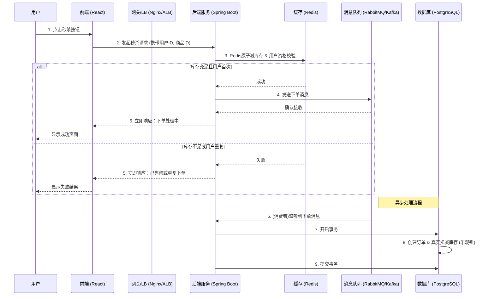

# 高并发秒杀场景设计与超卖问题解决方案

## 1. 引言

本文档针对 Mini-UPS 项目的现有技术栈（Spring Boot + React + PostgreSQL），旨在设计一个能够应对高并发、秒杀场景并有效防止超卖问题的系统级解决方案。其核心思想不是简单地修改代码，而是通过架构层面的优化，分层过滤请求，分散压力，保证数据一致性。

## 2. 核心设计思想

应对高并发秒杀场景，我们不能将所有请求压力都直接传导到数据库，因为数据库连接池有限，磁盘 I/O 是最大的性能瓶颈。核心思想如下：

- **数据分层**：将热点数据（如商品库存）从关系型数据库（PostgreSQL）提升到高速缓存（如 Redis）中，实现读写分离。
- **请求过滤**：在请求的生命周期中，通过多层关卡（前端、网关、缓存）过滤掉绝大部分无效或必将失败的请求，只让少量有效请求进入最终的数据库事务层。
- **异步处理**：将非核心流程（如下单、写数据库）与核心流程（如库存预扣减）分离，通过消息队列（Message Queue）实现削峰填谷，提高系统的吞-吐量和响应速度。

## 3. 整体架构流程

一个典型的秒杀请求处理流程如下：



## 4. 分层详细策略

### 4.1. 前端/客户端层 (React)

目标：减少无效的用户操作，防止用户重复提交。

- **按钮置灰**：用户点击“秒杀”按钮后，立即将按钮置为灰色或禁用状态，并显示加载提示，直到后端返回结果，有效防止用户因网络延迟而重复点击。
- **请求防抖/节流**：虽然主要靠置灰，但可以辅以防抖（debounce）逻辑。
- **动态令牌**：为防止恶意脚本直接调用API，可以在秒杀页面加载时从后端获取一个有时效性的动态令牌，秒杀请求必须携带此令牌，后端验证通过后即失效。

### 4.2. 网关/负载均衡层 (Nginx / AWS ALB)

目标：保护后端应用，过滤掉超出系统处理能力的流量。

- **限流 (Rate Limiting)**：基于IP或用户ID进行限流。例如，使用Nginx的 `limit_req_zone` 模块，或在AWS上配置Application Load Balancer的WAF规则，限制单个用户在短时间内的请求次数，防止恶意攻击。

### 4.3. 服务/应用层 (Spring Boot)

这是整个方案的核心，我们将在这里完成大部分工作。

#### a. 缓存策略 (Redis)

Redis 是本次设计的关键。我们需要利用其单线程、内存操作和原子性等特点。

- **库存预热**：在秒杀活动开始前，通过一个后台任务或脚本，将秒杀商品的库存数量从 PostgreSQL 加载到 Redis 中。
  - `Key`: `product:stock:{product_id}`
  - `Value`: `100` (库存数量)
- **用户资格校验**：为防止一个用户下多单，可以利用 Redis 的 `SET` 数据结构。
  - `Key`: `product:user:{product_id}`
  - `Value`: `{user_id_1, user_id_2, ...}`
- **库存原子预扣减**：这是防止超卖的第一道也是最重要的一道防线。**绝对不能使用 `GET` + `SET` 的方式**，因为非原子操作在高并发下必然出错。
  - **方案**：使用 Lua 脚本。Lua 脚本可以保证多个命令作为一个原子操作在 Redis 中执行。
    ```lua
    -- check_and_decr.lua
    local stock_key = KEYS[1]
    local user_key = KEYS[2]
    local user_id = ARGV[1]

    -- 检查用户是否已购买
    if redis.call('SISMEMBER', user_key, user_id) == 1 then
        return -2 -- -2 表示重复购买
    end

    -- 检查库存
    local stock = tonumber(redis.call('GET', stock_key))
    if stock and stock > 0 then
        redis.call('DECR', stock_key)
        redis.call('SADD', user_key, user_id)
        return 1 -- 1 表示成功
    else
        return -1 -- -1 表示库存不足
    end
    ```
  - **调用**：在 Spring Boot 中，使用 `RedisTemplate` 执行此 Lua 脚本。当脚本返回 `1` 时，表示预扣减成功，可以继续下一步；返回 `-1` 或 `-2` 则直接拒绝请求。

#### b. 异步处理 (Message Queue)

- **目的**：将耗时的数据库操作（创建订单、更新库存）与用户的秒杀请求解耦。
- **实现**：
  1. 在 Redis 预扣减成功后，构造一个包含 `user_id` 和 `product_id` 的消息体。
  2. 将该消息发送到消息队列（如 RabbitMQ 或 Kafka）。
  3. 立即向用户返回“正在处理中”的成功响应。
  4. 创建一个或多个消息队列的消费者服务（可以是同一个 Spring Boot 应用中的 `@RabbitListener` 或 `@KafkaListener`）。
  5. 消费者从队列中获取消息，执行真正的数据库写操作。

### 4.4. 数据库层 (PostgreSQL)

数据库是数据一致性的最后保障。

- **乐观锁机制**：即使有 Redis 的前置过滤，我们仍需在数据库层面防止极小概率下可能发生的并发问题（例如，MQ消费者重复消费、手动数据修复等）。
  - **实现**：在商品库存表（`products`）中增加一个 `version` 字段（数值类型，默认为0）。
  - **更新SQL**：
    ```sql
    UPDATE products
    SET
      stock = stock - 1,
      version = version + 1
    WHERE
      id = #{productId} AND stock > 0 AND version = #{currentVersion};
    ```
  - **逻辑**：
    1. 消费者处理消息时，先 `SELECT` 出商品的当前库存和 `version`。
    2. 在执行 `UPDATE` 时，将查询到的 `version` 作为条件。
    3. 如果 `UPDATE` 语句影响的行数为 0，说明在你查询之后，有其他线程已经修改了这条数据，`version` 不再匹配。此时可以选择重试或记录失败。

- **事务管理**：确保“创建订单”和“扣减库存”这两个操作在一个数据库事务中完成，要么都成功，要么都失败。使用 Spring 的 `@Transactional` 注解即可轻松实现。

## 5. 方案总结

通过以上设计，我们将一个瞬时的高并发请求洪峰，分解为一系列可控的流程：

1.  **前端**拦截了部分无效操作。
2.  **网关**挡住了恶意高频流量。
3.  **Redis** 以极高的性能完成了 99% 的库存判断和用户资格校验，过滤了所有库存不足和重复购买的请求。
4.  **消息队列** 承接了所有有效请求的下单任务，将数据库的写入压力平摊到一段时间内。
5.  **数据库** 在异步环境下，通过乐观锁和事务，从容地保证了数据的最终一致性。

这个方案兼顾了性能、用户体验和数据一致性，是业界处理此类问题的成熟模式。
