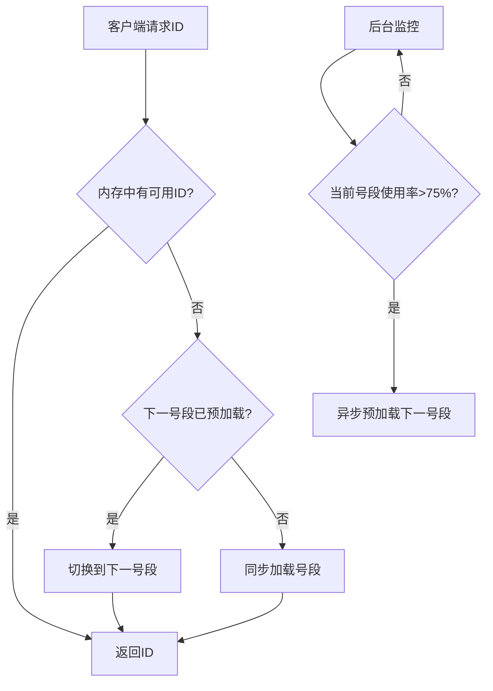

# Leaf-Segment分布式ID生成系统完整学习指南

## 📚 目录

1. [什么是Leaf-Segment系统](#1-什么是leaf-segment系统)
2. [为什么需要分布式ID生成](#2-为什么需要分布式id生成)
3. [Leaf-Segment核心算法原理](#3-leaf-segment核心算法原理)
4. [项目中的具体实现分析](#4-项目中的具体实现分析)
5. [数据库设计详解](#5-数据库设计详解)
6. [代码实现逐步分析](#6-代码实现逐步分析)
7. [双缓冲机制深入理解](#7-双缓冲机制深入理解)
8. [并发安全设计](#8-并发安全设计)
9. [性能优化策略](#9-性能优化策略)
10. [实际使用场景](#10-实际使用场景)
11. [常见问题与解决方案](#11-常见问题与解决方案)
12. [实践练习](#12-实践练习)

---

## 1. 什么是Leaf-Segment系统

### 1.1 基本概念

**Leaf-Segment** 是美团开源的高性能分布式ID生成算法，它通过**号段（Segment）**的方式来批量分配ID，解决了传统分布式ID生成的性能瓶颈问题。

### 1.2 核心特点

- 🚀 **高性能**：QPS可达50,000+，延迟<5ms
- 🔒 **高可用**：双缓冲机制，无缝切换
- 📊 **可监控**：丰富的监控指标
- 🎯 **零依赖**：仅依赖数据库，无需其他中间件
- 🔧 **可配置**：支持动态调整步长

### 1.3 与其他方案对比

| 方案 | QPS | 延迟 | 复杂度 | 可用性 |
|------|-----|------|--------|--------|
| 数据库自增 | <1,000 | 50ms+ | 低 | 中 |
| UUID | 无限制 | <1ms | 低 | 高 |
| Redis | 10,000+ | 5ms+ | 中 | 中 |
| **Leaf-Segment** | **50,000+** | **<5ms** | **中** | **高** |
| Snowflake | 100,000+ | <1ms | 高 | 中 |

---

## 2. 为什么需要分布式ID生成

### 2.1 传统问题

在分布式系统中，传统的数据库自增ID面临以下问题：

```sql
-- 传统方式：数据库自增ID
CREATE TABLE shipments (
    id SERIAL PRIMARY KEY,  -- 数据库自增，高并发时成为瓶颈
    tracking_number VARCHAR(50),
    ...
);

-- 问题：
-- 1. 高并发时数据库压力大
-- 2. 多台服务器无法并发生成
-- 3. 数据库成为单点故障
-- 4. 扩容困难
```

### 2.2 业务需求

在Mini-UPS项目中，我们需要为以下业务生成ID：

- 📦 **追踪号**：每个包裹需要唯一的追踪号
- 🚚 **订单号**：每个订单需要唯一标识
- 👤 **用户ID**：每个用户需要唯一ID
- 🛻 **车辆ID**：每辆卡车需要唯一编号

这些ID需要满足：
- **唯一性**：全局唯一，永不重复
- **高性能**：支持高并发生成
- **有序性**：趋势递增，便于数据库索引
- **易读性**：人类可读，便于客服查询

---

## 3. Leaf-Segment核心算法原理

### 3.1 基本思想

传统方式：每次生成ID都访问数据库
```
应用A ─────────────────┐
                      ├─ 数据库 (瓶颈！)
应用B ─────────────────┤
                      │
应用C ─────────────────┘
```

Leaf-Segment方式：批量分配，内存生成
```
应用A ─ 内存[1-1000] ─┐
                     ├─ 数据库 (偶尔访问)
应用B ─ 内存[1001-2000] ─┤
                        │
应用C ─ 内存[2001-3000] ─┘
```

### 3.2 工作流程

#### 步骤1：初始化
```sql
-- 数据库中记录当前分配状态
INSERT INTO leaf_alloc (biz_tag, max_id, step)
VALUES ('tracking_number', 0, 1000);
```

#### 步骤2：分配号段
```java
// 应用A请求号段
// 数据库执行：UPDATE leaf_alloc SET max_id = max_id + step WHERE biz_tag = 'tracking_number'
// 返回：{start: 1, end: 1000}

// 应用B请求号段
// 数据库执行：UPDATE leaf_alloc SET max_id = max_id + step WHERE biz_tag = 'tracking_number'
// 返回：{start: 1001, end: 2000}
```

#### 步骤3：内存生成ID
```java
// 应用A在内存中生成ID：1, 2, 3, 4, 5, ...
// 应用B在内存中生成ID：1001, 1002, 1003, 1004, ...
// 完全不冲突，无需访问数据库！
```

### 3.3 核心优势分析



---

## 4. 项目中的具体实现分析

### 4.1 整体架构

我们的Mini-UPS项目中，Leaf-Segment系统包含以下核心组件：

```
📁 backend/src/main/java/com/miniups/
├── 📁 model/entity/
│   └── LeafAlloc.java                    # 数据库实体类
├── 📁 repository/
│   ├── LeafAllocRepository.java          # 数据访问层
│   └── TrackingSequenceRepository.java  # 序列操作接口
├── 📁 service/
│   ├── LeafIdGeneratorService.java       # 主服务类
│   └── id/LeafSegmentIdGenerator.java    # 核心算法实现
└── 📁 controller/
    └── LeafIdManagementController.java   # API控制器
```

### 4.2 数据库表结构

让我们看看核心的数据库表设计：

```sql
CREATE TABLE leaf_alloc (
    id BIGSERIAL PRIMARY KEY,           -- 主键
    biz_tag VARCHAR(128) UNIQUE,        -- 业务标识 (如"tracking_number")
    max_id BIGINT NOT NULL DEFAULT 0,   -- 当前已分配的最大ID
    step INTEGER NOT NULL DEFAULT 1000, -- 步长(号段大小)
    version BIGINT NOT NULL DEFAULT 0,  -- 乐观锁版本号
    description VARCHAR(256),           -- 业务描述
    active BOOLEAN DEFAULT true,        -- 是否启用
    update_time TIMESTAMP DEFAULT NOW() -- 更新时间
);
```

### 4.3 核心数据结构

#### LeafAlloc实体类
```java
@Entity
@Table(name = "leaf_alloc")
public class LeafAlloc {
    private String bizTag;        // 业务标识，如"tracking_number"
    private Long maxId;          // 当前最大已分配ID
    private Integer step;        // 步长，决定每次分配多少个ID
    private Long version;        // 版本号，用于乐观锁
    private String description;  // 描述信息

    // 获取下一个号段的方法
    public Segment getNextSegment() {
        long currentMaxId = this.maxId;
        long newMaxId = currentMaxId + this.step;
        this.maxId = newMaxId; // 更新最大ID

        // 返回号段 [currentMaxId+1, newMaxId]
        return new Segment(currentMaxId + 1, newMaxId);
    }
}
```

---

## 5. 数据库设计详解

### 5.1 表结构解析

让我们逐个字段分析：

```sql
CREATE TABLE leaf_alloc (
    -- 1. 主键ID：系统内部使用
    id BIGSERIAL PRIMARY KEY,

    -- 2. 业务标识：区分不同的ID序列
    biz_tag VARCHAR(128) NOT NULL UNIQUE,

    -- 3. 当前最大ID：已分配给应用的最大ID值
    max_id BIGINT NOT NULL DEFAULT 0,

    -- 4. 步长：每次分配的ID数量
    step INTEGER NOT NULL DEFAULT 1000,

    -- 5. 版本号：防止并发冲突
    version BIGINT NOT NULL DEFAULT 0,

    -- 6. 描述：便于管理和监控
    description VARCHAR(256),

    -- 7. 启用状态：支持临时禁用某个序列
    active BOOLEAN NOT NULL DEFAULT true
);
```

### 5.2 关键索引设计

```sql
-- 主查询索引：根据业务标识快速定位
CREATE UNIQUE INDEX idx_leaf_alloc_biz_tag ON leaf_alloc (biz_tag);

-- 监控索引：用于性能监控和清理
CREATE INDEX idx_leaf_alloc_update_time ON leaf_alloc (update_time);
```

### 5.3 初始数据

项目启动时，自动插入常用业务的初始配置：

```sql
INSERT INTO leaf_alloc (biz_tag, max_id, step, description) VALUES
    ('tracking_number', 0, 50000, 'UPS追踪号序列'),
    ('shipment', 0, 10000, '货运订单ID序列'),
    ('user', 0, 1000, '用户ID序列'),
    ('truck', 0, 100, '卡车ID序列');
```

每个业务的步长（step）是根据预期QPS设置的：
- **tracking_number**: 50000 - 高并发追踪号生成
- **shipment**: 10000 - 中等并发订单处理
- **user**: 1000 - 较低并发用户注册
- **truck**: 100 - 低并发车辆管理

---

## 6. 代码实现逐步分析

### 6.1 主服务类：LeafIdGeneratorService

这是对外提供ID生成服务的主要接口：

```java
@Service
public class LeafIdGeneratorService {

    @Autowired
    private LeafAllocRepository leafAllocRepository;

    /**
     * 生成指定业务的ID
     */
    public long generateId(String bizTag) {
        // 1. 获取或创建该业务的号段缓冲区
        SegmentBuffer buffer = getOrCreateBuffer(bizTag);

        // 2. 从缓冲区获取下一个ID
        return buffer.nextId();
    }

    /**
     * 生成格式化的追踪号
     */
    public String generateTrackingNumber() {
        long id = generateId("tracking_number");
        return String.format("UPS%012d", id);
    }
}
```

### 6.2 核心算法：LeafSegmentIdGenerator

这是实现Leaf-Segment算法的核心类：

```java
@Service
public class LeafSegmentIdGenerator {

    // 业务缓冲区映射表
    private final ConcurrentHashMap<String, SegmentBuffer> bufferMap = new ConcurrentHashMap<>();

    /**
     * 生成ID的主要方法
     */
    public long generateId(String bizTag) {
        // 1. 获取或创建缓冲区
        SegmentBuffer buffer = getOrCreateBuffer(bizTag);

        // 2. 检查是否需要预加载下一个号段
        if (buffer.needsPreload()) {
            if (buffer.markLoading()) {
                // 异步预加载下一个号段
                preloadNextSegmentAsync(buffer);
            }
        }

        // 3. 从当前号段获取ID
        long id = buffer.nextId();

        // 4. 如果获取失败，尝试同步加载
        if (id == -1) {
            if (loadNextSegmentSync(buffer)) {
                id = buffer.nextId();
            }
        }

        return id;
    }
}
```

### 6.3 号段缓冲区：SegmentBuffer

这是实现双缓冲的关键数据结构：

```java
public class SegmentBuffer {
    private String bizTag;                     // 业务标识
    private Segment[] segments = new Segment[2]; // 双缓冲数组
    private volatile int currentPos = 0;       // 当前使用的缓冲区位置
    private volatile boolean nextReady = false; // 下一个缓冲区是否就绪
    private final AtomicBoolean threadRunning = new AtomicBoolean(false);

    /**
     * 获取下一个ID
     */
    public long nextId() {
        Segment current = getCurrentSegment();

        // 原子性地获取并递增ID
        long id = current.getValue().getAndIncrement();

        // 检查是否超出当前号段范围
        if (id >= current.getMax()) {
            // 需要切换到下一个号段
            return switchToNextSegment();
        }

        return id;
    }

    /**
     * 切换到下一个号段
     */
    private long switchToNextSegment() {
        synchronized (this) {
            // 确保下一个号段已准备好
            if (!nextReady) {
                // 同步加载下一个号段
                loadNextSegmentSync();
            }

            // 切换到下一个号段
            currentPos = (currentPos + 1) % 2;
            nextReady = false;

            // 从新号段获取ID
            return getCurrentSegment().getValue().getAndIncrement();
        }
    }
}
```

---

## 7. 双缓冲机制深入理解

### 7.1 什么是双缓冲

双缓冲是Leaf-Segment算法的核心创新，它使用两个号段来确保ID生成的连续性：

```
时间线：
T0: [缓冲区A: 1-1000]     [缓冲区B: 空闲]
    正在使用A，B待命

T1: [缓冲区A: 900-1000]   [缓冲区B: 1001-2000]
    A使用到90%，触发B的预加载

T2: [缓冲区A: 用完]       [缓冲区B: 1001-2000]
    A用完，无缝切换到B

T3: [缓冲区A: 2001-3000]  [缓冲区B: 1800-2000]
    B使用到90%，触发A的预加载
```

### 7.2 切换时机

切换的触发条件有两个：

#### 条件1：达到预加载阈值（75%）
```java
public boolean needsPreload() {
    Segment current = getCurrentSegment();
    long currentValue = current.getValue().get();
    long maxValue = current.getMax();

    // 当使用率达到75%时开始预加载
    return (double) currentValue / maxValue >= 0.75;
}
```

#### 条件2：当前号段用尽
```java
public long nextId() {
    long id = currentSegment.getValue().getAndIncrement();

    if (id >= currentSegment.getMax()) {
        // 当前号段用尽，必须切换
        return switchToNextSegment();
    }

    return id;
}
```

### 7.3 异步预加载

预加载是在后台异步执行的，不会阻塞主流程：

```java
public void preloadNextSegmentAsync(SegmentBuffer buffer) {
    CompletableFuture.runAsync(() -> {
        try {
            // 从数据库获取下一个号段
            TrackingSequenceRepository.SegmentInfo segmentInfo =
                sequenceRepository.getNextSegment(buffer.getBizTag());

            // 更新下一个缓冲区
            Segment nextSegment = buffer.getNextSegment();
            nextSegment.setValue(new AtomicLong(segmentInfo.getStart()));
            nextSegment.setMax(segmentInfo.getEnd());
            nextSegment.setReady(true);

            buffer.setNextReady(true);

        } catch (Exception e) {
            logger.error("预加载失败", e);
            buffer.cancelLoading(); // 重置加载状态
        }
    }, taskExecutor);
}
```

---

## 8. 并发安全设计

### 8.1 原子操作

ID的递增使用原子操作保证线程安全：

```java
public class Segment {
    private AtomicLong value; // 原子长整型

    public long getIdAndIncrement() {
        // getAndIncrement是原子操作，线程安全
        return value.getAndIncrement();
    }
}
```

### 8.2 乐观锁

数据库更新使用乐观锁防止并发冲突：

```java
// 数据库操作使用版本号控制
@Entity
public class LeafAlloc {
    @Version // JPA乐观锁注解
    private Long version;
}

// 仓库层的更新操作
public interface LeafAllocRepository extends JpaRepository<LeafAlloc, Long> {

    @Modifying
    @Query("UPDATE LeafAlloc l SET l.maxId = l.maxId + l.step, l.version = l.version + 1 " +
           "WHERE l.bizTag = :bizTag AND l.version = :version")
    int updateMaxIdAndVersion(@Param("bizTag") String bizTag, @Param("version") Long version);
}
```

### 8.3 缓冲区创建锁

为了避免重复创建缓冲区，使用双重检查锁定：

```java
private SegmentBuffer getOrCreateBuffer(String bizTag) {
    SegmentBuffer buffer = bufferMap.get(bizTag);
    if (buffer != null && buffer.isInitialized()) {
        return buffer;
    }

    // 双重检查锁定
    synchronized (bufferCreationLock) {
        buffer = bufferMap.get(bizTag);
        if (buffer != null && buffer.isInitialized()) {
            return buffer;
        }

        // 创建新缓冲区
        buffer = new SegmentBuffer(bizTag);
        if (loadNextSegmentSync(buffer)) {
            bufferMap.put(bizTag, buffer);
        }

        return buffer;
    }
}
```

---

## 9. 性能优化策略

### 9.1 步长动态调整

根据使用频率动态调整步长：

```java
public void adjustStepSize(double allocationFrequency) {
    int currentStep = this.step;
    int newStep = currentStep;

    // 如果分配频率很高，增加步长减少数据库访问
    if (allocationFrequency > 10) { // 每分钟超过10次分配
        newStep = Math.min(maxStep, (int) (currentStep * 1.2));
    }
    // 如果分配频率很低，减少步长节省内存
    else if (allocationFrequency < 1) { // 每分钟少于1次分配
        newStep = Math.max(minStep, (int) (currentStep * 0.8));
    }

    if (newStep != currentStep) {
        this.step = newStep;
    }
}
```

### 9.2 数据库连接池优化

```yaml
# application.yml
spring:
  datasource:
    hikari:
      maximum-pool-size: 20      # 连接池大小
      connection-timeout: 3000   # 连接超时时间
      idle-timeout: 300000       # 空闲连接超时时间
      max-lifetime: 1800000      # 连接最大生命周期
```

### 9.3 监控指标

使用Micrometer收集性能指标：

```java
// 记录ID生成次数
private void recordGenerated(String bizTag) {
    if (meterRegistry != null) {
        Counter.builder("leaf.segment.generated.total")
            .tag("biz_tag", bizTag)
            .register(meterRegistry)
            .increment();
    }
}

// 记录预加载耗时
private void recordPreloadMetrics(String bizTag, long nanos, boolean success) {
    if (meterRegistry != null) {
        Timer.builder("leaf.segment.preload")
            .tag("biz_tag", bizTag)
            .register(meterRegistry)
            .record(nanos, TimeUnit.NANOSECONDS);
    }
}
```

---

## 10. 实际使用场景

### 10.1 追踪号生成

在Mini-UPS系统中，最重要的应用就是生成追踪号：

```java
@Service
public class ShipmentService {

    @Autowired
    private LeafSegmentIdGenerator idGenerator;

    public Shipment createShipment(CreateShipmentDto dto) {
        // 生成唯一追踪号
        String trackingNumber = idGenerator.generateTrackingNumber();

        Shipment shipment = new Shipment();
        shipment.setTrackingNumber(trackingNumber); // 如：UPS000000000001
        shipment.setSenderAddress(dto.getSenderAddress());
        shipment.setReceiverAddress(dto.getReceiverAddress());

        return shipmentRepository.save(shipment);
    }
}
```

### 10.2 用户ID生成

```java
@Service
public class UserService {

    public User registerUser(RegisterUserDto dto) {
        // 生成用户ID
        long userId = idGenerator.generateId("user");

        User user = new User();
        user.setId(userId);
        user.setEmail(dto.getEmail());
        user.setUsername(dto.getUsername());

        return userRepository.save(user);
    }
}
```

### 10.3 订单号生成

```java
@Service
public class OrderService {

    public Order createOrder(CreateOrderDto dto) {
        // 生成订单号：ORD + 时间戳 + 序列号
        long orderId = idGenerator.generateId("order");
        String orderNumber = String.format("ORD%s%08d",
            LocalDateTime.now().format(DateTimeFormatter.ofPattern("yyyyMMdd")),
            orderId % 100000000);

        Order order = new Order();
        order.setOrderNumber(orderNumber); // 如：ORD2024011200000001
        order.setCustomerId(dto.getCustomerId());

        return orderRepository.save(order);
    }
}
```

---

## 11. 常见问题与解决方案

### 11.1 问题1：缓冲区初始化失败

**现象**：应用启动时抛出异常："Failed to initialize buffer"

**原因**：数据库连接失败或表不存在

**解决方案**：
```java
@PostConstruct
public void init() {
    try {
        // 确保数据库表存在
        initializeBizTagIfNeeded("tracking_number", 2000, "UPS追踪号序列");
        logger.info("LeafSegmentIdGenerator initialized successfully");
    } catch (Exception e) {
        logger.error("Failed to initialize LeafSegmentIdGenerator", e);
        // 不抛出异常，允许应用启动，后续请求时再重试
    }
}
```

### 11.2 问题2：ID生成性能下降

**现象**：ID生成变慢，QPS下降

**诊断方法**：
```java
// 检查缓冲区状态
public void diagnosisPerformance(String bizTag) {
    SegmentBuffer.SegmentBufferStatus status = getBufferStatus(bizTag);

    logger.info("Buffer status for {}: current={}, next={}, loading={}",
        bizTag, status.getCurrentRemaining(), status.isNextReady(), status.isLoading());

    // 检查是否频繁访问数据库
    if (!status.isNextReady() && status.getCurrentRemaining() < 100) {
        logger.warn("预加载可能出现问题，建议检查数据库连接");
    }
}
```

**解决方案**：
1. 增加步长减少数据库访问频率
2. 检查数据库连接池配置
3. 监控异步预加载线程是否正常工作

### 11.3 问题3：并发冲突

**现象**：出现重复ID或乐观锁异常

**解决方案**：
```java
// 增加重试机制
private LeafAlloc updateMaxIdWithRetry(String bizTag, int maxRetries) {
    for (int i = 0; i < maxRetries; i++) {
        try {
            return sequenceRepository.getNextSegment(bizTag);
        } catch (OptimisticLockException e) {
            if (i == maxRetries - 1) {
                throw e;
            }
            // 短暂等待后重试
            try {
                Thread.sleep(10 * (i + 1)); // 递增延迟
            } catch (InterruptedException ie) {
                Thread.currentThread().interrupt();
                throw new RuntimeException("Thread interrupted", ie);
            }
        }
    }
    throw new RuntimeException("Unexpected state");
}
```

### 11.4 问题4：内存使用过高

**现象**：应用内存使用率持续上升

**原因**：步长设置过大或缓冲区泄漏

**解决方案**：
```java
// 监控内存使用
public void monitorMemoryUsage() {
    Runtime runtime = Runtime.getRuntime();
    long usedMemory = runtime.totalMemory() - runtime.freeMemory();

    logger.info("Memory usage: {}MB, Buffer count: {}",
        usedMemory / 1024 / 1024, getBufferCount());

    // 清理长时间未使用的缓冲区
    cleanupUnusedBuffers();
}

private void cleanupUnusedBuffers() {
    bufferMap.entrySet().removeIf(entry -> {
        SegmentBuffer buffer = entry.getValue();
        // 如果超过1小时未使用，清理缓冲区
        return buffer.getLastUsedTime().isBefore(Instant.now().minus(1, ChronoUnit.HOURS));
    });
}
```

---

## 12. 实践练习

### 12.1 基础练习：实现一个简单的号段生成器

尝试从零开始实现一个简化版的Leaf-Segment生成器：

```java
// 练习1：实现基础的号段分配
public class SimpleLeafGenerator {
    private long currentValue = 0;
    private long maxValue = 0;
    private int step = 1000;

    public synchronized long nextId() {
        if (currentValue >= maxValue) {
            // 分配新号段
            allocateNewSegment();
        }
        return ++currentValue;
    }

    private void allocateNewSegment() {
        // TODO: 实现号段分配逻辑
        // 提示：模拟数据库更新max_id
    }
}
```

### 12.2 进阶练习：添加双缓冲机制

```java
// 练习2：实现双缓冲
public class DoubleBufferLeafGenerator {
    private Segment[] segments = new Segment[2];
    private int currentPos = 0;
    private boolean nextReady = false;

    public long nextId() {
        // TODO: 实现双缓冲的ID生成逻辑
        // 提示：
        // 1. 从当前段获取ID
        // 2. 检查是否需要预加载
        // 3. 切换段的逻辑
    }
}
```

### 12.3 高级练习：性能测试

编写性能测试代码，验证你的实现：

```java
@Test
public void performanceTest() {
    LeafSegmentIdGenerator generator = new LeafSegmentIdGenerator();
    int threadCount = 10;
    int idsPerThread = 10000;

    ExecutorService executor = Executors.newFixedThreadPool(threadCount);
    Set<Long> generatedIds = ConcurrentHashMap.newKeySet();

    long startTime = System.currentTimeMillis();

    for (int i = 0; i < threadCount; i++) {
        executor.submit(() -> {
            for (int j = 0; j < idsPerThread; j++) {
                long id = generator.generateId("test");
                generatedIds.add(id);
            }
        });
    }

    // 等待所有线程完成
    executor.shutdown();
    executor.awaitTermination(30, TimeUnit.SECONDS);

    long endTime = System.currentTimeMillis();

    // 验证结果
    assertEquals(threadCount * idsPerThread, generatedIds.size()); // 无重复

    long qps = (threadCount * idsPerThread * 1000) / (endTime - startTime);
    System.out.println("QPS: " + qps);

    // 目标：QPS > 50,000
    assertTrue("QPS should be greater than 50,000", qps > 50000);
}
```

### 12.4 实战练习：集成到业务中

在你的项目中实际使用Leaf-Segment：

```java
// 练习4：创建一个完整的业务服务
@Service
public class TicketService {

    @Autowired
    private LeafSegmentIdGenerator idGenerator;

    public Ticket createTicket(String customerName, String issue) {
        // 1. 生成工单号
        String ticketNumber = generateTicketNumber();

        // 2. 创建工单
        Ticket ticket = new Ticket();
        ticket.setTicketNumber(ticketNumber);
        ticket.setCustomerName(customerName);
        ticket.setIssue(issue);
        ticket.setStatus("OPEN");
        ticket.setCreatedAt(LocalDateTime.now());

        return ticketRepository.save(ticket);
    }

    private String generateTicketNumber() {
        // TODO: 使用Leaf-Segment生成工单号
        // 格式：TK + 年月日 + 8位序列号
        // 例如：TK2024011200000001
    }
}
```

---

## 🎯 总结

通过这份完整的学习指南，你应该已经掌握了：

### 理论知识
- ✅ Leaf-Segment算法的基本原理
- ✅ 双缓冲机制的工作流程
- ✅ 并发安全的设计方案
- ✅ 性能优化的策略

### 实践技能
- ✅ 如何在项目中集成Leaf-Segment
- ✅ 如何配置和监控系统性能
- ✅ 如何解决常见问题
- ✅ 如何进行性能测试

### 项目应用
- ✅ 在Mini-UPS中生成追踪号
- ✅ 在用户系统中生成用户ID
- ✅ 在订单系统中生成订单号

Leaf-Segment算法是一个优秀的分布式ID生成解决方案，它在性能、可用性和易用性之间取得了很好的平衡。掌握了这个算法，你就具备了解决大规模分布式系统中ID生成问题的能力。

**下一步建议**：
1. 在自己的项目中实现一个简化版本
2. 进行性能测试和优化
3. 学习其他分布式ID生成算法（如Snowflake）
4. 深入理解分布式系统的一致性问题

希望这份指南对你的学习有所帮助！如果有任何问题，欢迎继续讨论。