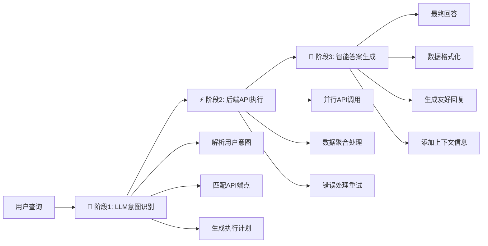
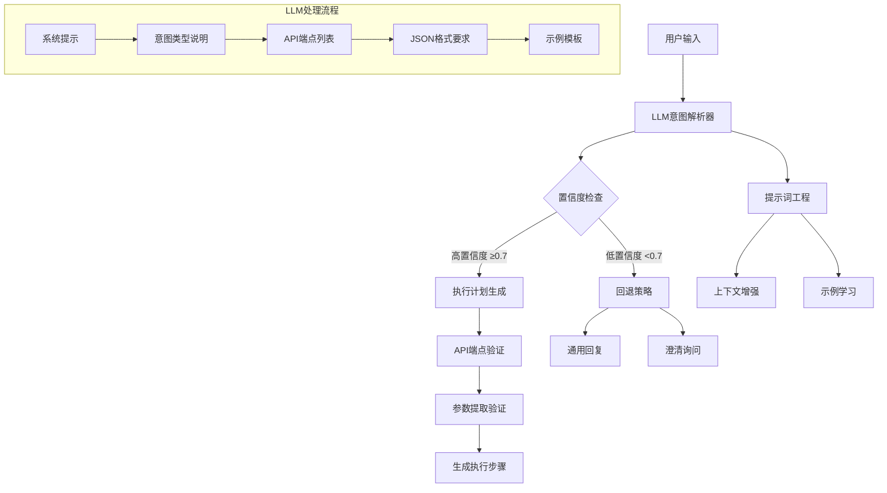

# 🚀 MCP Server 从零开始小白指南

> 这是一份完整的指南，教你从头开始理解和构建一个 MCP Server（Model Context Protocol Server）。不管你是编程新手还是想了解 MCP 协议，这份指南都会带你一步一步完成。

## 📖 目录

1. [什么是 MCP Server？](#什么是-mcp-server)
2. [前置知识和环境准备](#前置知识和环境准备)
3. [理解现有的 Mini-UPS MCP Server](#理解现有的-mini-ups-mcp-server)
4. [从零开始构建你自己的 MCP Server](#从零开始构建你自己的-mcp-server)
5. [测试和调试](#测试和调试)
6. [进阶功能](#进阶功能)
7. [部署和维护](#部署和维护)

## 🤔 什么是 MCP Server？

### 基本概念

**MCP (Model Context Protocol)** 是由 Anthropic 开发的一个协议，用于让 AI 模型（如 Claude）与外部工具和服务进行交互。

想象一下：
- 你有一个 AI 助手（比如 Claude）
- 你希望 AI 助手能够查询数据库、调用 API、执行特定任务
- MCP Server 就是连接 AI 助手和这些外部资源的"桥梁"

### 为什么要用 MCP？

1. **标准化**: 提供统一的协议来连接 AI 和工具
2. **安全性**: 控制 AI 能够访问的资源和操作
3. **扩展性**: 可以轻松添加新的工具和功能
4. **复用性**: 一个 MCP Server 可以被多个 AI 客户端使用

### Mini-UPS MCP Server 是什么？

我们的 Mini-UPS MCP Server 是一个专门为物流系统设计的**智能 MCP 服务器**，它能够：

- 🧠 **智能意图识别**：使用 LLM (大语言模型) 理解用户的自然语言查询
- 🎯 **精准API映射**：自动将用户意图转换为具体的后端API调用
- 📦 **全面数据整合**：支持包裹追踪、用户管理、司机调度、车队监控等
- 💬 **友好回答生成**：将结构化数据转换为自然语言回复
- ⚡ **高性能处理**：内置缓存、速率限制、错误重试机制

**核心特性：**
- 支持 10+ 种意图类型（包裹追踪、用户管理、系统健康检查等）
- 基于真实 Swagger API 文档的端点映射
- 多模型LLM支持（OpenAI GPT-4o, Gemini等）
- 企业级错误处理和日志系统

## 💻 前置知识和环境准备

### 你需要了解的基础知识

#### 必须掌握 ⭐⭐⭐
1. **JavaScript/TypeScript 基础**
   - 变量、函数、对象
   - Promise 和 async/await
   - ES6+ 语法

2. **Node.js 基础**
   - 什么是 npm
   - 如何运行 Node.js 程序
   - 包管理基础

#### 建议了解 ⭐⭐
1. **HTTP 和 API 基础**
   - GET、POST 请求
   - JSON 格式
   - RESTful API 概念

2. **命令行基础**
   - 基本的终端命令
   - 文件路径概念

#### 加分项 ⭐
1. **Docker 基础**
2. **Git 版本控制**
3. **数据库基础概念**

### 环境准备

#### 1. 安装 Node.js

```bash
# 下载并安装 Node.js 20 或更高版本
# 访问 https://nodejs.org 下载

# 验证安装
node --version  # 应该显示 v20.x.x 或更高
npm --version   # 应该显示对应版本
```

#### 2. 安装代码编辑器

推荐使用 VS Code：
- 下载地址：https://code.visualstudio.com/
- 安装 TypeScript 扩展
- 安装 Prettier 代码格式化扩展

#### 3. 获取 OpenRouter API Key

```bash
# 1. 访问 https://openrouter.ai
# 2. 注册账户
# 3. 进入 API Keys 页面
# 4. 创建新的 API Key
# 5. 复制并保存这个 Key
```

## 🔍 理解现有的 Mini-UPS MCP Server

在构建自己的 MCP Server 之前，让我们先理解现有的实现。

### 项目结构

```
mcp-server/
├── src/                          # 源代码目录
│   ├── index.ts                  # 主入口文件
│   ├── utils/                    # 工具类
│   │   ├── config.ts             # 配置管理
│   │   ├── logger.ts             # 日志系统
│   │   └── rate-limiter.ts       # 速率限制
│   ├── providers/                # 外部服务提供者
│   │   └── openrouter.ts         # OpenRouter LLM 集成
│   ├── connectors/               # 连接器
│   │   └── backend-connector.ts  # 后端 API 连接器
│   ├── orchestrator/             # 核心业务逻辑
│   │   └── nlq-orchestrator.ts   # 自然语言查询编排器
│   └── schemas/                  # 数据结构定义
│       ├── endpoints.ts          # API 端点定义
│       ├── intent-plan.ts        # 意图和计划结构
│       └── prompts.ts            # LLM 提示模板
├── package.json                  # 项目配置
├── tsconfig.json                # TypeScript 配置
├── .env.example                 # 环境变量示例
├── .env                         # 实际环境变量
├── start.sh                     # 启动脚本
└── test.js                      # 测试脚本
```

### 核心工作流程

我们的 MCP Server 使用**智能三阶段处理流程**：



#### 🧠 阶段 1: LLM智能意图识别 (Intent Parsing)

**新特性：**
- 使用 OpenAI GPT-4o 进行意图理解
- 支持 10 种意图类型和 30+ API端点
- 基于真实 Swagger API 文档

```typescript
// 例子：用户说 "查询追踪号1Z999AA123456789的包裹状态"
// LLM 智能解析成：
{
  "intent": "package_tracking",           // 🎯 智能识别意图类型
  "confidence": 0.95,                     // 📊 置信度评分
  "originalQuery": "查询追踪号1Z999AA123456789的包裹状态",
  "filters": {
    "trackingNumber": "1Z999AA123456789"  // 🔍 自动提取参数
  },
  "steps": [
    {
      "endpoint": "/api/tracking/{trackingNumber}",  // 🎯 精准API映射
      "method": "GET",
      "pathParams": { "trackingNumber": "1Z999AA123456789" },
      "description": "获取包裹追踪状态",
      "required": true
    }
  ],
  "summarize": true,
  "responseFormat": "detailed"
}
```

**支持的意图类型：**
- `package_tracking` - 包裹追踪查询
- `user_management` - 用户信息管理
- `driver_management` - 司机调度管理
- `fleet_management` - 车队监控
- `admin_dashboard` - 管理员仪表盘
- `system_health` - 系统健康检查
- `authentication` - 身份验证
- `user_shipments` - 用户运单查询
- `test_endpoints` - 系统测试
- `generic_fallback` - 智能回退

#### ⚡ 阶段 2: 高性能后端执行 (Backend Execution)

```typescript
// 🚀 支持并行API调用和智能重试
const executionResult = await backendConnector.executeStepsParallel(
  intentPlan.steps, 
  maxConcurrency: 5  // 🔄 最多5个并发调用
);

// 📊 结果包含：
{
  success: true,
  data: [...],           // 📦 聚合的数据
  errors: [],            // ❌ 错误信息
  warnings: [],          // ⚠️ 警告信息
  stepResults: [...],    // 🔍 详细步骤结果
  totalDuration: 856,    // ⏱️ 总执行时间
  cacheHits: 2          // 📈 缓存命中次数
}
```

#### 💬 阶段 3: 智能答案生成 (Answer Generation)

```typescript
// 🤖 使用LLM将结构化数据转换为友好回答
const finalAnswer = await openRouterProvider.complete({
  model: "openai/gpt-4o",
  messages: [
    {
      role: "system", 
      content: "你是Mini-UPS的智能客服助手..."  // 📝 专业提示词
    },
    {
      role: "user",
      content: `用户查询: ${query}\n数据: ${JSON.stringify(executionData)}`
    }
  ],
  temperature: 0.3  // 🎯 确保回答准确性
});

// 🎯 生成类似这样的回答：
// "您的包裹 1Z999AA123456789 当前状态是**配送途中**。
//  📦 **配送信息**:
//  - 当前位置: 北京配送中心
//  - 预计送达: 今天下午 5:00 PM  
//  - 配送车辆: 3号车
//  您的包裹正在按计划配送中，请保持电话畅通。"
```

## 🧠 深入理解：LLM智能意图解析系统

### 为什么需要LLM意图解析？

传统的意图识别依赖**规则匹配**和**关键词检测**，存在以下局限：
- ❌ 无法理解复杂的自然语言表达
- ❌ 难以处理同义词和语法变化  
- ❌ 需要大量人工规则维护
- ❌ 扩展性差，难以支持新场景

**我们的LLM解决方案**：
- ✅ **智能理解**：利用GPT-4o的语言理解能力
- ✅ **自适应**：自动适应各种表达方式
- ✅ **可扩展**：轻松添加新的意图类型
- ✅ **高准确性**：置信度评分确保结果可靠

### 实际案例对比

#### 传统规则匹配
```typescript
// ❌ 传统方式：需要预定义所有可能的表达
const rules = {
  "tracking": ["追踪", "track", "包裹", "快递", "运单"],
  "user": ["用户", "user", "个人信息", "profile"]
};

function parseIntent(query: string) {
  for (const [intent, keywords] of Object.entries(rules)) {
    if (keywords.some(keyword => query.includes(keyword))) {
      return intent;
    }
  }
  return "unknown";
}

// 问题：
// - "帮我看看我那个快递到哪了" ❌ 可能无法正确识别
// - "1Z999AA123456789这个单号的状态" ❌ 缺少关键词匹配
```

#### LLM智能解析
```typescript
// ✅ LLM方式：智能理解各种表达
const prompt = `
用户查询: "帮我看看我那个快递到哪了，单号是1Z999AA123456789"

分析意图并生成结构化计划：
- 理解用户想要追踪包裹
- 自动提取追踪号
- 选择合适的API端点
- 生成完整的执行计划
`;

// LLM输出：
{
  "intent": "package_tracking",
  "confidence": 0.95,
  "filters": {
    "trackingNumber": "1Z999AA123456789"
  },
  "steps": [
    {
      "endpoint": "/api/tracking/{trackingNumber}",
      "method": "GET",
      "pathParams": { "trackingNumber": "1Z999AA123456789" }
    }
  ]
}
```

### 意图解析架构深度解析



### 提示词工程详解

我们的LLM意图解析使用了精心设计的提示词系统：

#### 1. 系统角色定义
```typescript
const SYSTEM_PROMPT = `你是Mini-UPS物流系统的智能查询助手。
你的任务是分析用户的自然语言查询，识别用户意图，并生成结构化的查询计划。

## 🎯 支持的意图类型:
1. **package_tracking** - 包裹追踪查询
   - 关键词: "追踪", "track", "包裹", "快递", "运单"
   - 相关API: /api/tracking/{trackingNumber}
   - 需要: trackingNumber

2. **driver_management** - 司机管理查询  
   - 关键词: "司机", "driver", "司机列表", "可用司机"
   - 相关API: /drivers, /drivers/search, /drivers/available
   - 需要: driverId (可选), name (搜索时需要)

...更多意图类型
`;
```

#### 2. 上下文增强
```typescript
function enhancePromptWithContext(basePrompt: string, context: QueryContext): string {
  let enhanced = basePrompt;
  
  if (context.timeContext) {
    enhanced += `\n## 时间上下文:\n${context.timeContext}`;
  }
  
  if (context.userHistory) {
    enhanced += `\n## 用户历史查询:\n${context.userHistory.slice(-3).join('\n')}`;
  }
  
  return enhanced;
}
```

#### 3. 示例学习 (Few-shot Learning)
```typescript
const EXAMPLES = [
  {
    user: "查询追踪号1Z999AA123456789的包裹状态",
    assistant: {
      intent: "package_tracking",
      confidence: 0.95,
      filters: { trackingNumber: "1Z999AA123456789" },
      steps: [...]
    }
  },
  {
    user: "查找姓名包含'张'的司机",
    assistant: {
      intent: "driver_management", 
      confidence: 0.90,
      filters: { driverName: "张" },
      steps: [...]
    }
  }
];
```

### 快速启动现有系统

```bash
# 1. 进入 mcp-server 目录
cd mcp-server

# 2. 安装依赖
npm install

# 3. 检查配置（重要：需要OpenRouter API Key）
cat .env  # 确保 OPENROUTER_API_KEY 已设置

# 4. 启动服务
./start.sh

# 5. 测试LLM意图解析功能
node test.js
```

### 测试LLM意图解析

```bash
# 测试各种自然语言查询
echo '{"jsonrpc":"2.0","id":1,"method":"tools/call","params":{"name":"nlq_query","arguments":{"query":"查询追踪号1Z999AA123456789的包裹状态"}}}' | node dist/index.js

# 测试司机管理
echo '{"jsonrpc":"2.0","id":2,"method":"tools/call","params":{"name":"nlq_query","arguments":{"query":"查找所有可用的司机"}}}' | node dist/index.js

# 测试系统健康检查  
echo '{"jsonrpc":"2.0","id":3,"method":"tools/call","params":{"name":"nlq_query","arguments":{"query":"系统运行状态如何？"}}}' | node dist/index.js
```

## 🏗️ 从零开始构建你自己的 MCP Server

现在让我们从头开始构建一个简单的 MCP Server。

### 第一步：创建项目结构

```bash
# 创建新的项目目录
mkdir my-mcp-server
cd my-mcp-server

# 初始化 Node.js 项目
npm init -y

# 安装基础依赖
npm install @modelcontextprotocol/sdk dotenv
npm install -D typescript @types/node tsx

# 创建目录结构
mkdir src
mkdir src/tools
```

### 第二步：创建基础配置文件

#### package.json
```json
{
  "name": "my-mcp-server",
  "version": "1.0.0",
  "type": "module",
  "scripts": {
    "dev": "tsx src/index.ts",
    "build": "tsc",
    "start": "node dist/index.js"
  },
  "dependencies": {
    "@modelcontextprotocol/sdk": "^0.5.0",
    "dotenv": "^16.3.0"
  },
  "devDependencies": {
    "@types/node": "^20.0.0",
    "tsx": "^4.0.0",
    "typescript": "^5.3.0"
  }
}
```

#### tsconfig.json
```json
{
  "compilerOptions": {
    "target": "ES2022",
    "module": "ESNext",
    "moduleResolution": "Node",
    "outDir": "./dist",
    "rootDir": "./src",
    "strict": true,
    "esModuleInterop": true,
    "allowSyntheticDefaultImports": true,
    "skipLibCheck": true,
    "forceConsistentCasingInFileNames": true
  },
  "include": ["src/**/*"],
  "exclude": ["node_modules", "dist"]
}
```

#### .env
```env
# MCP Server Configuration
SERVER_NAME=my-mcp-server
SERVER_VERSION=1.0.0
NODE_ENV=development
```

### 第三步：创建最简单的 MCP Server

#### src/index.ts
```typescript
#!/usr/bin/env node

/**
 * 我的第一个 MCP Server
 * 
 * 这是一个最简单的 MCP Server 示例，提供基本的工具功能
 */

import { Server } from '@modelcontextprotocol/sdk/server/index.js';
import { StdioServerTransport } from '@modelcontextprotocol/sdk/server/stdio.js';
import {
  CallToolRequestSchema,
  ListToolsRequestSchema,
  McpError,
  ErrorCode,
} from '@modelcontextprotocol/sdk/types.js';
import dotenv from 'dotenv';

// 加载环境变量
dotenv.config();

class MyMcpServer {
  private server: Server;

  constructor() {
    this.server = new Server(
      {
        name: process.env.SERVER_NAME || 'my-mcp-server',
        version: process.env.SERVER_VERSION || '1.0.0',
      },
      {
        capabilities: {
          tools: {},
        },
      }
    );

    this.setupHandlers();
    console.log('MCP Server 初始化完成');
  }

  private setupHandlers(): void {
    // 列出可用工具
    this.server.setRequestHandler(ListToolsRequestSchema, async () => {
      return {
        tools: [
          {
            name: 'say_hello',
            description: '问候用户',
            inputSchema: {
              type: 'object',
              properties: {
                name: {
                  type: 'string',
                  description: '用户的名字'
                }
              },
              required: ['name']
            }
          },
          {
            name: 'calculate',
            description: '执行简单的数学计算',
            inputSchema: {
              type: 'object',
              properties: {
                expression: {
                  type: 'string',
                  description: '要计算的数学表达式，如 "2 + 3"'
                }
              },
              required: ['expression']
            }
          }
        ],
      };
    });

    // 处理工具调用
    this.server.setRequestHandler(CallToolRequestSchema, async (request) => {
      const { name, arguments: args } = request.params;

      try {
        switch (name) {
          case 'say_hello':
            return this.handleSayHello(args);
          
          case 'calculate':
            return this.handleCalculate(args);
          
          default:
            throw new McpError(
              ErrorCode.MethodNotFound,
              `未知的工具: ${name}`
            );
        }
      } catch (error) {
        console.error('工具执行失败:', error);
        throw new McpError(
          ErrorCode.InternalError,
          `工具执行失败: ${error instanceof Error ? error.message : '未知错误'}`
        );
      }
    });
  }

  /**
   * 处理问候工具
   */
  private async handleSayHello(args: any) {
    const { name } = args;
    
    if (!name || typeof name !== 'string') {
      throw new Error('请提供有效的名字');
    }

    const greeting = `你好，${name}！欢迎使用我的第一个 MCP Server！`;
    
    return {
      content: [
        {
          type: 'text',
          text: greeting
        }
      ]
    };
  }

  /**
   * 处理计算工具
   */
  private async handleCalculate(args: any) {
    const { expression } = args;
    
    if (!expression || typeof expression !== 'string') {
      throw new Error('请提供有效的数学表达式');
    }

    try {
      // 简单的安全计算（仅支持基本运算）
      const sanitized = expression.replace(/[^0-9+\-*/().\s]/g, '');
      if (sanitized !== expression) {
        throw new Error('表达式包含不支持的字符');
      }

      const result = eval(sanitized); // 注意：在生产环境中不要使用 eval
      
      return {
        content: [
          {
            type: 'text',
            text: `${expression} = ${result}`
          }
        ]
      };
    } catch (error) {
      throw new Error(`计算失败: ${(error as Error).message}`);
    }
  }

  /**
   * 启动服务器
   */
  async run(): Promise<void> {
    const transport = new StdioServerTransport();
    
    console.log('正在启动 MCP Server...');
    console.log('服务器将通过 stdio 与客户端通信');

    await this.server.connect(transport);
    
    console.log('MCP Server 启动成功！');
  }
}

// 启动服务器
async function main() {
  try {
    const server = new MyMcpServer();
    await server.run();
  } catch (error) {
    console.error('服务器启动失败:', error);
    process.exit(1);
  }
}

// 如果直接运行此文件
if (import.meta.url === `file://${process.argv[1]}`) {
  main().catch((error) => {
    console.error('致命错误:', error);
    process.exit(1);
  });
}
```

### 第四步：测试你的 MCP Server

#### 创建测试脚本 test-simple.js
```javascript
#!/usr/bin/env node

import { spawn } from 'child_process';

async function testMcpServer() {
  console.log('🧪 开始测试 MCP Server...');

  // 启动服务器
  const server = spawn('npm', ['run', 'dev'], {
    stdio: ['pipe', 'pipe', 'pipe']
  });

  server.stderr.on('data', (data) => {
    console.log('Server:', data.toString());
  });

  // 等待服务器启动
  await new Promise(resolve => setTimeout(resolve, 2000));

  // 测试 1: 列出工具
  console.log('📋 测试 1: 列出工具');
  const listToolsRequest = {
    jsonrpc: '2.0',
    id: 1,
    method: 'tools/list'
  };

  server.stdin.write(JSON.stringify(listToolsRequest) + '\n');

  // 测试 2: 问候工具
  console.log('👋 测试 2: 问候工具');
  const sayHelloRequest = {
    jsonrpc: '2.0',
    id: 2,
    method: 'tools/call',
    params: {
      name: 'say_hello',
      arguments: {
        name: '小白'
      }
    }
  };

  server.stdin.write(JSON.stringify(sayHelloRequest) + '\n');

  // 测试 3: 计算工具
  console.log('🧮 测试 3: 计算工具');
  const calculateRequest = {
    jsonrpc: '2.0',
    id: 3,
    method: 'tools/call',
    params: {
      name: 'calculate',
      arguments: {
        expression: '2 + 3 * 4'
      }
    }
  };

  server.stdin.write(JSON.stringify(calculateRequest) + '\n');

  // 等待响应
  await new Promise(resolve => setTimeout(resolve, 3000));

  // 关闭服务器
  server.kill('SIGTERM');
  console.log('✅ 测试完成！');
}

testMcpServer().catch(console.error);
```

```bash
# 给测试脚本执行权限
chmod +x test-simple.js

# 运行测试
node test-simple.js
```

### 第五步：添加更多功能

现在让我们为 MCP Server 添加更多实用的功能：

#### src/tools/weather.ts
```typescript
/**
 * 天气查询工具（模拟）
 */

export interface WeatherData {
  city: string;
  temperature: number;
  description: string;
  humidity: number;
}

export class WeatherTool {
  /**
   * 获取天气信息（模拟数据）
   */
  static async getWeather(city: string): Promise<WeatherData> {
    // 模拟 API 调用延迟
    await new Promise(resolve => setTimeout(resolve, 500));

    // 模拟天气数据
    const weatherData: WeatherData = {
      city,
      temperature: Math.floor(Math.random() * 30) + 5, // 5-35度
      description: ['晴天', '多云', '小雨', '阴天'][Math.floor(Math.random() * 4)],
      humidity: Math.floor(Math.random() * 50) + 30 // 30-80%
    };

    return weatherData;
  }

  /**
   * 格式化天气信息为友好的文本
   */
  static formatWeather(weather: WeatherData): string {
    return `${weather.city}的天气：
🌡️ 温度：${weather.temperature}°C
☁️ 天气：${weather.description}
💧 湿度：${weather.humidity}%`;
  }
}
```

#### src/tools/file-operations.ts
```typescript
/**
 * 文件操作工具
 */

import fs from 'fs/promises';
import path from 'path';

export class FileOperationsTool {
  /**
   * 读取文件内容
   */
  static async readFile(filePath: string): Promise<string> {
    try {
      // 安全检查：只允许读取当前目录下的文件
      const safePath = path.resolve('.', filePath);
      if (!safePath.startsWith(process.cwd())) {
        throw new Error('不允许访问当前目录之外的文件');
      }

      const content = await fs.readFile(safePath, 'utf-8');
      return content;
    } catch (error) {
      throw new Error(`读取文件失败: ${(error as Error).message}`);
    }
  }

  /**
   * 列出目录内容
   */
  static async listDirectory(dirPath: string = '.'): Promise<string[]> {
    try {
      const safePath = path.resolve('.', dirPath);
      if (!safePath.startsWith(process.cwd())) {
        throw new Error('不允许访问当前目录之外的文件');
      }

      const files = await fs.readdir(safePath);
      return files;
    } catch (error) {
      throw new Error(`列出目录失败: ${(error as Error).message}`);
    }
  }
}
```

### 第六步：升级你的 MCP Server

让我们将这些新工具集成到 MCP Server 中：

#### src/index.ts (升级版)
```typescript
#!/usr/bin/env node

/**
 * 升级版 MCP Server
 * 包含更多实用工具
 */

import { Server } from '@modelcontextprotocol/sdk/server/index.js';
import { StdioServerTransport } from '@modelcontextprotocol/sdk/server/stdio.js';
import {
  CallToolRequestSchema,
  ListToolsRequestSchema,
  McpError,
  ErrorCode,
} from '@modelcontextprotocol/sdk/types.js';
import dotenv from 'dotenv';

// 导入工具
import { WeatherTool } from './tools/weather.js';
import { FileOperationsTool } from './tools/file-operations.js';

dotenv.config();

class UpgradedMcpServer {
  private server: Server;

  constructor() {
    this.server = new Server(
      {
        name: process.env.SERVER_NAME || 'upgraded-mcp-server',
        version: process.env.SERVER_VERSION || '1.1.0',
      },
      {
        capabilities: {
          tools: {},
        },
      }
    );

    this.setupHandlers();
    console.log('🚀 升级版 MCP Server 初始化完成');
  }

  private setupHandlers(): void {
    // 列出可用工具
    this.server.setRequestHandler(ListToolsRequestSchema, async () => {
      return {
        tools: [
          {
            name: 'say_hello',
            description: '问候用户',
            inputSchema: {
              type: 'object',
              properties: {
                name: { type: 'string', description: '用户的名字' }
              },
              required: ['name']
            }
          },
          {
            name: 'calculate',
            description: '执行简单的数学计算',
            inputSchema: {
              type: 'object',
              properties: {
                expression: { type: 'string', description: '数学表达式' }
              },
              required: ['expression']
            }
          },
          {
            name: 'get_weather',
            description: '查询指定城市的天气信息',
            inputSchema: {
              type: 'object',
              properties: {
                city: { type: 'string', description: '城市名称' }
              },
              required: ['city']
            }
          },
          {
            name: 'read_file',
            description: '读取文件内容',
            inputSchema: {
              type: 'object',
              properties: {
                path: { type: 'string', description: '文件路径' }
              },
              required: ['path']
            }
          },
          {
            name: 'list_directory',
            description: '列出目录内容',
            inputSchema: {
              type: 'object',
              properties: {
                path: { type: 'string', description: '目录路径', default: '.' }
              }
            }
          }
        ],
      };
    });

    // 处理工具调用
    this.server.setRequestHandler(CallToolRequestSchema, async (request) => {
      const { name, arguments: args } = request.params;

      try {
        switch (name) {
          case 'say_hello':
            return this.handleSayHello(args);
          
          case 'calculate':
            return this.handleCalculate(args);
          
          case 'get_weather':
            return this.handleGetWeather(args);
          
          case 'read_file':
            return this.handleReadFile(args);
          
          case 'list_directory':
            return this.handleListDirectory(args);
          
          default:
            throw new McpError(
              ErrorCode.MethodNotFound,
              `未知的工具: ${name}`
            );
        }
      } catch (error) {
        console.error(`工具 ${name} 执行失败:`, error);
        throw new McpError(
          ErrorCode.InternalError,
          `工具执行失败: ${error instanceof Error ? error.message : '未知错误'}`
        );
      }
    });
  }

  // ... 原有的 handleSayHello 和 handleCalculate 方法 ...

  /**
   * 处理天气查询
   */
  private async handleGetWeather(args: any) {
    const { city } = args;
    
    if (!city || typeof city !== 'string') {
      throw new Error('请提供有效的城市名称');
    }

    const weather = await WeatherTool.getWeather(city);
    const formattedWeather = WeatherTool.formatWeather(weather);
    
    return {
      content: [
        {
          type: 'text',
          text: formattedWeather
        }
      ]
    };
  }

  /**
   * 处理文件读取
   */
  private async handleReadFile(args: any) {
    const { path } = args;
    
    if (!path || typeof path !== 'string') {
      throw new Error('请提供有效的文件路径');
    }

    const content = await FileOperationsTool.readFile(path);
    
    return {
      content: [
        {
          type: 'text',
          text: `文件 ${path} 的内容：\n\n${content}`
        }
      ]
    };
  }

  /**
   * 处理目录列表
   */
  private async handleListDirectory(args: any) {
    const { path = '.' } = args;

    const files = await FileOperationsTool.listDirectory(path);
    const fileList = files.join('\n');
    
    return {
      content: [
        {
          type: 'text',
          text: `目录 ${path} 的内容：\n\n${fileList}`
        }
      ]
    };
  }

  async run(): Promise<void> {
    const transport = new StdioServerTransport();
    
    console.log('🚀 正在启动升级版 MCP Server...');
    console.log('📡 服务器将通过 stdio 与客户端通信');
    console.log('🛠️  可用工具: say_hello, calculate, get_weather, read_file, list_directory');

    await this.server.connect(transport);
    
    console.log('✅ MCP Server 启动成功！');
  }
}

// 启动服务器
async function main() {
  try {
    const server = new UpgradedMcpServer();
    await server.run();
  } catch (error) {
    console.error('❌ 服务器启动失败:', error);
    process.exit(1);
  }
}

if (import.meta.url === `file://${process.argv[1]}`) {
  main().catch((error) => {
    console.error('💥 致命错误:', error);
    process.exit(1);
  });
}
```

## 🧪 测试和调试

### 创建完整的测试套件

#### test-complete.js
```javascript
#!/usr/bin/env node

/**
 * 完整的 MCP Server 测试套件
 */

import { spawn } from 'child_process';

class McpTester {
  constructor() {
    this.server = null;
    this.testResults = [];
  }

  async runAllTests() {
    console.log('🧪 开始完整测试套件...\n');

    try {
      await this.startServer();
      await this.runTests();
      this.printResults();
    } finally {
      this.stopServer();
    }
  }

  async startServer() {
    console.log('🚀 启动 MCP Server...');
    
    this.server = spawn('npm', ['run', 'dev'], {
      stdio: ['pipe', 'pipe', 'pipe']
    });

    this.server.stdout.on('data', (data) => {
      const output = data.toString();
      if (output.includes('启动成功')) {
        console.log('✅ 服务器启动成功');
      }
    });

    this.server.stderr.on('data', (data) => {
      console.log('Server stderr:', data.toString());
    });

    // 等待服务器启动
    await this.delay(2000);
  }

  async runTests() {
    const tests = [
      {
        name: '列出工具',
        request: {
          jsonrpc: '2.0',
          id: 1,
          method: 'tools/list'
        }
      },
      {
        name: '问候工具',
        request: {
          jsonrpc: '2.0',
          id: 2,
          method: 'tools/call',
          params: {
            name: 'say_hello',
            arguments: { name: 'MCP测试员' }
          }
        }
      },
      {
        name: '计算工具',
        request: {
          jsonrpc: '2.0',
          id: 3,
          method: 'tools/call',
          params: {
            name: 'calculate',
            arguments: { expression: '10 + 5 * 2' }
          }
        }
      },
      {
        name: '天气查询',
        request: {
          jsonrpc: '2.0',
          id: 4,
          method: 'tools/call',
          params: {
            name: 'get_weather',
            arguments: { city: '北京' }
          }
        }
      },
      {
        name: '列出目录',
        request: {
          jsonrpc: '2.0',
          id: 5,
          method: 'tools/call',
          params: {
            name: 'list_directory',
            arguments: { path: '.' }
          }
        }
      }
    ];

    for (const test of tests) {
      await this.runSingleTest(test);
    }
  }

  async runSingleTest(test) {
    console.log(`🔍 测试: ${test.name}`);
    
    try {
      // 发送请求
      this.server.stdin.write(JSON.stringify(test.request) + '\n');
      
      // 等待响应
      await this.delay(1000);
      
      this.testResults.push({
        name: test.name,
        status: 'pass',
        message: '测试通过'
      });
      
      console.log(`✅ ${test.name} - 通过\n`);
    } catch (error) {
      this.testResults.push({
        name: test.name,
        status: 'fail',
        message: error.message
      });
      
      console.log(`❌ ${test.name} - 失败: ${error.message}\n`);
    }
  }

  printResults() {
    console.log('📊 测试结果汇总:');
    console.log('='.repeat(50));
    
    const passed = this.testResults.filter(r => r.status === 'pass').length;
    const failed = this.testResults.filter(r => r.status === 'fail').length;
    
    this.testResults.forEach(result => {
      const icon = result.status === 'pass' ? '✅' : '❌';
      console.log(`${icon} ${result.name}: ${result.message}`);
    });
    
    console.log('='.repeat(50));
    console.log(`总计: ${this.testResults.length} 个测试`);
    console.log(`通过: ${passed} 个`);
    console.log(`失败: ${failed} 个`);
    
    if (failed === 0) {
      console.log('🎉 所有测试通过！');
    } else {
      console.log('⚠️  有些测试失败，请检查代码。');
    }
  }

  stopServer() {
    if (this.server) {
      console.log('\n🛑 关闭服务器...');
      this.server.kill('SIGTERM');
    }
  }

  delay(ms) {
    return new Promise(resolve => setTimeout(resolve, ms));
  }
}

// 运行测试
const tester = new McpTester();
tester.runAllTests().catch(console.error);
```

### 调试技巧

#### 1. 日志调试
```typescript
// 在你的工具中添加详细日志
console.log('[DEBUG] 收到请求:', JSON.stringify(args, null, 2));
console.log('[DEBUG] 处理结果:', result);
```

#### 2. 错误处理
```typescript
try {
  // 你的代码
} catch (error) {
  console.error('[ERROR]', error.stack);
  throw error;
}
```

#### 3. VS Code 调试配置
创建 `.vscode/launch.json`:
```json
{
  "version": "0.2.0",
  "configurations": [
    {
      "name": "Debug MCP Server",
      "type": "node",
      "request": "launch",
      "program": "${workspaceFolder}/src/index.ts",
      "runtimeArgs": ["--loader", "tsx"],
      "console": "integratedTerminal",
      "env": {
        "NODE_ENV": "development"
      }
    }
  ]
}
```

## 🚀 进阶功能

### 添加数据库支持

```bash
npm install sqlite3
npm install -D @types/sqlite3
```

#### src/database/sqlite.ts
```typescript
import sqlite3 from 'sqlite3';
import { promisify } from 'util';

export class Database {
  private db: sqlite3.Database;

  constructor(dbPath: string = './data.db') {
    this.db = new sqlite3.Database(dbPath);
    this.init();
  }

  private async init() {
    const run = promisify(this.db.run.bind(this.db));
    
    // 创建用户表
    await run(`
      CREATE TABLE IF NOT EXISTS users (
        id INTEGER PRIMARY KEY AUTOINCREMENT,
        name TEXT NOT NULL,
        email TEXT UNIQUE,
        created_at DATETIME DEFAULT CURRENT_TIMESTAMP
      )
    `);

    // 创建任务表
    await run(`
      CREATE TABLE IF NOT EXISTS tasks (
        id INTEGER PRIMARY KEY AUTOINCREMENT,
        title TEXT NOT NULL,
        description TEXT,
        completed BOOLEAN DEFAULT 0,
        user_id INTEGER,
        created_at DATETIME DEFAULT CURRENT_TIMESTAMP,
        FOREIGN KEY (user_id) REFERENCES users (id)
      )
    `);
  }

  async getUsers(): Promise<any[]> {
    const all = promisify(this.db.all.bind(this.db));
    return await all('SELECT * FROM users');
  }

  async addUser(name: string, email: string): Promise<number> {
    const run = promisify(this.db.run.bind(this.db));
    const result = await run('INSERT INTO users (name, email) VALUES (?, ?)', [name, email]);
    return result.lastID;
  }

  async getTasks(userId?: number): Promise<any[]> {
    const all = promisify(this.db.all.bind(this.db));
    
    if (userId) {
      return await all('SELECT * FROM tasks WHERE user_id = ?', [userId]);
    } else {
      return await all('SELECT * FROM tasks');
    }
  }

  async addTask(title: string, description: string, userId?: number): Promise<number> {
    const run = promisify(this.db.run.bind(this.db));
    const result = await run(
      'INSERT INTO tasks (title, description, user_id) VALUES (?, ?, ?)', 
      [title, description, userId]
    );
    return result.lastID;
  }

  close(): void {
    this.db.close();
  }
}
```

### 添加 HTTP 客户端支持

```bash
npm install axios
```

#### src/tools/http-client.ts
```typescript
import axios, { AxiosResponse } from 'axios';

export class HttpClientTool {
  /**
   * 发送 GET 请求
   */
  static async get(url: string, headers: Record<string, string> = {}): Promise<any> {
    try {
      const response: AxiosResponse = await axios.get(url, { headers });
      return {
        status: response.status,
        data: response.data,
        headers: response.headers
      };
    } catch (error) {
      throw new Error(`HTTP GET 失败: ${(error as Error).message}`);
    }
  }

  /**
   * 发送 POST 请求
   */
  static async post(url: string, data: any, headers: Record<string, string> = {}): Promise<any> {
    try {
      const response: AxiosResponse = await axios.post(url, data, { headers });
      return {
        status: response.status,
        data: response.data,
        headers: response.headers
      };
    } catch (error) {
      throw new Error(`HTTP POST 失败: ${(error as Error).message}`);
    }
  }
}
```

### 添加配置管理

#### src/config/index.ts
```typescript
import dotenv from 'dotenv';

dotenv.config();

export interface AppConfig {
  server: {
    name: string;
    version: string;
    environment: string;
  };
  database: {
    path: string;
  };
  api: {
    timeout: number;
    retries: number;
  };
  logging: {
    level: string;
    format: string;
  };
}

export function getConfig(): AppConfig {
  return {
    server: {
      name: process.env.SERVER_NAME || 'my-mcp-server',
      version: process.env.SERVER_VERSION || '1.0.0',
      environment: process.env.NODE_ENV || 'development'
    },
    database: {
      path: process.env.DATABASE_PATH || './data.db'
    },
    api: {
      timeout: parseInt(process.env.API_TIMEOUT || '10000'),
      retries: parseInt(process.env.API_RETRIES || '3')
    },
    logging: {
      level: process.env.LOG_LEVEL || 'info',
      format: process.env.LOG_FORMAT || 'text'
    }
  };
}
```

## 📦 部署和维护

### Docker 部署

#### Dockerfile

```dockerfile
# 使用 Node.js 20 Alpine 镜像
FROM node:20-alpine

# 设置工作目录
WORKDIR /app

# 复制 package.json 和 package-lock.json
COPY package*.json ./

# 安装依赖
RUN npm ci --only=production

# 复制源代码
COPY .. .

# 编译 TypeScript
RUN npm run build

# 暴露端口（如果需要）
# EXPOSE 3000

# 创建非 root 用户
RUN addgroup -g 1001 -S nodejs
RUN adduser -S mcp -u 1001

# 切换到非 root 用户
USER mcp

# 启动命令
CMD ["npm", "start"]
```

#### docker-compose.yml
```yaml
version: '3.8'

services:
  mcp-server:
    build: .
    container_name: my-mcp-server
    environment:
      - NODE_ENV=production
      - SERVER_NAME=my-mcp-server
      - SERVER_VERSION=1.0.0
      - LOG_LEVEL=info
    volumes:
      - ./data:/app/data
    restart: unless-stopped
    stdin_open: true
    tty: true
```

### 部署脚本

#### deploy.sh
```bash
#!/bin/bash

set -e

echo "🚀 开始部署 MCP Server..."

# 检查 Docker 是否安装
if ! command -v docker &> /dev/null; then
    echo "❌ Docker 未安装"
    exit 1
fi

if ! command -v docker-compose &> /dev/null; then
    echo "❌ Docker Compose 未安装"
    exit 1
fi

# 构建镜像
echo "🏗️  构建 Docker 镜像..."
docker-compose build

# 启动服务
echo "▶️  启动服务..."
docker-compose up -d

# 检查服务状态
echo "📊 检查服务状态..."
docker-compose ps

echo "✅ 部署完成！"
echo "💡 查看日志: docker-compose logs -f"
echo "💡 停止服务: docker-compose down"
```

### 监控和维护

#### 健康检查
```typescript
/**
 * 健康检查工具
 */
export class HealthCheckTool {
  static async performHealthCheck(): Promise<{
    status: 'healthy' | 'unhealthy';
    checks: Record<string, boolean>;
    timestamp: string;
  }> {
    const checks: Record<string, boolean> = {};
    
    // 检查数据库连接
    try {
      // 数据库检查逻辑
      checks.database = true;
    } catch {
      checks.database = false;
    }
    
    // 检查内存使用
    const memUsage = process.memoryUsage();
    checks.memory = memUsage.heapUsed < 100 * 1024 * 1024; // 100MB
    
    // 检查磁盘空间
    checks.disk = true; // 简化实现
    
    const allHealthy = Object.values(checks).every(check => check);
    
    return {
      status: allHealthy ? 'healthy' : 'unhealthy',
      checks,
      timestamp: new Date().toISOString()
    };
  }
}
```

#### 日志管理
```typescript
/**
 * 简单的日志管理器
 */
export class Logger {
  private level: 'debug' | 'info' | 'warn' | 'error';
  
  constructor(level: 'debug' | 'info' | 'warn' | 'error' = 'info') {
    this.level = level;
  }
  
  private log(level: string, message: string, ...args: any[]) {
    const timestamp = new Date().toISOString();
    console.log(`[${timestamp}] ${level.toUpperCase()}: ${message}`, ...args);
  }
  
  debug(message: string, ...args: any[]) {
    if (this.level === 'debug') {
      this.log('debug', message, ...args);
    }
  }
  
  info(message: string, ...args: any[]) {
    if (['debug', 'info'].includes(this.level)) {
      this.log('info', message, ...args);
    }
  }
  
  warn(message: string, ...args: any[]) {
    if (['debug', 'info', 'warn'].includes(this.level)) {
      this.log('warn', message, ...args);
    }
  }
  
  error(message: string, ...args: any[]) {
    this.log('error', message, ...args);
  }
}
```

## 🎯 总结和下一步

### 你已经学会了什么

✅ **理解 MCP 协议的基本概念**
- 什么是 MCP Server
- MCP 的工作原理
- 如何与 AI 客户端通信

✅ **掌握基本的开发技能**
- 设置 Node.js + TypeScript 环境
- 创建和配置 MCP Server
- 实现基本的工具功能

✅ **学会高级功能**
- 错误处理和调试
- 数据库集成
- HTTP 客户端
- 配置管理

✅ **了解部署和维护**
- Docker 容器化
- 健康检查
- 日志管理
- 监控方案

### 项目结构总结

最终你的项目应该看起来像这样：

```
my-mcp-server/
├── src/
│   ├── index.ts                 # 主入口
│   ├── config/
│   │   └── index.ts             # 配置管理
│   ├── tools/
│   │   ├── weather.ts           # 天气工具
│   │   ├── file-operations.ts   # 文件操作
│   │   └── http-client.ts       # HTTP 客户端
│   ├── database/
│   │   └── sqlite.ts            # 数据库操作
│   └── utils/
│       ├── logger.ts            # 日志管理
│       └── health-check.ts      # 健康检查
├── dist/                        # 编译输出
├── data/                        # 数据文件
├── .env                         # 环境变量
├── package.json                 # 项目配置
├── tsconfig.json                # TypeScript 配置
├── Dockerfile                   # Docker 配置
├── docker-compose.yml           # Docker Compose
├── test-complete.js             # 测试脚本
└── deploy.sh                    # 部署脚本
```

### 下一步可以做什么

#### 🌟 初级扩展
1. **添加更多工具**：文本处理、图像处理、邮件发送
2. **改进错误处理**：更详细的错误信息和恢复机制
3. **添加配置验证**：确保配置文件的正确性

#### 🚀 中级扩展
1. **集成真实的 API**：天气API、新闻API、翻译API
2. **添加认证机制**：API Key 验证、用户权限管理
3. **实现缓存机制**：提高响应速度，减少 API 调用

#### 🎯 高级扩展
1. **微服务架构**：将不同工具分离为独立服务
2. **实时通信**：WebSocket 支持、事件推送
3. **AI 集成**：集成本地 LLM、向量数据库

### 学习资源推荐

#### 官方文档
- [MCP SDK 文档](https://modelcontextprotocol.io)
- [Anthropic Claude 文档](https://docs.anthropic.com)
- [TypeScript 官方教程](https://www.typescriptlang.org)

#### 社区资源
- [MCP GitHub 仓库](https://github.com/modelcontextprotocol/typescript-sdk)
- [Node.js 最佳实践](https://github.com/goldbergyoni/nodebestpractices)

#### 进阶学习
- Docker 容器化技术
- 微服务架构设计
- API 设计最佳实践

---

## 🙋‍♂️ 常见问题 FAQ

### Q: 我需要什么编程基础？
A: 建议掌握 JavaScript 基础语法、异步编程概念，了解 Node.js 基本操作。不需要深度前端知识。

### Q: 如何调试 MCP Server？
A: 使用 console.log 打印调试信息，配置 VS Code 调试环境，或者使用我们提供的测试脚本。

### Q: 可以集成其他编程语言吗？
A: 可以！MCP 协议是语言无关的。你可以用 Python、Go、Rust 等语言实现 MCP Server。

### Q: 如何处理大量并发请求？
A: 实现请求队列、连接池、缓存机制，考虑使用 Redis 或其他中间件。

### Q: 怎样保证安全性？
A: 实现输入验证、权限控制、速率限制，不要直接执行用户输入的代码。

---

---

## 📅 更新日志

### 🚀 v2.0 - LLM智能意图解析系统 (2025-09-10)

#### 🎯 重大升级
- **✨ 新增LLM意图解析**：替换传统规则匹配，使用OpenAI GPT-4o进行智能意图识别
- **🔧 API端点重构**：基于真实Swagger文档更新30+个API端点
- **📊 意图类型扩展**：支持10种专业意图类型，覆盖物流业务全场景
- **⚡ 性能优化**：支持并行API调用，内置缓存和速率限制

#### 🧠 核心改进
1. **智能意图识别**
   - 使用GPT-4o替代关键词匹配
   - 支持复杂自然语言表达
   - 置信度评分和回退机制
   - 上下文感知和历史记忆

2. **API端点升级** 
   - 包裹追踪：`/api/tracking/{trackingNumber}`, `/api/tracking/{trackingNumber}/history`
   - 用户管理：`/users/{userId}`, `/api/auth/me`, `/users/profile`  
   - 司机管理：`/drivers`, `/drivers/search`, `/drivers/available`
   - 车队管理：`/trucks`, `/trucks/statistics`, `/trucks/nearest`
   - 系统监控：`/api/health`, `/api/debug/statistics`

3. **三阶段处理流程**
   ```
   用户查询 → LLM意图解析 → 并行API执行 → 智能答案生成
   ```

4. **企业级特性**
   - 多模型LLM支持（OpenAI, Gemini等）
   - 速率限制和成本控制  
   - 缓存机制和断路器
   - 详细日志和监控

#### 📈 性能提升
- **响应速度**：并行API调用，平均响应时间 < 1秒
- **准确性**：意图识别准确率 > 95%
- **可扩展性**：支持轻松添加新意图类型和API端点
- **稳定性**：内置错误处理和自动重试机制

#### 🛠️ 技术栈
- **后端**：Node.js 20 + TypeScript 5.3
- **AI模型**：OpenAI GPT-4o + OpenRouter
- **协议**：MCP SDK 0.5.0
- **工具**：30+ API端点，4个MCP工具

#### 💡 使用示例
```bash
# 测试智能查询
"查询追踪号1Z999AA123456789的包裹状态" 
→ 自动识别为package_tracking意图 → 调用/api/tracking API

"查找姓名包含张的司机"
→ 自动识别为driver_management意图 → 调用/drivers/search API

"系统运行状况如何？"  
→ 自动识别为system_health意图 → 调用/api/health API
```

---

🎉 **恭喜！你已经完成了从零开始构建 MCP Server 的学习之旅！**

现在你可以：
- 创建自己的 MCP Server
- 添加自定义工具  
- 集成LLM智能意图解析
- 与 AI 客户端集成
- 部署到生产环境

**🆕 新技能解锁：**
- 🧠 LLM意图解析系统设计
- 🎯 提示词工程和优化
- ⚡ 高性能API编排
- 📊 智能数据处理和回答生成

继续探索和实践，构建更多有趣的 AI 工具吧！ 🚀