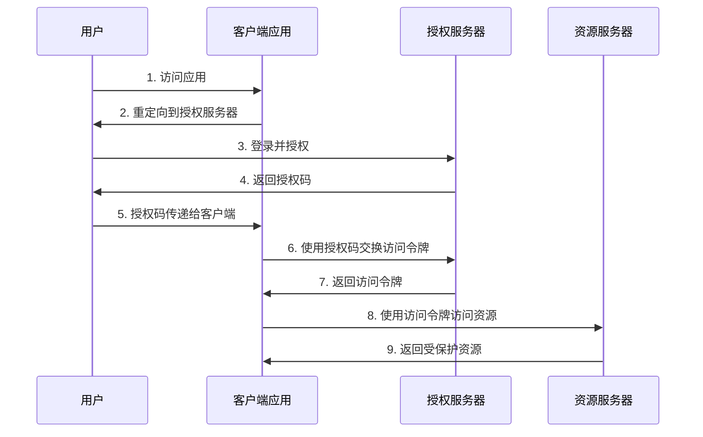
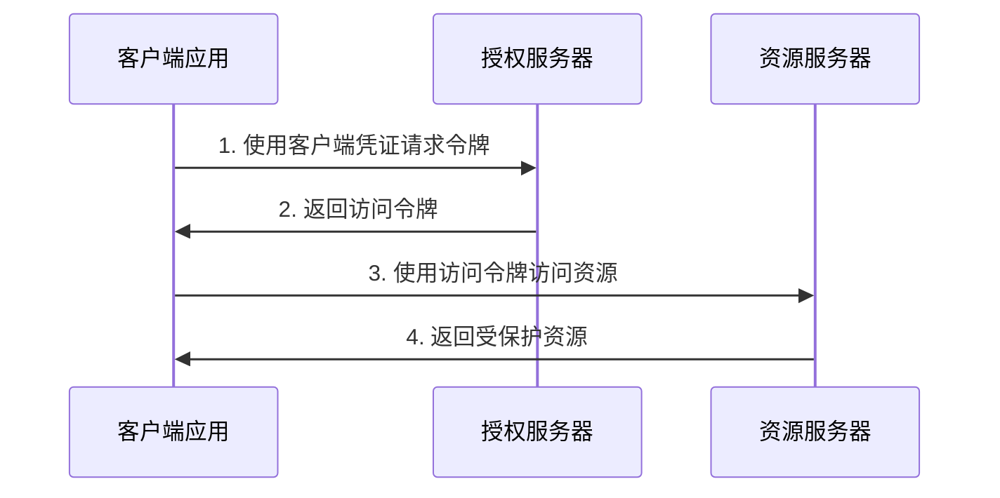

# OAuth2 完整配置指南

## 目录
1. [OAuth2 基础概念](#oauth2-基础概念)
2. [OAuth2 授权流程](#oauth2-授权流程)
3. [Spring Boot OAuth2 配置](#spring-boot-oauth2-配置)
4. [实际代码示例](#实际代码示例)
5. [测试和调试](#测试和调试)
6. [常见问题和解决方案](#常见问题和解决方案)
7. [最佳实践](#最佳实践)

---

## OAuth2 基础概念

### 什么是 OAuth2？
OAuth2（Open Authorization 2.0）是一个开放标准的授权协议，允许第三方应用程序在不暴露用户密码的情况下，获得对用户资源的有限访问权限。

### 核心角色

1. **Resource Owner（资源拥有者）**
   - 通常是用户本人
   - 拥有被保护资源的实体

2. **Client（客户端）**
   - 需要访问受保护资源的应用程序
   - 例如：第三方应用、移动App、Web应用

3. **Authorization Server（授权服务器）**
   - 验证资源拥有者身份
   - 颁发访问令牌（Access Token）

4. **Resource Server（资源服务器）**
   - 存储受保护资源的服务器
   - 验证访问令牌并提供资源

### 核心概念

#### Tokens（令牌）
- **Access Token（访问令牌）**：用于访问受保护资源的凭证
- **Refresh Token（刷新令牌）**：用于获取新的访问令牌
- **Authorization Code（授权码）**：临时凭证，用于交换访问令牌

#### Scopes（范围）
- 定义了客户端可以访问的资源范围
- 例如：`read`、`write`、`profile`、`email`

---

## OAuth2 授权流程

### 1. Authorization Code Flow（授权码模式）
**最安全，适用于Web应用程序**



### 2. Client Credentials Flow（客户端凭证模式）
**适用于服务间通信**



### 3. Resource Owner Password Flow（密码模式）
**不推荐使用，仅用于高度信任的应用**

### 4. Implicit Flow（隐式模式）
**已废弃，不推荐使用**

---

## Spring Boot OAuth2 配置

### 步骤 1: 添加依赖

在 `pom.xml` 中添加必要的依赖：

```xml
<dependencies>
    <!-- Spring Boot Starter Web -->
    <dependency>
        <groupId>org.springframework.boot</groupId>
        <artifactId>spring-boot-starter-web</artifactId>
    </dependency>

    <!-- Spring Boot Starter Security -->
    <dependency>
        <groupId>org.springframework.boot</groupId>
        <artifactId>spring-boot-starter-security</artifactId>
    </dependency>

    <!-- Spring Boot Starter OAuth2 Resource Server -->
    <dependency>
        <groupId>org.springframework.boot</groupId>
        <artifactId>spring-boot-starter-oauth2-resource-server</artifactId>
    </dependency>

    <!-- Spring Boot Starter OAuth2 Client -->
    <dependency>
        <groupId>org.springframework.boot</groupId>
        <artifactId>spring-boot-starter-oauth2-client</artifactId>
    </dependency>

    <!-- Spring Authorization Server (如果需要自建授权服务器) -->
    <dependency>
        <groupId>org.springframework.security</groupId>
        <artifactId>spring-security-oauth2-authorization-server</artifactId>
        <version>1.2.0</version>
    </dependency>

    <!-- JWT Support -->
    <dependency>
        <groupId>org.springframework.security</groupId>
        <artifactId>spring-security-oauth2-jose</artifactId>
    </dependency>
</dependencies>
```

### 步骤 2: 配置文件设置

#### application.yml 配置

```yaml
spring:
  application:
    name: oauth2-demo

  # OAuth2 Client 配置（如果作为客户端）
  security:
    oauth2:
      client:
        registration:
          # Google OAuth2 配置示例
          google:
            client-id: ${GOOGLE_CLIENT_ID:your-google-client-id}
            client-secret: ${GOOGLE_CLIENT_SECRET:your-google-client-secret}
            scope:
              - openid
              - profile
              - email
            redirect-uri: "http://localhost:8080/login/oauth2/code/google"
            client-name: Google

          # GitHub OAuth2 配置示例
          github:
            client-id: ${GITHUB_CLIENT_ID:your-github-client-id}
            client-secret: ${GITHUB_CLIENT_SECRET:your-github-client-secret}
            scope:
              - read:user
              - user:email
            redirect-uri: "http://localhost:8080/login/oauth2/code/github"
            client-name: GitHub

        provider:
          google:
            authorization-uri: https://accounts.google.com/o/oauth2/v2/auth
            token-uri: https://oauth2.googleapis.com/token
            user-info-uri: https://www.googleapis.com/oauth2/v2/userinfo
            user-name-attribute: id

          github:
            authorization-uri: https://github.com/login/oauth/authorize
            token-uri: https://github.com/login/oauth/access_token
            user-info-uri: https://api.github.com/user
            user-name-attribute: id

      # OAuth2 Resource Server 配置（如果作为资源服务器）
      resourceserver:
        jwt:
          # JWT 验证密钥位置
          jwk-set-uri: http://localhost:9000/.well-known/jwks.json
          # 或使用固定密钥
          # public-key-location: classpath:public-key.pem

# 授权服务器配置（如果自建授权服务器）
authorization-server:
  port: 9000
  issuer-url: http://localhost:9000

# 应用配置
server:
  port: 8080

# 日志配置
logging:
  level:
    org.springframework.security: DEBUG
    org.springframework.security.oauth2: DEBUG
```

### 步骤 3: 安全配置类

#### OAuth2 Client 配置

```java
@Configuration
@EnableWebSecurity
public class OAuth2ClientSecurityConfig {

    @Bean
    public SecurityFilterChain filterChain(HttpSecurity http) throws Exception {
        http
            .authorizeHttpRequests(authz -> authz
                .requestMatchers("/", "/login", "/error").permitAll()
                .anyRequest().authenticated()
            )
            .oauth2Login(oauth2 -> oauth2
                .loginPage("/login")
                .successHandler(oAuth2AuthenticationSuccessHandler())
                .failureHandler(oAuth2AuthenticationFailureHandler())
            )
            .logout(logout -> logout
                .logoutSuccessUrl("/")
                .invalidateHttpSession(true)
                .clearAuthentication(true)
            );

        return http.build();
    }

    @Bean
    public AuthenticationSuccessHandler oAuth2AuthenticationSuccessHandler() {
        return new SimpleUrlAuthenticationSuccessHandler("/dashboard");
    }

    @Bean
    public AuthenticationFailureHandler oAuth2AuthenticationFailureHandler() {
        return new SimpleUrlAuthenticationFailureHandler("/login?error");
    }
}
```

#### OAuth2 Resource Server 配置

```java
@Configuration
@EnableWebSecurity
@EnableMethodSecurity(prePostEnabled = true)
public class OAuth2ResourceServerConfig {

    @Bean
    public SecurityFilterChain resourceServerFilterChain(HttpSecurity http) throws Exception {
        http
            .authorizeHttpRequests(authz -> authz
                .requestMatchers("/api/public/**").permitAll()
                .requestMatchers("/api/admin/**").hasRole("ADMIN")
                .requestMatchers("/api/user/**").hasRole("USER")
                .anyRequest().authenticated()
            )
            .oauth2ResourceServer(oauth2 -> oauth2
                .jwt(jwt -> jwt
                    .decoder(jwtDecoder())
                    .jwtAuthenticationConverter(jwtAuthenticationConverter())
                )
            )
            .sessionManagement(session -> session
                .sessionCreationPolicy(SessionCreationPolicy.STATELESS)
            )
            .csrf(csrf -> csrf.disable());

        return http.build();
    }

    @Bean
    public JwtDecoder jwtDecoder() {
        // 从授权服务器获取公钥
        return JwtDecoders.fromOidcIssuerLocation("http://localhost:9000");
    }

    @Bean
    public JwtAuthenticationConverter jwtAuthenticationConverter() {
        JwtGrantedAuthoritiesConverter authoritiesConverter = new JwtGrantedAuthoritiesConverter();
        authoritiesConverter.setAuthorityPrefix("ROLE_");
        authoritiesConverter.setAuthoritiesClaimName("authorities");

        JwtAuthenticationConverter authenticationConverter = new JwtAuthenticationConverter();
        authenticationConverter.setJwtGrantedAuthoritiesConverter(authoritiesConverter);
        return authenticationConverter;
    }
}
```

---

## 实际代码示例

### 1. OAuth2 登录控制器

```java
@Controller
public class OAuth2LoginController {

    @GetMapping("/")
    public String home() {
        return "index";
    }

    @GetMapping("/login")
    public String login() {
        return "login";
    }

    @GetMapping("/dashboard")
    public String dashboard(Model model, Authentication authentication) {
        if (authentication instanceof OAuth2AuthenticationToken oauth2Token) {
            OAuth2User oauth2User = oauth2Token.getPrincipal();
            model.addAttribute("user", oauth2User);
            model.addAttribute("provider", oauth2Token.getAuthorizedClientRegistrationId());
        }
        return "dashboard";
    }

    @GetMapping("/profile")
    @ResponseBody
    public Map<String, Object> profile(Authentication authentication) {
        if (authentication instanceof OAuth2AuthenticationToken oauth2Token) {
            return oauth2Token.getPrincipal().getAttributes();
        }
        return Collections.emptyMap();
    }
}
```

### 2. REST API 控制器（受保护资源）

```java
@RestController
@RequestMapping("/api")
public class ProtectedResourceController {

    @GetMapping("/public/info")
    public Map<String, String> publicInfo() {
        return Map.of("message", "This is public information");
    }

    @GetMapping("/user/profile")
    @PreAuthorize("hasRole('USER')")
    public Map<String, Object> userProfile(JwtAuthenticationToken token) {
        return Map.of(
            "user", token.getName(),
            "authorities", token.getAuthorities(),
            "claims", token.getToken().getClaims()
        );
    }

    @GetMapping("/admin/users")
    @PreAuthorize("hasRole('ADMIN')")
    public List<Map<String, String>> adminUsers() {
        return List.of(
            Map.of("id", "1", "name", "John Doe", "role", "USER"),
            Map.of("id", "2", "name", "Jane Smith", "role", "ADMIN")
        );
    }

    @PostMapping("/user/data")
    @PreAuthorize("hasAuthority('SCOPE_write')")
    public Map<String, String> createUserData(@RequestBody Map<String, Object> data) {
        return Map.of("message", "Data created successfully", "id", UUID.randomUUID().toString());
    }
}
```

### 3. 自定义用户服务

```java
@Service
public class CustomOAuth2UserService implements OAuth2UserService<OAuth2UserRequest, OAuth2User> {

    private final DefaultOAuth2UserService delegate = new DefaultOAuth2UserService();

    @Override
    public OAuth2User loadUser(OAuth2UserRequest userRequest) throws OAuth2AuthenticationException {
        OAuth2User oauth2User = delegate.loadUser(userRequest);

        String registrationId = userRequest.getClientRegistration().getRegistrationId();
        String userNameAttributeName = userRequest.getClientRegistration()
            .getProviderDetails().getUserInfoEndpoint().getUserNameAttributeName();

        // 自定义用户处理逻辑
        return processOAuth2User(oauth2User, registrationId, userNameAttributeName);
    }

    private OAuth2User processOAuth2User(OAuth2User oauth2User, String registrationId, String userNameAttributeName) {
        // 提取用户信息
        String email = oauth2User.getAttribute("email");
        String name = oauth2User.getAttribute("name");

        // 保存或更新用户信息到数据库
        // User user = userRepository.findByEmail(email)
        //     .orElse(createNewUser(oauth2User, registrationId));

        // 返回自定义的用户对象
        return new CustomOAuth2User(oauth2User.getAttributes(), userNameAttributeName);
    }
}
```

### 4. 前端模板示例

#### login.html
```html
<!DOCTYPE html>
<html>
<head>
    <title>OAuth2 Login</title>
    <style>
        .login-container { max-width: 400px; margin: 50px auto; padding: 20px; }
        .oauth-btn { display: block; width: 100%; margin: 10px 0; padding: 10px; text-decoration: none; text-align: center; border-radius: 5px; }
        .google-btn { background-color: #4285f4; color: white; }
        .github-btn { background-color: #333; color: white; }
    </style>
</head>
<body>
    <div class="login-container">
        <h2>Login with OAuth2</h2>

        <a href="/oauth2/authorization/google" class="oauth-btn google-btn">
            Login with Google
        </a>

        <a href="/oauth2/authorization/github" class="oauth-btn github-btn">
            Login with GitHub
        </a>

        <div th:if="${param.error}" style="color: red; margin-top: 10px;">
            Login failed. Please try again.
        </div>
    </div>
</body>
</html>
```

#### dashboard.html
```html
<!DOCTYPE html>
<html>
<head>
    <title>Dashboard</title>
    <style>
        .dashboard { max-width: 800px; margin: 20px auto; padding: 20px; }
        .user-info { background: #f5f5f5; padding: 15px; border-radius: 5px; margin-bottom: 20px; }
        .logout-btn { background-color: #dc3545; color: white; padding: 8px 16px; text-decoration: none; border-radius: 3px; }
    </style>
</head>
<body>
    <div class="dashboard">
        <h1>Welcome to Dashboard</h1>

        <div class="user-info">
            <h3>User Information</h3>
            <p><strong>Provider:</strong> <span th:text="${provider}"></span></p>
            <p><strong>Name:</strong> <span th:text="${user.name}"></span></p>
            <p><strong>Email:</strong> <span th:text="${user.email}"></span></p>
        </div>

        <div>
            <a href="/profile" target="_blank">View Full Profile (JSON)</a> |
            <a href="/logout" class="logout-btn">Logout</a>
        </div>
    </div>
</body>
</html>
```

---

## 测试和调试

### 1. 单元测试

```java
@SpringBootTest
@AutoConfigureMockMvc
class OAuth2SecurityTest {

    @Autowired
    private MockMvc mockMvc;

    @Test
    @WithMockUser(roles = "USER")
    void testUserEndpointWithValidUser() throws Exception {
        mockMvc.perform(get("/api/user/profile"))
            .andExpect(status().isOk())
            .andExpect(jsonPath("$.user").exists());
    }

    @Test
    @WithMockUser(roles = "ADMIN")
    void testAdminEndpointWithAdminUser() throws Exception {
        mockMvc.perform(get("/api/admin/users"))
            .andExpect(status().isOk())
            .andExpect(jsonPath("$").isArray());
    }

    @Test
    void testProtectedEndpointWithoutAuth() throws Exception {
        mockMvc.perform(get("/api/user/profile"))
            .andExpect(status().isUnauthorized());
    }
}
```

### 2. 集成测试

```java
@SpringBootTest(webEnvironment = SpringBootTest.WebEnvironment.RANDOM_PORT)
class OAuth2IntegrationTest {

    @Autowired
    private TestRestTemplate restTemplate;

    @LocalServerPort
    private int port;

    @Test
    void testOAuth2LoginFlow() {
        String loginUrl = "http://localhost:" + port + "/oauth2/authorization/google";

        ResponseEntity<String> response = restTemplate.getForEntity(loginUrl, String.class);

        // 验证重定向到授权服务器
        assertThat(response.getStatusCode()).isEqualTo(HttpStatus.FOUND);
        assertThat(response.getHeaders().getLocation().toString()).contains("accounts.google.com");
    }

    @Test
    void testJwtTokenValidation() {
        String token = "eyJhbGciOiJSUzI1NiIsInR5cCI6IkpXVCJ9..."; // 模拟JWT令牌

        HttpHeaders headers = new HttpHeaders();
        headers.setBearerAuth(token);
        HttpEntity<String> entity = new HttpEntity<>(headers);

        ResponseEntity<String> response = restTemplate.exchange(
            "/api/user/profile", HttpMethod.GET, entity, String.class);

        assertThat(response.getStatusCode()).isEqualTo(HttpStatus.OK);
    }
}
```

### 3. 使用 Postman 测试

#### 获取访问令牌
1. **Authorization Code Flow 测试**：
   ```
   GET http://localhost:8080/oauth2/authorization/google
   ```

2. **使用访问令牌访问API**：
   ```
   GET http://localhost:8080/api/user/profile
   Authorization: Bearer your-access-token
   ```

#### 测试不同的权限级别
```bash
# 公开端点
curl -X GET http://localhost:8080/api/public/info

# 需要认证的端点
curl -X GET http://localhost:8080/api/user/profile \
  -H "Authorization: Bearer your-access-token"

# 需要管理员权限的端点
curl -X GET http://localhost:8080/api/admin/users \
  -H "Authorization: Bearer admin-access-token"
```

---

## 常见问题和解决方案

### 1. CORS 问题

**问题**：前端无法访问后端API，出现CORS错误

**解决方案**：
```java
@Configuration
public class CorsConfig {

    @Bean
    public CorsConfigurationSource corsConfigurationSource() {
        CorsConfiguration configuration = new CorsConfiguration();
        configuration.setAllowedOriginPatterns(Arrays.asList("*"));
        configuration.setAllowedMethods(Arrays.asList("GET", "POST", "PUT", "DELETE", "OPTIONS"));
        configuration.setAllowedHeaders(Arrays.asList("*"));
        configuration.setAllowCredentials(true);

        UrlBasedCorsConfigurationSource source = new UrlBasedCorsConfigurationSource();
        source.registerCorsConfiguration("/**", configuration);
        return source;
    }
}
```

### 2. JWT 令牌过期

**问题**：访问令牌过期后无法访问资源

**解决方案**：实现令牌刷新机制
```java
@Component
public class TokenRefreshService {

    @Autowired
    private OAuth2AuthorizedClientService authorizedClientService;

    public String refreshToken(String clientRegistrationId, String principalName) {
        OAuth2AuthorizedClient authorizedClient = authorizedClientService
            .loadAuthorizedClient(clientRegistrationId, principalName);

        if (authorizedClient != null && authorizedClient.getRefreshToken() != null) {
            // 使用刷新令牌获取新的访问令牌
            // 实现令牌刷新逻辑
        }

        return null;
    }
}
```

### 3. 权限映射问题

**问题**：OAuth2 用户角色无法正确映射到应用权限

**解决方案**：自定义权限转换器
```java
@Bean
public JwtAuthenticationConverter jwtAuthenticationConverter() {
    JwtAuthenticationConverter converter = new JwtAuthenticationConverter();
    converter.setJwtGrantedAuthoritiesConverter(jwt -> {
        Collection<GrantedAuthority> authorities = new ArrayList<>();

        // 从JWT claims中提取角色信息
        List<String> roles = jwt.getClaimAsStringList("roles");
        if (roles != null) {
            roles.forEach(role -> authorities.add(new SimpleGrantedAuthority("ROLE_" + role)));
        }

        // 从JWT claims中提取范围信息
        List<String> scopes = jwt.getClaimAsStringList("scope");
        if (scopes != null) {
            scopes.forEach(scope -> authorities.add(new SimpleGrantedAuthority("SCOPE_" + scope)));
        }

        return authorities;
    });

    return converter;
}
```

### 4. 重定向URI不匹配

**问题**：OAuth2 提供商返回 `redirect_uri_mismatch` 错误

**解决方案**：
1. 检查客户端注册的重定向URI
2. 确保配置文件中的URI与OAuth2提供商设置一致
```yaml
spring:
  security:
    oauth2:
      client:
        registration:
          google:
            redirect-uri: "http://localhost:8080/login/oauth2/code/google"
```

---

## 最佳实践

### 1. 安全性最佳实践

#### 使用HTTPS
```yaml
server:
  port: 8443
  ssl:
    key-store: classpath:keystore.p12
    key-store-password: password
    key-store-type: PKCS12
    key-alias: tomcat
```

#### 令牌安全存储
```java
@Configuration
public class TokenSecurityConfig {

    @Bean
    public OAuth2AuthorizedClientRepository authorizedClientRepository() {
        return new HttpSessionOAuth2AuthorizedClientRepository();
    }

    @Bean
    public OAuth2AuthorizedClientManager authorizedClientManager(
            ClientRegistrationRepository clientRegistrationRepository,
            OAuth2AuthorizedClientRepository authorizedClientRepository) {

        OAuth2AuthorizedClientProvider authorizedClientProvider =
            OAuth2AuthorizedClientProviderBuilder.builder()
                .authorizationCode()
                .refreshToken()
                .build();

        DefaultOAuth2AuthorizedClientManager authorizedClientManager =
            new DefaultOAuth2AuthorizedClientManager(
                clientRegistrationRepository, authorizedClientRepository);

        authorizedClientManager.setAuthorizedClientProvider(authorizedClientProvider);

        return authorizedClientManager;
    }
}
```

### 2. 性能优化

#### 缓存配置
```java
@Configuration
@EnableCaching
public class CacheConfig {

    @Bean
    public CacheManager cacheManager() {
        CaffeineCacheManager cacheManager = new CaffeineCacheManager();
        cacheManager.setCaffeine(Caffeine.newBuilder()
            .maximumSize(1000)
            .expireAfterWrite(Duration.ofMinutes(30)));
        return cacheManager;
    }
}

@Service
public class UserService {

    @Cacheable(value = "users", key = "#email")
    public User findByEmail(String email) {
        // 数据库查询逻辑
        return userRepository.findByEmail(email);
    }
}
```

#### 连接池配置
```yaml
spring:
  datasource:
    hikari:
      maximum-pool-size: 20
      minimum-idle: 5
      connection-timeout: 30000
      idle-timeout: 600000
      max-lifetime: 1800000
```

### 3. 监控和日志

#### 自定义审计事件
```java
@Component
public class OAuth2AuditEventListener {

    private static final Logger logger = LoggerFactory.getLogger(OAuth2AuditEventListener.class);

    @EventListener
    public void onApplicationEvent(AbstractAuthenticationEvent event) {
        if (event instanceof AuthenticationSuccessEvent) {
            logger.info("OAuth2 login successful: {}", event.getAuthentication().getName());
        } else if (event instanceof AbstractAuthenticationFailureEvent) {
            logger.warn("OAuth2 login failed: {}", event.getException().getMessage());
        }
    }
}
```

#### 健康检查端点
```java
@Component
public class OAuth2HealthIndicator implements HealthIndicator {

    @Override
    public Health health() {
        try {
            // 检查OAuth2服务状态
            // 例如：验证授权服务器连接
            return Health.up()
                .withDetail("oauth2-provider", "available")
                .build();
        } catch (Exception e) {
            return Health.down()
                .withDetail("oauth2-provider", "unavailable")
                .withException(e)
                .build();
        }
    }
}
```

### 4. 生产环境配置

#### 环境变量配置
```bash
# .env 文件
GOOGLE_CLIENT_ID=your-production-google-client-id
GOOGLE_CLIENT_SECRET=your-production-google-client-secret
GITHUB_CLIENT_ID=your-production-github-client-id
GITHUB_CLIENT_SECRET=your-production-github-client-secret
JWT_SECRET=your-256-bit-secret-key
```

#### Docker 配置
```dockerfile
FROM openjdk:17-jre-slim

COPY target/oauth2-demo.jar app.jar

EXPOSE 8080

ENV SPRING_PROFILES_ACTIVE=prod

ENTRYPOINT ["java", "-jar", "/app.jar"]
```

```yaml
# docker-compose.yml
version: '3.8'
services:
  oauth2-app:
    build: .
    ports:
      - "8080:8080"
    environment:
      - SPRING_PROFILES_ACTIVE=prod
      - GOOGLE_CLIENT_ID=${GOOGLE_CLIENT_ID}
      - GOOGLE_CLIENT_SECRET=${GOOGLE_CLIENT_SECRET}
      - GITHUB_CLIENT_ID=${GITHUB_CLIENT_ID}
      - GITHUB_CLIENT_SECRET=${GITHUB_CLIENT_SECRET}
    depends_on:
      - postgres
      - redis

  postgres:
    image: postgres:15
    environment:
      POSTGRES_DB: oauth2_db
      POSTGRES_USER: postgres
      POSTGRES_PASSWORD: password
    volumes:
      - postgres_data:/var/lib/postgresql/data

  redis:
    image: redis:7
    command: redis-server --appendonly yes
    volumes:
      - redis_data:/data

volumes:
  postgres_data:
  redis_data:
```

---

## 总结

这份指南涵盖了OAuth2的完整配置流程，从基础概念到生产环境部署。关键要点：

1. **理解概念**：掌握OAuth2的四种角色和授权流程
2. **选择合适的流程**：根据应用类型选择Authorization Code或Client Credentials
3. **安全配置**：使用HTTPS、安全存储令牌、实施适当的权限控制
4. **测试验证**：编写完整的单元测试和集成测试
5. **监控维护**：实施日志记录、健康检查和性能监控

按照这个指南，你应该能够成功配置和部署OAuth2认证系统。记住，安全性是最重要的考虑因素，始终遵循最佳实践。