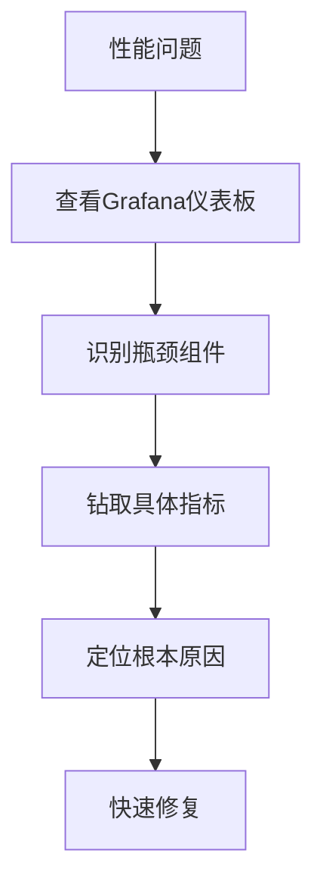

# Prometheus + Grafana监控系统完整学习指南

## 📚 目录

1. [什么是Prometheus和Grafana](#1-什么是prometheus和grafana)
2. [为什么需要监控系统](#2-为什么需要监控系统)
3. [项目中的监控架构分析](#3-项目中的监控架构分析)
4. [一步一步安装配置](#4-一步一步安装配置)
5. [Spring Boot集成详解](#5-spring-boot集成详解)
6. [Prometheus配置深入理解](#6-prometheus配置深入理解)
7. [Grafana仪表板创建](#7-grafana仪表板创建)
8. [告警系统配置](#8-告警系统配置)
9. [实际监控场景应用](#9-实际监控场景应用)
10. [故障排查和优化](#10-故障排查和优化)
11. [实践练习](#11-实践练习)

---

## 1. 什么是Prometheus和Grafana

### 1.1 Prometheus简介

**Prometheus** 是一个开源的系统监控和告警工具，由SoundCloud开发。它通过HTTP协议周期性抓取被监控组件的状态。

#### 核心特点
- 🕐 **时间序列数据**：所有数据都以时间序列形式存储
- 🎯 **Pull模式**：主动拉取数据而非被动接收
- 🔍 **强大查询语言**：PromQL支持复杂的数据查询和聚合
- 📊 **多维度数据模型**：支持标签(Label)进行数据分组

#### 工作原理
```
应用程序 → 暴露/metrics端点 → Prometheus定期抓取 → 存储时间序列数据
```

### 1.2 Grafana简介

**Grafana** 是一个开源的可视化和监控平台，能够查询、可视化、告警和理解你的数据。

#### 核心特点
- 📈 **丰富的图表类型**：折线图、柱状图、饼图、热力图等
- 🔗 **多数据源支持**：Prometheus、MySQL、InfluxDB等
- 🎨 **可定制仪表板**：灵活的布局和样式配置
- 🚨 **告警集成**：与多种通知渠道集成

#### 数据流程
```
Prometheus → Grafana查询数据 → 生成可视化图表 → 展示在仪表板
```

### 1.3 监控技术栈组合

在Mini-UPS项目中的完整监控栈：

```
┌─────────────────┐    ┌─────────────────┐    ┌─────────────────┐
│   Spring Boot   │    │   Prometheus    │    │    Grafana      │
│    应用程序       │────▶│   时间序列DB     │────▶│   可视化平台     │
│   /actuator/    │    │                 │    │                 │
│   prometheus    │    │   数据收集+存储    │    │   仪表板+告警     │
└─────────────────┘    └─────────────────┘    └─────────────────┘
         │                        │                        │
         ▼                        ▼                        ▼
   应用程序指标             Metrics存储              用户界面查看
   - HTTP请求数              - CPU/内存              - 实时图表
   - 数据库连接              - 错误率                - 告警通知
   - 业务指标                - 响应时间              - 历史趋势
```

---

## 2. 为什么需要监控系统

### 2.1 传统问题

在没有监控的情况下，我们面临：

❌ **问题发现滞后**
```
用户投诉 → 开发人员发现问题 → 查看日志 → 分析原因 → 修复
(可能已经影响大量用户)
```

❌ **性能问题难以定位**
```java
// 用户报告：页面很慢
// 开发人员猜测：
// - 是数据库慢？
// - 是网络慢？
// - 是代码逻辑问题？
// - 是服务器资源不足？
```

❌ **容量规划困难**
```
// 什么时候需要扩容？
// 哪个服务成为瓶颈？
// 用户访问模式是什么？
```

### 2.2 监控系统的价值

✅ **问题提前发现**
```
监控指标异常 → 自动告警 → 开发人员提前处理 → 用户无感知
```

✅ **性能问题可视化**


✅ **数据驱动决策**
```yaml
容量规划:
  - CPU使用率趋势: 过去30天平均70%，需要扩容
  - 内存使用: 峰值8GB，配置16GB充足

性能优化:
  - API响应时间: /api/shipments平均300ms，需优化
  - 错误率: 0.1%，在可接受范围内

业务洞察:
  - 追踪号生成QPS: 峰值5000/秒
  - 用户活跃时间: 上午9-11点，下午2-4点
```

### 2.3 Mini-UPS业务监控需求

在我们的包裹配送系统中，需要监控：

#### 系统性能指标
- **HTTP请求**：QPS、响应时间、错误率
- **数据库**：连接池使用率、查询响应时间
- **JVM**：内存使用、GC频率
- **系统资源**：CPU、内存、磁盘

#### 业务指标
- **包裹处理**：创建数量、配送状态、配送时长
- **追踪号生成**：生成速率、号段剩余量
- **用户行为**：登录次数、API调用分布
- **WebSocket连接**：活跃连接数、消息传输率

#### 告警场景
- **严重告警**：应用停止、数据库连接失败、追踪号段耗尽
- **警告告警**：响应时间过长、错误率过高、内存使用过高
- **业务告警**：包裹积压、配送延迟、异常操作

---

## 3. 项目中的监控架构分析

### 3.1 完整架构图

```
┌─────────────────────────────────────────────────────────────────┐
│                         监控架构全景图                            │
└─────────────────────────────────────────────────────────────────┘

┌─────────────────┐  ┌─────────────────┐  ┌─────────────────┐
│   Mini-UPS      │  │   Node Exporter │  │    cAdvisor     │
│   Spring Boot   │  │   系统指标采集    │  │   容器指标采集    │
│                 │  │                 │  │                 │
│ :8081/actuator/ │  │     :9100       │  │     :8080       │
│   prometheus    │  │                 │  │                 │
└─────────┬───────┘  └─────────┬───────┘  └─────────┬───────┘
          │                    │                    │
          │                    │                    │
          ▼                    ▼                    ▼
┌─────────────────────────────────────────────────────────────────┐
│                      Prometheus                                 │
│                    时间序列数据库                                  │
│                      :9090                                      │
│                                                                 │
│  • 每15秒采集指标数据                                             │
│  • 存储15天历史数据                                               │
│  • 执行告警规则评估                                               │
│  • 提供PromQL查询接口                                            │
└─────────────────────────┬───────────────────────────────────────┘
                          │
                          ▼
┌─────────────────────────────────────────────────────────────────┐
│                       Grafana                                   │
│                     可视化平台                                    │
│                       :3001                                     │
│                                                                 │
│  • 连接Prometheus数据源                                          │
│  • 展示实时监控仪表板                                             │
│  • 支持钻取和数据探索                                             │
│  • 集成告警通知                                                  │
└─────────────────────────┬───────────────────────────────────────┘
                          │
                          ▼
┌─────────────────────────────────────────────────────────────────┐
│                    AlertManager                                 │
│                     告警管理                                      │
│                      :9093                                      │
│                                                                 │
│  • 接收Prometheus告警                                            │
│  • 告警分组和抑制                                                 │
│  • 发送通知到多渠道                                               │
│  • 告警静默管理                                                  │
└─────────────────────────────────────────────────────────────────┘
```

### 3.2 数据采集层

#### Mini-UPS应用指标
```yaml
地址: http://localhost:8081/actuator/prometheus
采集间隔: 10秒
指标类型:
  - HTTP请求指标: http_server_requests_total
  - JVM内存指标: jvm_memory_used_bytes
  - 数据库连接: hikaricp_connections_active
  - 自定义业务指标: miniups_shipments_created_total
```

#### 系统级指标 (Node Exporter)
```yaml
地址: http://localhost:9100/metrics
采集间隔: 15秒
指标类型:
  - CPU使用率: node_cpu_seconds_total
  - 内存使用: node_memory_MemTotal_bytes
  - 磁盘使用: node_filesystem_size_bytes
  - 网络流量: node_network_receive_bytes_total
```

#### 容器指标 (cAdvisor)
```yaml
地址: http://localhost:8080/metrics
采集间隔: 15秒
指标类型:
  - 容器CPU: container_cpu_usage_seconds_total
  - 容器内存: container_memory_usage_bytes
  - 容器网络: container_network_receive_bytes_total
  - 容器磁盘IO: container_fs_reads_bytes_total
```

### 3.3 存储层 (Prometheus)

#### 配置文件分析 (`prometheus.yml`)
```yaml
global:
  scrape_interval: 15s      # 全局采集间隔
  evaluation_interval: 15s  # 告警规则评估间隔

# 告警规则文件
rule_files:
  - "rules/*.yml"

# 数据源配置
scrape_configs:
  - job_name: 'mini-ups-backend'
    static_configs:
      - targets: ['host.docker.internal:8081']
    metrics_path: '/actuator/prometheus'
    scrape_interval: 10s    # 应用指标更频繁采集

  - job_name: 'node'
    static_configs:
      - targets: ['node-exporter:9100']

  - job_name: 'cadvisor'
    static_configs:
      - targets: ['cadvisor:8080']
```

#### 数据存储特点
- **时间序列存储**：每个指标按时间顺序存储
- **标签维度**：支持多维度数据查询
- **数据保留**：默认保留15天数据
- **压缩算法**：自动压缩历史数据

### 3.4 可视化层 (Grafana)

#### 仪表板结构
```
Mini-UPS 监控仪表板
├── 应用概览
│   ├── HTTP请求QPS
│   ├── 响应时间分布
│   ├── 错误率趋势
│   └── 活跃用户数
├── 系统资源
│   ├── CPU使用率
│   ├── 内存使用率
│   ├── 磁盘使用率
│   └── 网络吞吐量
├── 业务指标
│   ├── 包裹创建数量
│   ├── 配送状态分布
│   ├── 追踪号生成速率
│   └── WebSocket连接数
└── 数据库性能
    ├── 连接池状态
    ├── 查询响应时间
    ├── 事务数量
    └── 死锁统计
```

---

## 4. 一步一步安装配置

### 4.1 环境准备

#### 检查前置条件
```bash
# 1. 确保Docker已安装
docker --version
# 输出：Docker version 20.10.x

# 2. 确保Docker Compose已安装
docker-compose --version
# 输出：docker-compose version 1.29.x

# 3. 确保端口未被占用
netstat -an | grep -E ":(3001|9090|9093|9100|8080)"
# 如果有输出，说明端口被占用，需要先停止相关服务
```

#### 创建项目目录
```bash
# 进入你的Mini-UPS项目根目录
cd /path/to/mini-ups

# 检查是否有monitoring目录
ls -la monitoring/
```

### 4.2 快速安装（推荐）

使用项目提供的一键安装脚本：

```bash
# 1. 给脚本执行权限
chmod +x monitoring/setup-monitoring.sh

# 2. 运行安装脚本
./monitoring/setup-monitoring.sh
```

安装脚本会自动完成：
- ✅ 创建必要的目录结构
- ✅ 生成Prometheus配置文件
- ✅ 配置Grafana数据源
- ✅ 设置告警规则
- ✅ 启动所有监控服务

### 4.3 手动安装（详细步骤）

如果你想了解每个步骤的细节，可以手动安装：

#### 步骤1：创建目录结构
```bash
mkdir -p monitoring/{prometheus/rules,grafana/{provisioning/datasources,provisioning/dashboards,dashboards},alertmanager}
```

#### 步骤2：配置Prometheus
```bash
# 创建Prometheus主配置文件
cat > monitoring/prometheus/prometheus.yml << 'EOF'
global:
  scrape_interval: 15s
  evaluation_interval: 15s

rule_files:
  - "rules/*.yml"

alerting:
  alertmanagers:
    - static_configs:
        - targets:
          - alertmanager:9093

scrape_configs:
  - job_name: 'mini-ups-backend'
    static_configs:
      - targets: ['host.docker.internal:8081']
    metrics_path: '/actuator/prometheus'
    scrape_interval: 10s

  - job_name: 'prometheus'
    static_configs:
      - targets: ['localhost:9090']

  - job_name: 'node'
    static_configs:
      - targets: ['node-exporter:9100']

  - job_name: 'cadvisor'
    static_configs:
      - targets: ['cadvisor:8080']
EOF
```

#### 步骤3：配置告警规则
```bash
# 创建告警规则文件
cat > monitoring/prometheus/rules/mini-ups-alerts.yml << 'EOF'
groups:
- name: mini-ups-alerts
  rules:
  - alert: HighErrorRate
    expr: |
      (
        sum(rate(http_server_requests_total{status!~"2.."}[5m])) /
        sum(rate(http_server_requests_total[5m]))
      ) > 0.05
    for: 2m
    labels:
      severity: warning
    annotations:
      summary: "Mini-UPS错误率过高"
      description: "错误率已达到 {{ $value | humanizePercentage }}"

  - alert: ApplicationDown
    expr: up{job="mini-ups-backend"} == 0
    for: 1m
    labels:
      severity: critical
    annotations:
      summary: "Mini-UPS应用程序停止运行"
EOF
```

#### 步骤4：配置Grafana数据源
```bash
# 创建Grafana数据源配置
cat > monitoring/grafana/provisioning/datasources/prometheus.yml << 'EOF'
apiVersion: 1

datasources:
  - name: Prometheus
    type: prometheus
    access: proxy
    url: http://prometheus:9090
    isDefault: true
    editable: true
EOF
```

#### 步骤5：启动服务
```bash
cd monitoring
docker-compose -f docker-compose.monitoring.yml up -d
```

### 4.4 验证安装

#### 检查服务状态
```bash
# 查看所有服务状态
docker-compose -f docker-compose.monitoring.yml ps

# 期望输出：
# NAME            STATUS          PORTS
# prometheus      Up             0.0.0.0:9090->9090/tcp
# grafana         Up             0.0.0.0:3001->3000/tcp
# alertmanager    Up             0.0.0.0:9093->9093/tcp
# node-exporter   Up             0.0.0.0:9100->9100/tcp
# cadvisor        Up             0.0.0.0:8080->8080/tcp
```

#### 测试访问
```bash
# 1. 测试Prometheus
curl http://localhost:9090/-/healthy
# 期望输出：Prometheus is Healthy.

# 2. 测试Grafana
curl http://localhost:3001/api/health
# 期望输出：{"database": "ok"}

# 3. 测试应用指标
curl http://localhost:8081/actuator/prometheus | head -10
# 期望输出：应该看到Prometheus格式的指标数据
```

#### 访问Web界面
打开浏览器访问：

1. **Prometheus**: http://localhost:9090
   - 检查Targets页面，确保所有target都是UP状态

2. **Grafana**: http://localhost:3001
   - 默认账号：admin / admin123
   - 进入后应该能看到数据源已配置

3. **AlertManager**: http://localhost:9093
   - 检查告警管理界面

---

## 5. Spring Boot集成详解

### 5.1 依赖配置

在Mini-UPS项目中，已经集成了必要的监控依赖：

```xml
<!-- pom.xml -->
<dependencies>
    <!-- Spring Boot Actuator - 提供监控端点 -->
    <dependency>
        <groupId>org.springframework.boot</groupId>
        <artifactId>spring-boot-starter-actuator</artifactId>
    </dependency>

    <!-- Micrometer Prometheus - Prometheus指标格式 -->
    <dependency>
        <groupId>io.micrometer</groupId>
        <artifactId>micrometer-registry-prometheus</artifactId>
    </dependency>

    <!-- Micrometer Core - 指标收集核心库 -->
    <dependency>
        <groupId>io.micrometer</groupId>
        <artifactId>micrometer-core</artifactId>
    </dependency>
</dependencies>
```

### 5.2 配置文件设置

#### application.yml配置
```yaml
# 监控端点配置
management:
  endpoints:
    web:
      exposure:
        include: health,info,metrics,prometheus  # 暴露监控端点
  endpoint:
    health:
      show-details: when_authorized             # 健康检查详情
    prometheus:
      enabled: true                             # 启用Prometheus端点
  metrics:
    tags:
      application: mini-ups-backend             # 为所有指标添加应用标签
```

这些配置会暴露以下端点：
- `/actuator/health` - 应用健康状态
- `/actuator/metrics` - 原始指标数据
- `/actuator/prometheus` - Prometheus格式指标

### 5.3 自定义指标配置

项目中的`MetricsConfig.java`提供了丰富的自定义指标：

#### 业务指标配置
```java
@Configuration
@EnableScheduling
public class MetricsConfig {

    private final MeterRegistry meterRegistry;

    // 初始化自定义指标
    private void initializeCustomMetrics() {
        // HTTP请求指标
        registerCounter("miniups.http.requests.total",
                       "Total HTTP requests",
                       "endpoint", "method", "status");

        // 业务指标
        registerCounter("miniups.shipments.created.total",
                       "Total shipments created");
        registerCounter("miniups.tracking.updates.total",
                       "Total tracking updates");

        // WebSocket指标
        registerGauge("miniups.websocket.connections.active",
                     "Active WebSocket connections",
                     activeWebSocketConnections);
    }
}
```

#### 指标使用示例
```java
@Service
public class ShipmentService {

    @Autowired
    private MetricsConfig metricsConfig;

    public Shipment createShipment(CreateShipmentDto dto) {
        // 记录业务指标
        metricsConfig.recordShipmentCreated();

        // 创建货运订单的业务逻辑
        Shipment shipment = new Shipment();
        // ... 业务处理

        return shipmentRepository.save(shipment);
    }
}
```

### 5.4 指标类型详解

#### Counter（计数器）
记录只能增加的值，如请求总数、错误总数：

```java
// 记录HTTP请求
public void recordHttpRequest(String endpoint, String method, String status) {
    meterRegistry.counter("miniups.http.requests.total",
            "endpoint", endpoint,
            "method", method,
            "status", status).increment();
}

// 使用示例
recordHttpRequest("/api/shipments", "POST", "200");
```

#### Gauge（仪表盘）
记录可增可减的值，如当前连接数、内存使用量：

```java
// 记录WebSocket连接数
private final AtomicInteger activeConnections = new AtomicInteger(0);

Gauge.builder("miniups.websocket.connections.active", activeConnections, AtomicInteger::get)
     .description("Active WebSocket connections")
     .register(meterRegistry);

// 连接时增加
public void onConnect() {
    activeConnections.incrementAndGet();
}

// 断开时减少
public void onDisconnect() {
    activeConnections.decrementAndGet();
}
```

#### Timer（计时器）
记录操作耗时，如API响应时间、数据库查询时间：

```java
// 记录API响应时间
public void recordApiDuration(String endpoint, long durationMs) {
    meterRegistry.timer("miniups.api.response.time", "endpoint", endpoint)
                 .record(durationMs, TimeUnit.MILLISECONDS);
}

// 使用Timer.Sample更精确计时
Timer.Sample sample = Timer.start(meterRegistry);
try {
    // 执行业务逻辑
    processShipment();
} finally {
    sample.stop(Timer.builder("miniups.shipment.processing.time")
                     .register(meterRegistry));
}
```

### 5.5 自动指标收集

#### JVM指标
Spring Boot Actuator自动收集JVM指标：
```
# 内存使用
jvm_memory_used_bytes{area="heap",id="PS Eden Space"}
jvm_memory_max_bytes{area="heap",id="PS Eden Space"}

# GC统计
jvm_gc_pause_seconds_count{action="end of minor GC",cause="Allocation Failure"}
jvm_gc_pause_seconds_sum{action="end of minor GC",cause="Allocation Failure"}

# 线程统计
jvm_threads_live_threads
jvm_threads_daemon_threads
```

#### HTTP指标
Spring Boot WebMVC自动收集HTTP请求指标：
```
# 请求总数
http_server_requests_total{exception="None",method="GET",outcome="SUCCESS",status="200",uri="/api/shipments"}

# 请求耗时
http_server_requests_seconds_count{exception="None",method="GET",outcome="SUCCESS",status="200",uri="/api/shipments"}
http_server_requests_seconds_sum{exception="None",method="GET",outcome="SUCCESS",status="200",uri="/api/shipments"}
```

#### 数据库连接池指标
HikariCP自动提供连接池监控：
```
# 活跃连接数
hikaricp_connections_active{pool="HikariPool-1"}

# 空闲连接数
hikaricp_connections_idle{pool="HikariPool-1"}

# 连接获取时间
hikaricp_connections_acquire_seconds_count{pool="HikariPool-1"}
```

---

## 6. Prometheus配置深入理解

### 6.1 Prometheus.yml配置文件详解

#### 全局配置 (global)
```yaml
global:
  scrape_interval: 15s      # 默认采集间隔 - 影响数据精度和存储空间
  evaluation_interval: 15s  # 告警规则评估间隔
  external_labels:           # 添加到所有指标的标签
    cluster: 'mini-ups-prod'
    region: 'us-west-1'
```

**配置说明**：
- `scrape_interval`: 更短的间隔提供更高精度，但增加存储开销
- `evaluation_interval`: 决定告警响应速度
- `external_labels`: 用于联邦集群和外部系统集成

#### 告警规则配置 (rule_files)
```yaml
rule_files:
  - "rules/*.yml"              # 告警规则文件路径
  - "rules/mini-ups-*.yml"     # 支持通配符匹配
```

#### 数据源配置 (scrape_configs)

**Mini-UPS应用监控**：
```yaml
- job_name: 'mini-ups-backend'
  static_configs:
    - targets: ['host.docker.internal:8081']    # Docker环境访问宿主机
  metrics_path: '/actuator/prometheus'          # Spring Boot Actuator端点
  scrape_interval: 10s                         # 覆盖全局间隔
  scrape_timeout: 5s                           # 采集超时时间
  params:                                       # URL参数
    'format': ['prometheus']
  basic_auth:                                   # 如果需要认证
    username: 'monitor'
    password: 'secret'
```

**系统监控 (Node Exporter)**：
```yaml
- job_name: 'node'
  static_configs:
    - targets: ['node-exporter:9100']
  relabel_configs:                              # 标签重写
    - source_labels: [__address__]
      target_label: instance
      regex: '(.+)'
      replacement: 'mini-ups-server'
```

**容器监控 (cAdvisor)**：
```yaml
- job_name: 'cadvisor'
  static_configs:
    - targets: ['cadvisor:8080']
  metric_relabel_configs:                       # 指标标签重写
    - source_labels: [__name__]
      regex: 'container_.*'
      target_label: __name__
      replacement: 'miniups_${1}'
```

### 6.2 服务发现配置

#### 静态配置 (static_configs)
适用于固定的服务地址：
```yaml
- job_name: 'mini-ups-services'
  static_configs:
    - targets:
        - 'backend:8081'
        - 'frontend:3000'
      labels:
        service: 'mini-ups'
        environment: 'production'
```

#### 文件服务发现 (file_sd_configs)
适用于动态变化的服务：
```yaml
- job_name: 'dynamic-services'
  file_sd_configs:
    - files:
        - '/etc/prometheus/targets/*.json'
      refresh_interval: 30s
```

目标文件示例(`targets.json`)：
```json
[
  {
    "targets": ["backend-1:8081", "backend-2:8081"],
    "labels": {
      "service": "mini-ups-backend",
      "version": "v1.2.0"
    }
  }
]
```

#### DNS服务发现 (dns_sd_configs)
适用于Kubernetes或Docker Swarm：
```yaml
- job_name: 'kubernetes-services'
  dns_sd_configs:
    - names:
        - 'mini-ups-backend.default.svc.cluster.local'
      type: 'SRV'
      port: 8081
```

### 6.3 标签和重写规则

#### 标签重写 (relabel_configs)
在采集前修改标签：
```yaml
relabel_configs:
  # 1. 只采集特定服务
  - source_labels: [__meta_kubernetes_service_label_app]
    action: keep
    regex: 'mini-ups'

  # 2. 重命名标签
  - source_labels: [__meta_kubernetes_service_name]
    target_label: service_name

  # 3. 添加自定义标签
  - target_label: cluster
    replacement: 'mini-ups-cluster'

  # 4. 修改采集路径
  - source_labels: [__meta_kubernetes_service_annotation_prometheus_io_path]
    action: replace
    target_label: __metrics_path__
    regex: (.+)
```

#### 指标标签重写 (metric_relabel_configs)
在存储前修改指标：
```yaml
metric_relabel_configs:
  # 1. 删除不需要的指标
  - source_labels: [__name__]
    regex: 'jvm_gc_.*'
    action: drop

  # 2. 重命名指标
  - source_labels: [__name__]
    regex: 'http_server_requests_total'
    target_label: __name__
    replacement: 'miniups_http_requests_total'

  # 3. 删除高基数标签
  - regex: 'trace_id'
    action: labeldrop
```

### 6.4 存储配置

#### 存储参数
```yaml
# 命令行参数配置
storage:
  tsdb:
    path: /prometheus                    # 数据存储路径
    retention.time: 15d                  # 数据保留时间
    retention.size: 10GB                 # 数据保留大小
    wal-compression: true                # WAL压缩
    min-block-duration: 2h               # 最小块持续时间
    max-block-duration: 25h              # 最大块持续时间
```

#### 远程存储
```yaml
remote_write:
  - url: "http://victoriametrics:8428/api/v1/write"
    queue_config:
      max_samples_per_send: 1000
      max_shards: 200
      capacity: 2500

remote_read:
  - url: "http://victoriametrics:8428/api/v1/read"
    read_recent: true
```

### 6.5 性能调优

#### 采集优化
```yaml
# 1. 降低高频采集的间隔
- job_name: 'critical-services'
  scrape_interval: 5s          # 关键服务5秒采集

# 2. 增加非关键服务间隔
- job_name: 'batch-jobs'
  scrape_interval: 60s         # 批处理任务60秒采集

# 3. 配置合理的超时时间
global:
  scrape_timeout: 10s          # 不应超过scrape_interval
```

#### 内存优化
```yaml
# 限制采集目标数量
- job_name: 'limited-targets'
  static_configs:
    - targets: ['service1:8080']
  relabel_configs:
    - source_labels: [__address__]
      regex: '.*:(808[0-2])'      # 只采集8080-8082端口
      action: keep
```

---

## 7. Grafana仪表板创建

### 7.1 Grafana基础概念

#### 数据源 (Data Source)
连接到数据存储系统（如Prometheus）的配置：
```yaml
# grafana/provisioning/datasources/prometheus.yml
apiVersion: 1

datasources:
  - name: Prometheus
    type: prometheus
    access: proxy                    # proxy模式通过Grafana服务器访问
    url: http://prometheus:9090      # Prometheus地址
    isDefault: true                  # 设为默认数据源
    basicAuth: false                 # 是否需要基础认证
    editable: true                   # 是否可在UI中编辑
```

#### 仪表板 (Dashboard)
包含多个面板的可视化页面：
- **面板 (Panel)**: 单个图表或表格
- **行 (Row)**: 组织面板的容器
- **变量 (Variable)**: 动态过滤数据
- **注释 (Annotation)**: 标记重要事件

### 7.2 创建第一个仪表板

#### 方法1：通过UI创建

1. **登录Grafana**
   ```
   URL: http://localhost:3001
   账号: admin
   密码: admin123
   ```

2. **创建新仪表板**
   - 点击 "+" → "Dashboard"
   - 点击 "Add new panel"

3. **配置查询**
   ```
   数据源: Prometheus
   查询: http_server_requests_total
   ```

4. **设置面板选项**
   ```
   标题: HTTP请求总数
   类型: Time series
   单位: reqps (requests per second)
   ```

#### 方法2：导入预制仪表板

项目中提供了预制的仪表板JSON文件：

```bash
# 1. 在Grafana中点击 "+" → "Import"
# 2. 上传文件：docs/monitoring/grafana-dashboard-mini-ups.json
# 3. 选择Prometheus数据源
# 4. 点击Import
```

### 7.3 仪表板结构设计

#### Mini-UPS监控仪表板布局

```
┌─────────────────────────────────────────────────────────────────┐
│                        Mini-UPS 监控仪表板                        │
├─────────────────────────────────────────────────────────────────┤
│                          总览指标                                │
├─────────────────┬─────────────────┬─────────────────┬─────────────┤
│   总请求数        │    当前QPS       │    错误率        │   响应时间   │
│   📊 Counter    │   📈 Gauge      │   📊 Gauge      │  📈 Gauge   │
└─────────────────┴─────────────────┴─────────────────┴─────────────┘
├─────────────────────────────────────────────────────────────────┤
│                          性能趋势                                │
├─────────────────────────────┬─────────────────────────────────────┤
│        HTTP请求QPS          │           API响应时间分布             │
│      📈 Time Series        │         📈 Time Series             │
│                           │                                   │
└─────────────────────────────┴─────────────────────────────────────┘
├─────────────────────────────────────────────────────────────────┤
│                          业务指标                                │
├─────────────────────────────┬─────────────────────────────────────┤
│       包裹创建趋势            │          WebSocket连接数             │
│      📈 Time Series        │         📊 Stat                   │
│                           │                                   │
└─────────────────────────────┴─────────────────────────────────────┘
├─────────────────────────────────────────────────────────────────┤
│                          系统资源                                │
├─────────────────┬─────────────────┬─────────────────┬─────────────┤
│   CPU使用率      │    内存使用率     │    磁盘使用率     │   网络流量   │
│   📈 Gauge     │   📈 Gauge      │   📈 Gauge      │  📈 Graph   │
└─────────────────┴─────────────────┴─────────────────┴─────────────┘
```

### 7.4 常用查询语句 (PromQL)

#### HTTP性能监控

**请求QPS**：
```promql
# 每秒请求数
sum(rate(http_server_requests_total[1m])) by (uri)

# 按状态码分组的请求数
sum(rate(http_server_requests_total[1m])) by (status)
```

**响应时间**：
```promql
# 95%分位响应时间
histogram_quantile(0.95,
  sum(rate(http_server_requests_seconds_bucket[5m])) by (le, uri)
)

# 平均响应时间
sum(rate(http_server_requests_seconds_sum[1m])) by (uri) /
sum(rate(http_server_requests_seconds_count[1m])) by (uri)
```

**错误率**：
```promql
# 总体错误率
sum(rate(http_server_requests_total{status!~"2.."}[5m])) /
sum(rate(http_server_requests_total[5m])) * 100

# 按接口分组的错误率
(
  sum(rate(http_server_requests_total{status!~"2.."}[5m])) by (uri) /
  sum(rate(http_server_requests_total[5m])) by (uri)
) * 100
```

#### 系统资源监控

**CPU使用率**：
```promql
# 总CPU使用率
100 - (avg(rate(node_cpu_seconds_total{mode="idle"}[5m])) * 100)

# 各核心CPU使用率
100 - (rate(node_cpu_seconds_total{mode="idle"}[5m]) * 100)
```

**内存使用率**：
```promql
# 内存使用率
(1 - (node_memory_MemAvailable_bytes / node_memory_MemTotal_bytes)) * 100

# 可用内存
node_memory_MemAvailable_bytes / 1024 / 1024 / 1024
```

**磁盘使用率**：
```promql
# 磁盘使用率
(1 - (node_filesystem_avail_bytes / node_filesystem_size_bytes)) * 100

# 按挂载点过滤
(1 - (node_filesystem_avail_bytes{mountpoint="/"} /
      node_filesystem_size_bytes{mountpoint="/"})) * 100
```

#### 业务指标监控

**包裹处理量**：
```promql
# 包裹创建速率
rate(miniups_shipments_created_total[1m])

# 累计创建数量
miniups_shipments_created_total

# 今日创建数量
increase(miniups_shipments_created_total[1d])
```

**WebSocket连接**：
```promql
# 当前连接数
miniups_websocket_connections_active

# 消息发送速率
rate(miniups_websocket_messages_total[1m])
```

**数据库性能**：
```promql
# 活跃连接数
hikaricp_connections_active

# 连接获取时间
histogram_quantile(0.95,
  sum(rate(hikaricp_connections_acquire_seconds_bucket[5m])) by (le)
)

# 连接池使用率
hikaricp_connections_active / hikaricp_connections_max * 100
```

### 7.5 面板配置详解

#### Time Series面板配置
```json
{
  "type": "timeseries",
  "title": "HTTP请求QPS",
  "targets": [
    {
      "expr": "sum(rate(http_server_requests_total[1m])) by (uri)",
      "legendFormat": "{{uri}}",
      "refId": "A"
    }
  ],
  "fieldConfig": {
    "defaults": {
      "unit": "reqps",
      "color": {
        "mode": "palette-classic"
      },
      "custom": {
        "drawStyle": "line",
        "lineInterpolation": "linear",
        "fillOpacity": 10,
        "pointSize": 5
      }
    }
  },
  "options": {
    "legend": {
      "displayMode": "list",
      "placement": "bottom"
    },
    "tooltip": {
      "mode": "multi"
    }
  }
}
```

#### Stat面板配置
```json
{
  "type": "stat",
  "title": "当前QPS",
  "targets": [
    {
      "expr": "sum(rate(http_server_requests_total[1m]))",
      "refId": "A"
    }
  ],
  "fieldConfig": {
    "defaults": {
      "unit": "reqps",
      "mappings": [],
      "thresholds": {
        "mode": "absolute",
        "steps": [
          {"color": "green", "value": null},
          {"color": "yellow", "value": 100},
          {"color": "red", "value": 1000}
        ]
      }
    }
  },
  "options": {
    "colorMode": "background",
    "graphMode": "area",
    "justifyMode": "center",
    "orientation": "horizontal"
  }
}
```

### 7.6 变量和模板

#### 定义变量
```
名称: instance
类型: Query
查询: label_values(up, instance)
刷新: On Dashboard Load
```

#### 使用变量
```promql
# 在查询中使用变量
up{instance="$instance"}

# 多选变量
up{instance=~"$instance"}
```

#### 常用变量模板
```
# 服务实例
label_values(up{job="mini-ups-backend"}, instance)

# 接口URI
label_values(http_server_requests_total, uri)

# 时间范围
5m, 15m, 30m, 1h, 6h, 12h, 1d
```

---

## 8. 告警系统配置

### 8.1 告警规则设计

#### 告警规则文件结构
```yaml
# prometheus/rules/mini-ups-alerts.yml
groups:
- name: mini-ups-alerts          # 告警组名称
  interval: 30s                  # 评估间隔
  rules:
  - alert: AlertName             # 告警名称
    expr: promql_expression      # PromQL表达式
    for: 2m                      # 持续时间
    labels:                      # 告警标签
      severity: warning
      service: mini-ups
    annotations:                 # 告警注释
      summary: "简短描述"
      description: "详细描述"
```

#### 告警级别定义

**Critical (严重)**：
影响服务可用性，需要立即处理
```yaml
- alert: ApplicationDown
  expr: up{job="mini-ups-backend"} == 0
  for: 1m
  labels:
    severity: critical
    service: mini-ups
  annotations:
    summary: "Mini-UPS应用程序停止运行"
    description: "Mini-UPS后端服务已停止响应超过1分钟"
```

**Warning (警告)**：
性能下降或异常，需要关注
```yaml
- alert: HighResponseTime
  expr: |
    histogram_quantile(0.95,
      sum(rate(http_server_requests_seconds_bucket[5m])) by (le)
    ) > 0.5
  for: 3m
  labels:
    severity: warning
    service: mini-ups
  annotations:
    summary: "API响应时间过长"
    description: "95%的请求响应时间超过500ms: {{ $value }}s"
```

**Info (信息)**：
一般信息通知，不需要立即处理
```yaml
- alert: HighTrafficVolume
  expr: sum(rate(http_server_requests_total[1m])) > 1000
  for: 5m
  labels:
    severity: info
    service: mini-ups
  annotations:
    summary: "流量高峰"
    description: "当前QPS达到{{ $value }}，请注意系统负载"
```

### 8.2 常用告警规则

#### 应用可用性告警
```yaml
# 应用停止运行
- alert: ApplicationDown
  expr: up{job="mini-ups-backend"} == 0
  for: 1m
  labels:
    severity: critical
  annotations:
    summary: "应用停止运行"

# 健康检查失败
- alert: HealthCheckFailed
  expr: up{job="mini-ups-backend"} == 0 OR
        http_server_requests_total{uri="/actuator/health",status!="200"} > 0
  for: 2m
  labels:
    severity: critical
  annotations:
    summary: "健康检查失败"
```

#### 性能告警
```yaml
# 高错误率
- alert: HighErrorRate
  expr: |
    (
      sum(rate(http_server_requests_total{status!~"2.."}[5m])) /
      sum(rate(http_server_requests_total[5m]))
    ) > 0.05
  for: 2m
  labels:
    severity: warning
  annotations:
    summary: "错误率过高: {{ $value | humanizePercentage }}"

# 响应时间过长
- alert: HighResponseTime
  expr: |
    histogram_quantile(0.95,
      sum(rate(http_server_requests_seconds_bucket[5m])) by (le)
    ) > 0.5
  for: 3m
  labels:
    severity: warning
  annotations:
    summary: "响应时间过长: {{ $value }}s"

# QPS异常
- alert: UnusualTrafficPattern
  expr: |
    abs(
      sum(rate(http_server_requests_total[5m])) -
      avg_over_time(sum(rate(http_server_requests_total[5m]))[1h:5m])
    ) / avg_over_time(sum(rate(http_server_requests_total[5m]))[1h:5m]) > 2
  for: 5m
  labels:
    severity: warning
  annotations:
    summary: "流量模式异常"
```

#### 系统资源告警
```yaml
# CPU使用率过高
- alert: HighCPUUsage
  expr: 100 - (avg(rate(node_cpu_seconds_total{mode="idle"}[5m])) * 100) > 80
  for: 5m
  labels:
    severity: warning
  annotations:
    summary: "CPU使用率过高: {{ $value }}%"

# 内存使用率过高
- alert: HighMemoryUsage
  expr: (1 - (node_memory_MemAvailable_bytes / node_memory_MemTotal_bytes)) > 0.9
  for: 5m
  labels:
    severity: critical
  annotations:
    summary: "内存使用率过高: {{ $value | humanizePercentage }}"

# 磁盘空间不足
- alert: LowDiskSpace
  expr: (1 - (node_filesystem_avail_bytes / node_filesystem_size_bytes)) > 0.85
  for: 5m
  labels:
    severity: warning
  annotations:
    summary: "磁盘空间不足: {{ $labels.mountpoint }} 使用率 {{ $value | humanizePercentage }}"
```

#### 业务告警
```yaml
# 追踪号段剩余不足
- alert: LowTrackingIDSegment
  expr: leaf_segment_remaining{biz_tag="tracking_number"} < 1000
  for: 1m
  labels:
    severity: critical
  annotations:
    summary: "追踪号段剩余不足"
    description: "剩余数量: {{ $value }} 个"

# WebSocket连接数异常
- alert: WebSocketConnectionsHigh
  expr: miniups_websocket_connections_active > 100
  for: 2m
  labels:
    severity: warning
  annotations:
    summary: "WebSocket连接数过高: {{ $value }}"

# 数据库连接池告警
- alert: DatabaseConnectionsHigh
  expr: hikaricp_connections_active / hikaricp_connections_max > 0.8
  for: 3m
  labels:
    severity: warning
  annotations:
    summary: "数据库连接池使用率过高: {{ $value | humanizePercentage }}"
```

### 8.3 AlertManager配置

#### 基础配置文件
```yaml
# alertmanager/alertmanager.yml
global:
  smtp_smarthost: 'localhost:587'
  smtp_from: 'alerts@mini-ups.com'
  smtp_auth_username: 'alerts@mini-ups.com'
  smtp_auth_password: 'password'

# 路由配置
route:
  group_by: ['alertname', 'cluster', 'service']    # 分组字段
  group_wait: 10s                                  # 分组等待时间
  group_interval: 10s                              # 分组间隔
  repeat_interval: 1h                              # 重复间隔
  receiver: 'default-receiver'                     # 默认接收器

  routes:
    # 严重告警立即发送
    - match:
        severity: critical
      receiver: 'critical-alerts'
      group_wait: 0s
      repeat_interval: 5m

    # 警告告警正常处理
    - match:
        severity: warning
      receiver: 'warning-alerts'
      repeat_interval: 30m

    # 业务告警单独处理
    - match:
        service: mini-ups
      receiver: 'business-alerts'

# 接收器配置
receivers:
  # 默认接收器
  - name: 'default-receiver'
    webhook_configs:
      - url: 'http://localhost:5001/webhook'
        send_resolved: true

  # 严重告警接收器
  - name: 'critical-alerts'
    email_configs:
      - to: 'ops-team@mini-ups.com'
        subject: '🚨 严重告警: {{ .GroupLabels.alertname }}'
        body: |
          {{ range .Alerts }}
          告警: {{ .Annotations.summary }}
          描述: {{ .Annotations.description }}
          时间: {{ .StartsAt }}
          标签: {{ range .Labels.SortedPairs }}{{ .Name }}={{ .Value }} {{ end }}
          {{ end }}
    slack_configs:
      - api_url: 'https://hooks.slack.com/services/YOUR/SLACK/WEBHOOK'
        channel: '#alerts-critical'
        title: '🚨 {{ .GroupLabels.alertname }}'
        text: '{{ range .Alerts }}{{ .Annotations.summary }}{{ end }}'

  # 警告告警接收器
  - name: 'warning-alerts'
    email_configs:
      - to: 'dev-team@mini-ups.com'
        subject: '⚠️ 警告告警: {{ .GroupLabels.alertname }}'

  # 业务告警接收器
  - name: 'business-alerts'
    webhook_configs:
      - url: 'http://mini-ups-backend:8081/api/internal/alerts'
        send_resolved: true
        http_config:
          basic_auth:
            username: 'alert-webhook'
            password: 'secret'

# 抑制规则
inhibit_rules:
  # 严重告警抑制警告告警
  - source_match:
      severity: 'critical'
    target_match:
      severity: 'warning'
    equal: ['alertname', 'instance']
```

#### 告警模板配置
```yaml
# templates/email.tmpl
{{ define "email.default.subject" }}
[{{ .Status | toUpper }}] {{ .GroupLabels.alertname }} ({{ len .Alerts }} alerts)
{{ end }}

{{ define "email.default.html" }}
<html>
<head>
  <style>
    .alert { padding: 10px; margin: 5px; border-left: 4px solid; }
    .critical { border-color: #d9534f; background-color: #f2dede; }
    .warning { border-color: #f0ad4e; background-color: #fcf8e3; }
    .resolved { border-color: #5cb85c; background-color: #dff0d8; }
  </style>
</head>
<body>
  <h2>Mini-UPS 监控告警</h2>
  {{ range .Alerts }}
  <div class="alert {{ .Labels.severity }}">
    <h3>{{ .Annotations.summary }}</h3>
    <p><strong>描述:</strong> {{ .Annotations.description }}</p>
    <p><strong>时间:</strong> {{ .StartsAt.Format "2006-01-02 15:04:05" }}</p>
    <p><strong>标签:</strong>
      {{ range .Labels.SortedPairs }}
        <span>{{ .Name }}={{ .Value }}</span>
      {{ end }}
    </p>
  </div>
  {{ end }}
</body>
</html>
{{ end }}
```

### 8.4 通知渠道配置

#### 邮件通知
```yaml
email_configs:
  - to: 'alerts@mini-ups.com'
    from: 'prometheus@mini-ups.com'
    smarthost: 'smtp.gmail.com:587'
    auth_username: 'prometheus@mini-ups.com'
    auth_password: 'app-password'
    subject: '{{ template "email.default.subject" . }}'
    html: '{{ template "email.default.html" . }}'
    headers:
      Priority: 'high'
      X-Custom-Header: 'Mini-UPS-Alert'
```

#### Slack通知
```yaml
slack_configs:
  - api_url: 'https://hooks.slack.com/services/YOUR/SLACK/WEBHOOK'
    channel: '#alerts'
    username: 'Prometheus'
    icon_emoji: ':warning:'
    title: '{{ .GroupLabels.alertname }}'
    text: |
      {{ range .Alerts }}
      *{{ .Annotations.summary }}*
      {{ .Annotations.description }}
      _Labels:_ {{ range .Labels.SortedPairs }}`{{ .Name }}={{ .Value }}` {{ end }}
      {{ end }}
    send_resolved: true
```

#### 企业微信通知
```yaml
wechat_configs:
  - corp_id: 'YOUR_CORP_ID'
    agent_id: 'YOUR_AGENT_ID'
    api_secret: 'YOUR_API_SECRET'
    to_party: '1'
    message: |
      {{ range .Alerts }}
      告警: {{ .Annotations.summary }}
      描述: {{ .Annotations.description }}
      时间: {{ .StartsAt.Format "2006-01-02 15:04:05" }}
      {{ end }}
```

#### 自定义Webhook
```yaml
webhook_configs:
  - url: 'http://mini-ups-backend:8081/api/webhooks/alerts'
    send_resolved: true
    http_config:
      bearer_token: 'your-api-token'
    max_alerts: 10
```

对应的webhook处理代码：
```java
@RestController
@RequestMapping("/api/webhooks")
public class AlertWebhookController {

    @PostMapping("/alerts")
    public ResponseEntity<String> handleAlert(@RequestBody AlertWebhookPayload payload) {
        for (Alert alert : payload.getAlerts()) {
            // 处理告警逻辑
            if ("critical".equals(alert.getLabels().get("severity"))) {
                // 严重告警处理
                sendSMSNotification(alert);
                createIncident(alert);
            } else {
                // 一般告警处理
                logAlert(alert);
            }
        }
        return ResponseEntity.ok("Alert processed");
    }
}
```

---

## 9. 实际监控场景应用

### 9.1 应用启动监控

#### 场景描述
监控Mini-UPS应用的启动过程，确保所有组件正常初始化。

#### 监控指标
```promql
# 应用状态
up{job="mini-ups-backend"}

# 启动时间
process_start_time_seconds{job="mini-ups-backend"}

# 数据库连接池初始化
hikaricp_connections_total{pool="HikariPool-1"}

# JVM启动后内存使用
jvm_memory_used_bytes{area="heap"}
```

#### 仪表板配置
```json
{
  "title": "应用启动监控",
  "panels": [
    {
      "title": "应用状态",
      "type": "stat",
      "targets": [{"expr": "up{job=\"mini-ups-backend\"}"}],
      "fieldConfig": {
        "mappings": [
          {"options": {"0": {"text": "DOWN", "color": "red"}}},
          {"options": {"1": {"text": "UP", "color": "green"}}}
        ]
      }
    },
    {
      "title": "启动时长",
      "type": "stat",
      "targets": [{"expr": "time() - process_start_time_seconds"}],
      "fieldConfig": {"unit": "s"}
    }
  ]
}
```

#### 告警配置
```yaml
- alert: ApplicationStartupSlow
  expr: (time() - process_start_time_seconds) > 300
  for: 1m
  labels:
    severity: warning
  annotations:
    summary: "应用启动缓慢"
    description: "应用启动时间超过5分钟"
```

### 9.2 API性能监控

#### 场景描述
实时监控各个API接口的性能表现，识别慢接口和错误接口。

#### 核心指标监控

**请求速率监控**：
```promql
# 总体QPS
sum(rate(http_server_requests_total[1m]))

# 按接口分组QPS
sum(rate(http_server_requests_total[1m])) by (uri)

# 按状态码分组QPS
sum(rate(http_server_requests_total[1m])) by (status)
```

**响应时间监控**：
```promql
# P50响应时间
histogram_quantile(0.50, sum(rate(http_server_requests_seconds_bucket[5m])) by (le, uri))

# P95响应时间
histogram_quantile(0.95, sum(rate(http_server_requests_seconds_bucket[5m])) by (le, uri))

# P99响应时间
histogram_quantile(0.99, sum(rate(http_server_requests_seconds_bucket[5m])) by (le, uri))
```

**错误率监控**：
```promql
# 按接口错误率
(
  sum(rate(http_server_requests_total{status!~"2.."}[5m])) by (uri) /
  sum(rate(http_server_requests_total[5m])) by (uri)
) * 100

# 4xx错误率
(
  sum(rate(http_server_requests_total{status=~"4.."}[5m])) by (uri) /
  sum(rate(http_server_requests_total[5m])) by (uri)
) * 100

# 5xx错误率
(
  sum(rate(http_server_requests_total{status=~"5.."}[5m])) by (uri) /
  sum(rate(http_server_requests_total[5m])) by (uri)
) * 100
```

#### 实际仪表板示例
```json
{
  "title": "API性能监控",
  "panels": [
    {
      "title": "接口QPS Top 10",
      "type": "timeseries",
      "targets": [
        {
          "expr": "topk(10, sum(rate(http_server_requests_total[1m])) by (uri))",
          "legendFormat": "{{uri}}"
        }
      ]
    },
    {
      "title": "响应时间分布",
      "type": "timeseries",
      "targets": [
        {
          "expr": "histogram_quantile(0.50, sum(rate(http_server_requests_seconds_bucket[5m])) by (le))",
          "legendFormat": "P50"
        },
        {
          "expr": "histogram_quantile(0.95, sum(rate(http_server_requests_seconds_bucket[5m])) by (le))",
          "legendFormat": "P95"
        },
        {
          "expr": "histogram_quantile(0.99, sum(rate(http_server_requests_seconds_bucket[5m])) by (le))",
          "legendFormat": "P99"
        }
      ]
    },
    {
      "title": "慢接口 Top 10",
      "type": "table",
      "targets": [
        {
          "expr": "topk(10, histogram_quantile(0.95, sum(rate(http_server_requests_seconds_bucket[5m])) by (le, uri)))",
          "format": "table"
        }
      ]
    }
  ]
}
```

### 9.3 业务指标监控

#### 包裹处理监控

**创建和配送趋势**：
```promql
# 包裹创建速率
rate(miniups_shipments_created_total[1m])

# 包裹配送速率
rate(miniups_shipments_delivered_total[1m])

# 累计创建数量
miniups_shipments_created_total

# 今日创建数量
increase(miniups_shipments_created_total[1d])

# 配送成功率
(
  miniups_shipments_delivered_total /
  miniups_shipments_created_total
) * 100
```

**追踪号生成监控**：
```promql
# 追踪号生成速率
rate(leaf_segment_generated_total{biz_tag="tracking_number"}[1m])

# 号段剩余量
leaf_segment_remaining{biz_tag="tracking_number"}

# 号段预加载成功率
(
  rate(leaf_segment_preload_successes_total[5m]) /
  (rate(leaf_segment_preload_successes_total[5m]) + rate(leaf_segment_preload_failures_total[5m]))
) * 100
```

#### 实时业务仪表板
```json
{
  "title": "业务监控仪表板",
  "panels": [
    {
      "title": "包裹处理统计",
      "type": "stat",
      "gridPos": {"h": 4, "w": 6, "x": 0, "y": 0},
      "targets": [
        {
          "expr": "miniups_shipments_created_total",
          "legendFormat": "累计创建"
        },
        {
          "expr": "miniups_shipments_delivered_total",
          "legendFormat": "累计配送"
        }
      ]
    },
    {
      "title": "今日业务量",
      "type": "timeseries",
      "gridPos": {"h": 8, "w": 12, "x": 0, "y": 4},
      "targets": [
        {
          "expr": "increase(miniups_shipments_created_total[1h])",
          "legendFormat": "包裹创建"
        },
        {
          "expr": "increase(miniups_shipments_delivered_total[1h])",
          "legendFormat": "包裹配送"
        }
      ]
    },
    {
      "title": "追踪号系统状态",
      "type": "timeseries",
      "gridPos": {"h": 8, "w": 12, "x": 12, "y": 4},
      "targets": [
        {
          "expr": "leaf_segment_remaining{biz_tag=\"tracking_number\"}",
          "legendFormat": "剩余号段"
        },
        {
          "expr": "rate(leaf_segment_generated_total{biz_tag=\"tracking_number\"}[1m]) * 60",
          "legendFormat": "生成速率/分钟"
        }
      ]
    }
  ]
}
```

### 9.4 系统容量监控

#### 资源使用趋势
```promql
# CPU使用率趋势
avg_over_time((100 - avg(rate(node_cpu_seconds_total{mode="idle"}[5m])) * 100)[7d:1h])

# 内存使用率趋势
avg_over_time(((1 - (node_memory_MemAvailable_bytes / node_memory_MemTotal_bytes)) * 100)[7d:1h])

# 磁盘使用率增长
deriv((1 - (node_filesystem_avail_bytes / node_filesystem_size_bytes))[7d:1h]) * 3600 * 24
```

#### 容量预测
```promql
# 基于7天趋势预测30天后的磁盘使用率
predict_linear(node_filesystem_avail_bytes[7d], 30*24*3600)

# 基于内存使用趋势预测
predict_linear(node_memory_MemAvailable_bytes[7d], 7*24*3600)
```

#### 容量告警
```yaml
- alert: DiskWillFillIn7Days
  expr: |
    predict_linear(node_filesystem_avail_bytes{mountpoint="/"}[7d], 7*24*3600) < 0
  for: 1h
  labels:
    severity: warning
  annotations:
    summary: "磁盘空间将在7天内耗尽"
    description: "根据当前使用趋势，磁盘将在7天内用完"

- alert: MemoryGrowthTooFast
  expr: |
    deriv(node_memory_MemAvailable_bytes[24h]) < -1073741824  # -1GB/day
  for: 2h
  labels:
    severity: warning
  annotations:
    summary: "内存使用量增长过快"
    description: "内存使用量每天增长超过1GB"
```

### 9.5 故障检测场景

#### 数据库连接问题
```promql
# 数据库连接数异常
hikaricp_connections_active / hikaricp_connections_max > 0.9

# 连接获取时间过长
histogram_quantile(0.95, sum(rate(hikaricp_connections_acquire_seconds_bucket[5m])) by (le)) > 1

# 连接超时
rate(hikaricp_connections_timeout_total[5m]) > 0
```

#### 内存泄漏检测
```promql
# JVM堆内存使用持续增长
deriv(jvm_memory_used_bytes{area="heap"}[1h]) > 1048576  # 每小时增长1MB

# 老年代使用率持续高位
jvm_memory_used_bytes{area="heap",id=~".*Old.*"} /
jvm_memory_max_bytes{area="heap",id=~".*Old.*"} > 0.8

# GC频率异常
rate(jvm_gc_pause_seconds_count[5m]) > 10
```

#### 网络问题检测
```promql
# 网络错误率
rate(node_network_receive_errs_total[5m]) + rate(node_network_transmit_errs_total[5m]) > 0

# 网络带宽使用率
(
  rate(node_network_receive_bytes_total[5m]) +
  rate(node_network_transmit_bytes_total[5m])
) * 8 / (100 * 1024 * 1024) > 0.8  # 80% of 100Mbps
```

---

## 10. 故障排查和优化

### 10.1 常见监控问题

#### 问题1：Prometheus无法采集到指标

**现象**：
- Targets页面显示DOWN状态
- 查询返回空结果

**排查步骤**：
```bash
# 1. 检查Prometheus配置
cat monitoring/prometheus/prometheus.yml

# 2. 检查网络连通性
curl http://localhost:8081/actuator/prometheus

# 3. 检查Prometheus日志
docker logs prometheus

# 4. 检查防火墙和端口
netstat -an | grep 8081
```

**解决方案**：
```yaml
# 修复配置文件中的地址
scrape_configs:
  - job_name: 'mini-ups-backend'
    static_configs:
      - targets: ['host.docker.internal:8081']  # Docker环境
      # - targets: ['localhost:8081']            # 本地环境
```

#### 问题2：Grafana无法连接Prometheus

**现象**：
- 数据源测试失败
- 仪表板显示"No Data"

**排查步骤**：
```bash
# 1. 在Grafana容器中测试连接
docker exec -it grafana curl http://prometheus:9090/api/v1/status/config

# 2. 检查网络配置
docker network ls
docker network inspect monitoring_monitoring

# 3. 检查数据源配置
cat monitoring/grafana/provisioning/datasources/prometheus.yml
```

**解决方案**：
```yaml
# 确保数据源配置正确
datasources:
  - name: Prometheus
    type: prometheus
    url: http://prometheus:9090  # 容器间通信使用服务名
    access: proxy               # 通过Grafana代理访问
```

#### 问题3：告警不生效

**现象**：
- 告警规则显示正常但不发送通知
- AlertManager没有收到告警

**排查步骤**：
```bash
# 1. 检查告警规则语法
promtool check rules monitoring/prometheus/rules/*.yml

# 2. 查看Prometheus告警页面
# 访问 http://localhost:9090/alerts

# 3. 检查AlertManager配置
docker logs alertmanager

# 4. 测试告警规则
curl -X POST http://localhost:9093/api/v1/alerts
```

**解决方案**：
```yaml
# 确保告警规则语法正确
- alert: TestAlert
  expr: up == 1  # 简单的测试表达式
  for: 0m        # 立即触发
  labels:
    severity: info
  annotations:
    summary: "测试告警"
```

### 10.2 性能优化

#### Prometheus性能调优

**存储优化**：
```bash
# 调整数据保留策略
--storage.tsdb.retention.time=15d        # 保留15天数据
--storage.tsdb.retention.size=10GB       # 限制存储大小

# WAL压缩
--storage.tsdb.wal-compression           # 启用WAL压缩

# 块大小优化
--storage.tsdb.min-block-duration=2h     # 最小块2小时
--storage.tsdb.max-block-duration=25h    # 最大块25小时
```

**采集优化**：
```yaml
# 降低高基数指标的采集频率
- job_name: 'low-priority'
  scrape_interval: 60s    # 低优先级服务60秒采集

- job_name: 'high-priority'
  scrape_interval: 5s     # 高优先级服务5秒采集

# 过滤不需要的指标
metric_relabel_configs:
  - source_labels: [__name__]
    regex: 'go_.*|process_.*'  # 过滤Go运行时指标
    action: drop
```

**查询优化**：
```promql
# 避免高基数查询
# 不好的查询
sum(http_server_requests_total) by (uri, method, status, user_id)

# 好的查询
sum(http_server_requests_total) by (uri, status)

# 使用rate而不是increase
rate(http_server_requests_total[5m])  # 推荐
increase(http_server_requests_total[5m]) / 300  # 避免

# 限制时间范围
http_server_requests_total[5m]   # 推荐
http_server_requests_total[24h]  # 避免大范围查询
```

#### Grafana性能调优

**查询优化**：
```json
{
  "targets": [
    {
      "expr": "rate(http_server_requests_total[5m])",
      "interval": "30s",     // 设置合理的查询间隔
      "maxDataPoints": 100   // 限制数据点数量
    }
  ],
  "refresh": "30s"         // 设置刷新间隔
}
```

**仪表板优化**：
```json
{
  "time": {
    "from": "now-1h",      // 默认显示1小时数据
    "to": "now"
  },
  "refresh": "30s",        // 30秒刷新一次
  "panels": [
    {
      "maxDataPoints": 100,  // 限制每个面板的数据点
      "cacheTimeout": "300"  // 缓存5分钟
    }
  ]
}
```

### 10.3 监控数据的备份和恢复

#### Prometheus数据备份
```bash
# 1. 创建快照
curl -XPOST http://localhost:9090/api/v1/admin/tsdb/snapshot

# 2. 备份数据目录
docker run --rm -v prometheus_data:/source -v $(pwd)/backup:/backup alpine \
  tar czf /backup/prometheus-$(date +%Y%m%d).tar.gz -C /source .

# 3. 自动备份脚本
#!/bin/bash
BACKUP_DIR="/backup/prometheus"
DATE=$(date +%Y%m%d-%H%M%S)

# 创建快照
SNAPSHOT=$(curl -s -XPOST http://localhost:9090/api/v1/admin/tsdb/snapshot | jq -r .data.name)

# 备份快照
docker run --rm \
  -v prometheus_data:/source \
  -v ${BACKUP_DIR}:/backup \
  alpine tar czf /backup/prometheus-${DATE}.tar.gz -C /source/snapshots/${SNAPSHOT} .

# 清理旧快照
curl -XPOST http://localhost:9090/api/v1/admin/tsdb/delete_series?match[]={__name__=~".+"}
curl -XPOST http://localhost:9090/api/v1/admin/tsdb/clean_tombstones
```

#### Grafana配置备份
```bash
# 1. 备份仪表板
curl -H "Authorization: Bearer YOUR_API_KEY" \
  http://localhost:3001/api/search | \
  jq -r '.[].uri' | \
  xargs -I {} curl -H "Authorization: Bearer YOUR_API_KEY" \
    http://localhost:3001/api/dashboards/{} > dashboards_backup.json

# 2. 备份数据源
curl -H "Authorization: Bearer YOUR_API_KEY" \
  http://localhost:3001/api/datasources > datasources_backup.json

# 3. 备份Grafana数据库
docker exec grafana grafana-cli admin export-dashboard > grafana_export.json
```

### 10.4 监控系统的监控

#### 监控Prometheus自身
```promql
# Prometheus配置重载
prometheus_config_last_reload_successful

# TSDB状态
prometheus_tsdb_head_samples_appended_total
prometheus_tsdb_head_series

# 查询性能
prometheus_engine_query_duration_seconds
prometheus_engine_queries_concurrent_max

# 存储使用
prometheus_tsdb_symbol_table_size_bytes
prometheus_tsdb_head_chunks
```

#### 监控Grafana状态
```promql
# Grafana指标（如果启用了指标采集）
grafana_database_conn_max
grafana_database_conn_in_use
grafana_api_dashboard_get_duration_seconds
```

#### 自监控告警
```yaml
- alert: PrometheusConfigReloadFailed
  expr: prometheus_config_last_reload_successful == 0
  for: 5m
  labels:
    severity: critical
  annotations:
    summary: "Prometheus配置重载失败"

- alert: PrometheusHighQueryLatency
  expr: histogram_quantile(0.95, prometheus_engine_query_duration_seconds_bucket) > 1
  for: 5m
  labels:
    severity: warning
  annotations:
    summary: "Prometheus查询延迟过高"
```

---

## 11. 实践练习

### 11.1 基础练习：配置第一个监控指标

#### 练习目标
在你的Spring Boot应用中添加自定义指标，并在Grafana中展示。

#### 步骤1：添加自定义指标
```java
@Component
public class UserActivityTracker {

    private final Counter userLoginCounter;
    private final Timer requestTimer;

    public UserActivityTracker(MeterRegistry meterRegistry) {
        this.userLoginCounter = Counter.builder("miniups.user.login.total")
                .description("Total user logins")
                .tag("type", "success")
                .register(meterRegistry);

        this.requestTimer = Timer.builder("miniups.custom.request.duration")
                .description("Custom request duration")
                .register(meterRegistry);
    }

    public void recordLogin(String userType) {
        userLoginCounter.increment(Tags.of("user_type", userType));
    }

    public void recordRequest(Runnable operation) {
        Timer.Sample sample = Timer.start();
        try {
            operation.run();
        } finally {
            sample.stop(requestTimer);
        }
    }
}
```

#### 步骤2：在业务代码中使用
```java
@RestController
public class AuthController {

    @Autowired
    private UserActivityTracker activityTracker;

    @PostMapping("/api/auth/login")
    public ResponseEntity<LoginResponse> login(@RequestBody LoginRequest request) {
        return activityTracker.recordRequest(() -> {
            // 登录逻辑
            User user = authenticateUser(request);

            // 记录登录事件
            activityTracker.recordLogin(user.getUserType());

            return ResponseEntity.ok(new LoginResponse(user));
        });
    }
}
```

#### 步骤3：验证指标
```bash
# 访问指标端点
curl http://localhost:8081/actuator/prometheus | grep "miniups_user_login"

# 期望输出：
# miniups_user_login_total{type="success",user_type="admin"} 5.0
# miniups_user_login_total{type="success",user_type="customer"} 23.0
```

#### 步骤4：在Grafana中创建图表
1. 打开Grafana (http://localhost:3001)
2. 创建新仪表板
3. 添加面板，查询：`rate(miniups_user_login_total[1m])`
4. 设置图例：`{{user_type}}`

### 11.2 进阶练习：创建综合监控仪表板

#### 练习目标
创建一个包含系统、应用、业务三层指标的综合监控仪表板。

#### 仪表板结构设计
```json
{
  "title": "Mini-UPS 综合监控",
  "tags": ["mini-ups", "monitoring"],
  "time": {"from": "now-1h", "to": "now"},
  "refresh": "30s",
  "panels": [
    {
      "title": "系统概览",
      "type": "row",
      "panels": [
        {
          "title": "CPU使用率",
          "type": "gauge",
          "targets": [{
            "expr": "100 - (avg(rate(node_cpu_seconds_total{mode=\"idle\"}[5m])) * 100)"
          }],
          "fieldConfig": {
            "min": 0,
            "max": 100,
            "thresholds": [
              {"color": "green", "value": 0},
              {"color": "yellow", "value": 70},
              {"color": "red", "value": 90}
            ]
          }
        },
        {
          "title": "内存使用率",
          "type": "gauge",
          "targets": [{
            "expr": "(1 - (node_memory_MemAvailable_bytes / node_memory_MemTotal_bytes)) * 100"
          }]
        }
      ]
    },
    {
      "title": "应用性能",
      "type": "row",
      "panels": [
        {
          "title": "QPS趋势",
          "type": "timeseries",
          "targets": [{
            "expr": "sum(rate(http_server_requests_total[1m]))",
            "legendFormat": "总QPS"
          }]
        },
        {
          "title": "响应时间分布",
          "type": "timeseries",
          "targets": [
            {
              "expr": "histogram_quantile(0.50, sum(rate(http_server_requests_seconds_bucket[5m])) by (le))",
              "legendFormat": "P50"
            },
            {
              "expr": "histogram_quantile(0.95, sum(rate(http_server_requests_seconds_bucket[5m])) by (le))",
              "legendFormat": "P95"
            }
          ]
        }
      ]
    },
    {
      "title": "业务指标",
      "type": "row",
      "panels": [
        {
          "title": "包裹处理量",
          "type": "stat",
          "targets": [
            {
              "expr": "miniups_shipments_created_total",
              "legendFormat": "创建总数"
            },
            {
              "expr": "miniups_shipments_delivered_total",
              "legendFormat": "配送总数"
            }
          ]
        }
      ]
    }
  ]
}
```

### 11.3 高级练习：实现SLI/SLO监控

#### 练习目标
实现服务水平指标(SLI)和服务水平目标(SLO)的监控和告警。

#### 定义SLO
```yaml
# Mini-UPS SLO定义
availability_slo: 99.9%     # 可用性SLO
latency_slo: 95%的请求<500ms  # 延迟SLO
error_rate_slo: <1%         # 错误率SLO
```

#### 实现SLI指标
```java
@Component
public class SLITracker {

    private final MeterRegistry meterRegistry;

    public SLITracker(MeterRegistry meterRegistry) {
        this.meterRegistry = meterRegistry;
        initializeSLIMetrics();
    }

    private void initializeSLIMetrics() {
        // 可用性SLI
        Gauge.builder("sli.availability")
                .description("Service availability SLI")
                .register(meterRegistry, this, this::calculateAvailability);

        // 延迟SLI
        Gauge.builder("sli.latency")
                .description("Latency SLI (% of requests under 500ms)")
                .register(meterRegistry, this, this::calculateLatency);

        // 错误率SLI
        Gauge.builder("sli.error_rate")
                .description("Error rate SLI")
                .register(meterRegistry, this, this::calculateErrorRate);
    }

    private double calculateAvailability(SLITracker tracker) {
        // 计算可用性：成功请求 / 总请求
        // 实现计算逻辑
        return 99.95; // 示例值
    }

    private double calculateLatency(SLITracker tracker) {
        // 计算延迟SLI：P95 < 500ms的请求比例
        // 实现计算逻辑
        return 98.5; // 示例值
    }

    private double calculateErrorRate(SLITracker tracker) {
        // 计算错误率：错误请求 / 总请求 * 100
        // 实现计算逻辑
        return 0.3; // 示例值
    }
}
```

#### SLO告警规则
```yaml
groups:
- name: slo-alerts
  rules:
  # 可用性SLO违反
  - alert: AvailabilitySLOViolation
    expr: sli_availability < 99.9
    for: 5m
    labels:
      severity: critical
      slo_type: availability
    annotations:
      summary: "可用性SLO违反"
      description: "当前可用性 {{ $value }}% 低于SLO目标 99.9%"

  # 延迟SLO违反
  - alert: LatencySLOViolation
    expr: sli_latency < 95
    for: 3m
    labels:
      severity: warning
      slo_type: latency
    annotations:
      summary: "延迟SLO违反"
      description: "{{ $value }}% 的请求在500ms内完成，低于SLO目标 95%"

  # 错误率SLO违反
  - alert: ErrorRateSLOViolation
    expr: sli_error_rate > 1
    for: 2m
    labels:
      severity: warning
      slo_type: error_rate
    annotations:
      summary: "错误率SLO违反"
      description: "当前错误率 {{ $value }}% 超过SLO目标 1%"
```

#### SLO仪表板
```json
{
  "title": "SLO监控仪表板",
  "panels": [
    {
      "title": "SLO遵守情况",
      "type": "gauge",
      "targets": [
        {
          "expr": "sli_availability",
          "legendFormat": "可用性"
        },
        {
          "expr": "sli_latency",
          "legendFormat": "延迟"
        },
        {
          "expr": "100 - sli_error_rate",
          "legendFormat": "可靠性"
        }
      ],
      "fieldConfig": {
        "min": 95,
        "max": 100,
        "thresholds": [
          {"color": "red", "value": 95},
          {"color": "yellow", "value": 99},
          {"color": "green", "value": 99.5}
        ]
      }
    },
    {
      "title": "SLO趋势",
      "type": "timeseries",
      "targets": [
        {"expr": "sli_availability", "legendFormat": "可用性"},
        {"expr": "sli_latency", "legendFormat": "延迟SLI"},
        {"expr": "100 - sli_error_rate", "legendFormat": "可靠性"}
      ]
    }
  ]
}
```

### 11.4 综合项目：搭建完整监控系统

#### 练习目标
从零开始为一个新项目搭建完整的Prometheus + Grafana监控系统。

#### 项目要求
1. **监控范围**：系统资源、应用性能、业务指标
2. **告警覆盖**：关键故障、性能问题、业务异常
3. **可视化**：管理层仪表板、运维仪表板、开发仪表板
4. **自动化**：一键部署、自动发现、智能告警

#### 实施步骤

**步骤1：环境规划**
```bash
# 目录结构
monitoring/
├── docker-compose.yml           # 服务编排
├── prometheus/
│   ├── prometheus.yml          # 主配置
│   ├── rules/                  # 告警规则
│   └── targets/                # 服务发现
├── grafana/
│   ├── provisioning/           # 自动配置
│   └── dashboards/            # 仪表板
├── alertmanager/
│   └── alertmanager.yml       # 告警配置
└── scripts/
    ├── setup.sh               # 安装脚本
    └── backup.sh              # 备份脚本
```

**步骤2：服务配置**
```yaml
# docker-compose.yml
version: '3.8'
services:
  prometheus:
    image: prom/prometheus:latest
    ports: ["9090:9090"]
    volumes:
      - ./prometheus:/etc/prometheus
    command:
      - '--config.file=/etc/prometheus/prometheus.yml'
      - '--storage.tsdb.retention.time=30d'
      - '--web.enable-lifecycle'

  grafana:
    image: grafana/grafana:latest
    ports: ["3001:3000"]
    environment:
      - GF_SECURITY_ADMIN_PASSWORD=admin123
    volumes:
      - ./grafana/provisioning:/etc/grafana/provisioning

  alertmanager:
    image: prom/alertmanager:latest
    ports: ["9093:9093"]
    volumes:
      - ./alertmanager:/etc/alertmanager
```

**步骤3：监控指标设计**
```java
// 核心业务指标
@Component
public class BusinessMetrics {

    // 订单相关指标
    Counter orderCreated = Counter.build()
        .name("business_orders_created_total")
        .help("Total orders created")
        .labelNames("product_type", "region")
        .register();

    // 用户行为指标
    Histogram userSessionDuration = Histogram.build()
        .name("business_user_session_duration_seconds")
        .help("User session duration")
        .buckets(30, 60, 300, 600, 1800, 3600)
        .register();

    // 系统健康指标
    Gauge systemHealth = Gauge.build()
        .name("business_system_health_score")
        .help("Overall system health score")
        .register();
}
```

**步骤4：多层次仪表板**
```json
{
  "管理层仪表板": {
    "purpose": "高层次业务指标和趋势",
    "metrics": [
      "日活用户数",
      "营收指标",
      "系统可用性",
      "客户满意度"
    ]
  },
  "运维仪表板": {
    "purpose": "系统健康和性能监控",
    "metrics": [
      "服务状态",
      "资源使用率",
      "告警统计",
      "性能趋势"
    ]
  },
  "开发仪表板": {
    "purpose": "应用性能和错误分析",
    "metrics": [
      "API性能",
      "错误率",
      "数据库性能",
      "代码质量指标"
    ]
  }
}
```

**步骤5：智能告警策略**
```yaml
# 分级告警
groups:
- name: critical-alerts
  rules:
  - alert: ServiceDown
    expr: up == 0
    for: 1m
    labels:
      severity: critical
      escalation: immediate

- name: warning-alerts
  rules:
  - alert: HighLatency
    expr: histogram_quantile(0.95, http_request_duration_seconds_bucket) > 0.5
    for: 5m
    labels:
      severity: warning
      escalation: 15min

- name: info-alerts
  rules:
  - alert: UnusualTraffic
    expr: abs(rate(http_requests_total[5m]) - avg_over_time(rate(http_requests_total[5m])[1h:5m])) > 100
    for: 10m
    labels:
      severity: info
      escalation: 1h
```

**完成标准**：
- ✅ 所有服务监控正常
- ✅ 告警规则测试通过
- ✅ 仪表板数据展示正确
- ✅ 备份恢复流程验证
- ✅ 性能压测验证监控准确性

---

## 🎯 总结

通过这份完整的Prometheus + Grafana学习指南，你已经掌握了：

### 理论基础
- ✅ 监控系统的重要性和架构设计
- ✅ Prometheus的工作原理和配置方法
- ✅ Grafana的可视化能力和仪表板设计
- ✅ 告警系统的规则设计和通知配置

### 实践技能
- ✅ 完整监控系统的搭建和配置
- ✅ Spring Boot应用的监控集成
- ✅ 自定义指标的开发和使用
- ✅ 复杂查询语句(PromQL)的编写
- ✅ 多层次仪表板的设计和实现
- ✅ 智能告警规则的配置和优化

### 项目应用
- ✅ 在Mini-UPS中实现全方位监控
- ✅ 系统资源、应用性能、业务指标的监控
- ✅ SLI/SLO的实现和监控
- ✅ 故障检测和性能优化

### 企业级能力
- ✅ 监控系统的规划和设计
- ✅ 大规模监控的性能优化
- ✅ 监控数据的备份和恢复
- ✅ 监控系统的自监控

Prometheus + Grafana是现代微服务监控的标配组合，掌握了这套技术栈，你就具备了构建企业级监控系统的能力。这不仅能帮助你及时发现和解决系统问题，还能为业务决策提供数据支持。

**下一步建议**：
1. 在实际项目中实践监控系统搭建
2. 学习更高级的监控概念如OpenTelemetry
3. 探索云原生监控解决方案
4. 深入学习可观测性(Observability)的理论和实践

希望这份指南能成为你监控系统学习路上的得力助手！如果在实践过程中遇到问题，欢迎继续讨论和交流。