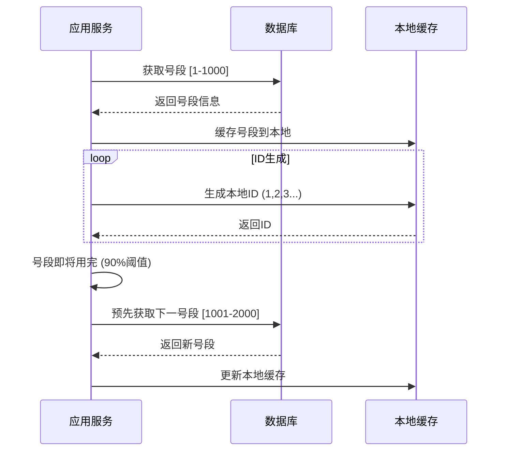

# 分布式ID完全指南

## 目录

1. [基础概念和理论](#1-基础概念和理论)
2. [Leaf-segment算法详解](#2-leaf-segment算法详解)
3. [数据库配置](#3-数据库配置)
4. [Spring Boot集成](#4-spring-boot集成)
5. [实际使用案例](#5-实际使用案例)
6. [性能调优和监控](#6-性能调优和监控)
7. [故障排除](#7-故障排除)

---

## 1. 基础概念和理论

### 1.1 什么是分布式ID？

在分布式系统中，我们经常需要生成全局唯一的ID来标识各种资源（如订单号、用户ID、消息ID等）。传统的单机自增ID在分布式环境下会产生冲突，因此需要分布式ID生成方案。

### 1.2 分布式ID的要求

1. **全局唯一性** - 在整个分布式系统中必须唯一
2. **高性能** - 生成速度要快，支持高并发
3. **高可用** - 服务要稳定，不能成为系统瓶颈
4. **趋势递增** - 最好能保证趋势递增（对数据库索引友好）
5. **信息安全** - 不能泄露业务信息

### 1.3 常见的分布式ID方案

| 方案 | 优点 | 缺点 | 适用场景 |
|------|------|------|----------|
| UUID | 简单、本地生成 | 无序、占用空间大 | 对性能要求不高的场景 |
| Snowflake | 趋势递增、性能好 | 依赖机器时钟、ID较长 | 高性能要求场景 |
| 数据库自增 | 简单、有序 | 性能瓶颈、单点故障 | 小规模系统 |
| **Leaf-segment** | 高性能、趋势递增、容错性好 | 需要数据库支持 | **推荐方案** |

### 1.4 为什么选择Leaf-segment？

Leaf-segment算法是美团开源的分布式ID生成方案，具有以下优势：

- **高性能**: 批量获取ID号段，减少数据库访问
- **趋势递增**: 生成的ID趋势递增，对数据库索引友好
- **高可用**: 支持容灾，双buffer机制保证可用性
- **简单易用**: 接入简单，维护成本低

## 2. Leaf-segment算法详解

### 2.1 核心思想

Leaf-segment的核心思想是：
1. 从数据库批量获取一段连续的ID（如1-1000）
2. 应用服务本地生成这个号段内的ID
3. 当号段用完时，再次从数据库获取下一个号段

### 2.2 算法流程



### 2.3 双Buffer机制

为了保证高可用，Leaf-segment使用双Buffer机制：

```
Buffer A: [1-1000]     正在使用
Buffer B: [1001-2000]  预加载
```

当Buffer A使用到90%时，自动加载Buffer B，切换后继续服务。

## 3. 数据库配置

### 3.1 创建Leaf表

```sql
-- 创建leaf分配表
CREATE TABLE leaf_alloc (
    biz_tag VARCHAR(128) NOT NULL DEFAULT '' COMMENT '业务标识',
    max_id BIGINT NOT NULL DEFAULT 1 COMMENT '当前最大ID',
    step INT NOT NULL DEFAULT 1000 COMMENT '步长',
    description VARCHAR(256) DEFAULT '' COMMENT '业务描述',
    update_time TIMESTAMP NOT NULL DEFAULT CURRENT_TIMESTAMP ON UPDATE CURRENT_TIMESTAMP COMMENT '更新时间',
    PRIMARY KEY (biz_tag)
) ENGINE=InnoDB DEFAULT CHARSET=utf8mb4 COMMENT='Leaf号段分配表';

-- 初始化业务数据
INSERT INTO leaf_alloc (biz_tag, max_id, step, description) VALUES
('order_id', 1, 1000, '订单ID'),
('user_id', 1, 1000, '用户ID'),
('shipment_id', 1, 1000, '运单ID'),
('tracking_number', 1, 1000, '追踪号');
```

### 3.2 表结构说明

- `biz_tag`: 业务标识，不同业务使用不同的tag
- `max_id`: 当前已分配的最大ID
- `step`: 每次分配的号段大小
- `description`: 业务描述
- `update_time`: 最后更新时间

## 4. Spring Boot集成

### 4.1 添加依赖（如需要）

如果要集成第三方Leaf库，在`pom.xml`中添加：

```xml
<!-- 注意：这里使用项目自定义实现，不需要外部依赖 -->
```

### 4.2 实现LeafIdGenerator服务

基于你的项目代码，已经有了完整的实现：

```java
@Service
public class LeafIdGeneratorService {

    @Autowired
    private JdbcTemplate jdbcTemplate;

    // 存储各业务的号段信息
    private final ConcurrentHashMap<String, SegmentBuffer> cache = new ConcurrentHashMap<>();

    /**
     * 获取下一个ID
     * @param bizTag 业务标识
     * @return 生成的ID
     */
    public long nextId(String bizTag) {
        SegmentBuffer buffer = cache.get(bizTag);
        if (buffer == null) {
            buffer = new SegmentBuffer();
            cache.put(bizTag, buffer);
        }

        return buffer.nextId(bizTag, this);
    }

    /**
     * 从数据库获取下一个号段
     */
    public LeafAlloc updateMaxIdAndGetLeafAlloc(String bizTag) {
        // 数据库操作实现...
    }
}
```

### 4.3 配置类

```java
@Configuration
@EnableConfigurationProperties(LeafProperties.class)
public class LeafConfiguration {

    @Bean
    public LeafIdGeneratorService leafIdGeneratorService() {
        return new LeafIdGeneratorService();
    }
}
```

### 4.4 配置属性

在`application.yml`中添加配置：

```yaml
leaf:
  # 启用Leaf-segment模式
  segment:
    enabled: true
    # 默认步长
    default-step: 1000
    # 异步更新阈值（当前号段使用90%时开始预加载）
    update-threshold: 0.9
    # 数据库连接配置（使用现有数据源）
```

## 5. 实际使用案例

### 5.1 在Controller中使用

```java
@RestController
@RequestMapping("/api")
public class OrderController {

    @Autowired
    private LeafIdGeneratorService idGenerator;

    @PostMapping("/orders")
    public ResponseEntity<Order> createOrder(@RequestBody OrderRequest request) {
        // 生成订单ID
        long orderId = idGenerator.nextId("order_id");

        Order order = new Order();
        order.setId(orderId);
        // 其他业务逻辑...

        return ResponseEntity.ok(order);
    }
}
```

### 5.2 在Service中使用

```java
@Service
public class ShipmentService {

    @Autowired
    private LeafIdGeneratorService idGenerator;

    public Shipment createShipment(CreateShipmentDto dto) {
        // 生成运单ID和追踪号
        long shipmentId = idGenerator.nextId("shipment_id");
        long trackingNumber = idGenerator.nextId("tracking_number");

        Shipment shipment = new Shipment();
        shipment.setId(shipmentId);
        shipment.setTrackingNumber(String.valueOf(trackingNumber));

        return shipmentRepository.save(shipment);
    }
}
```

### 5.3 自定义业务标识

```java
@Component
public class IdGeneratorUtil {

    @Autowired
    private LeafIdGeneratorService idGenerator;

    // 订单ID生成
    public long generateOrderId() {
        return idGenerator.nextId("order_id");
    }

    // 用户ID生成
    public long generateUserId() {
        return idGenerator.nextId("user_id");
    }

    // 自定义格式的追踪号
    public String generateTrackingNumber() {
        long id = idGenerator.nextId("tracking_number");
        return "UPS" + String.format("%010d", id);
    }
}
```

## 6. 性能调优和监控

### 6.1 步长调优

根据业务QPS调整步长：

```sql
-- 高频业务，增大步长减少数据库访问
UPDATE leaf_alloc SET step = 5000 WHERE biz_tag = 'order_id';

-- 低频业务，减小步长避免浪费
UPDATE leaf_alloc SET step = 100 WHERE biz_tag = 'user_id';
```

### 6.2 性能监控

添加监控指标：

```java
@Service
public class LeafIdGeneratorService {

    private final MeterRegistry meterRegistry;
    private final Counter idGenerationCounter;
    private final Timer dbAccessTimer;

    public LeafIdGeneratorService(MeterRegistry meterRegistry) {
        this.meterRegistry = meterRegistry;
        this.idGenerationCounter = Counter.builder("leaf.id.generation")
            .description("Number of IDs generated")
            .register(meterRegistry);
        this.dbAccessTimer = Timer.builder("leaf.db.access")
            .description("Database access time")
            .register(meterRegistry);
    }

    public long nextId(String bizTag) {
        Timer.Sample sample = Timer.start(meterRegistry);
        try {
            long id = doNextId(bizTag);
            idGenerationCounter.increment();
            return id;
        } finally {
            sample.stop(dbAccessTimer);
        }
    }
}
```

### 6.3 健康检查

```java
@Component
public class LeafHealthIndicator implements HealthIndicator {

    @Autowired
    private LeafIdGeneratorService idGenerator;

    @Override
    public Health health() {
        try {
            // 尝试生成一个测试ID
            long testId = idGenerator.nextId("health_check");
            return Health.up()
                .withDetail("test_id", testId)
                .withDetail("status", "ok")
                .build();
        } catch (Exception e) {
            return Health.down()
                .withDetail("error", e.getMessage())
                .build();
        }
    }
}
```

## 7. 故障排除

### 7.1 常见问题

#### 问题1: ID生成失败
```
Error: Cannot get next segment from database
```

**解决方案:**
1. 检查数据库连接是否正常
2. 确认`leaf_alloc`表是否存在
3. 检查对应的`biz_tag`是否已初始化

#### 问题2: 性能下降
```
Warning: Frequent database access detected
```

**解决方案:**
1. 增大对应业务的`step`值
2. 检查预加载阈值设置
3. 优化数据库连接池配置

#### 问题3: ID重复
```
Error: Duplicate ID detected
```

**解决方案:**
1. 检查是否有多个实例使用相同的`biz_tag`
2. 确认数据库事务隔离级别
3. 检查并发控制逻辑

### 7.2 调试技巧

#### 启用详细日志
```yaml
logging:
  level:
    com.miniups.service.LeafIdGeneratorService: DEBUG
```

#### 查看当前号段状态
```java
@GetMapping("/admin/leaf/status")
public Map<String, Object> getLeafStatus() {
    // 返回当前各业务的号段使用情况
}
```

#### 数据库查询当前状态
```sql
-- 查看各业务当前分配情况
SELECT biz_tag, max_id, step,
       CONCAT(max_id - step + 1, ' - ', max_id) as current_segment,
       update_time
FROM leaf_alloc;
```

---

## 快速开始检查清单

- [ ] 创建`leaf_alloc`表
- [ ] 插入业务初始数据
- [ ] 配置Spring Boot集成
- [ ] 编写业务使用代码
- [ ] 配置监控和健康检查
- [ ] 进行压力测试
- [ ] 设置告警和日志

## 总结

通过这份指南，你应该能够：

1. **理解**分布式ID的基本概念和Leaf-segment算法原理
2. **配置**数据库和Spring Boot集成
3. **使用**分布式ID生成服务
4. **监控**和调优性能
5. **解决**常见问题

Leaf-segment算法是一个成熟、稳定的分布式ID解决方案，在你的Mini-UPS项目中已经得到了很好的应用。继续实践和优化，你将能够掌握分布式ID的精髓！