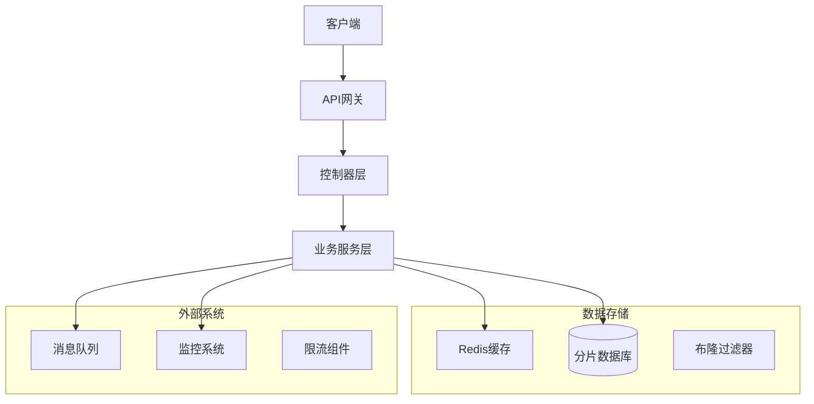
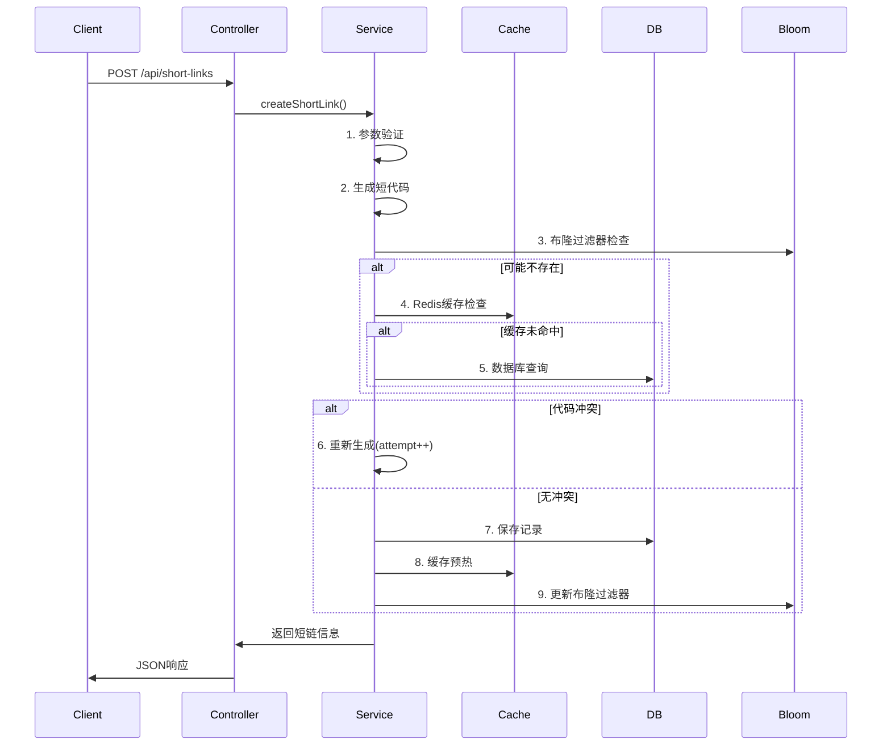
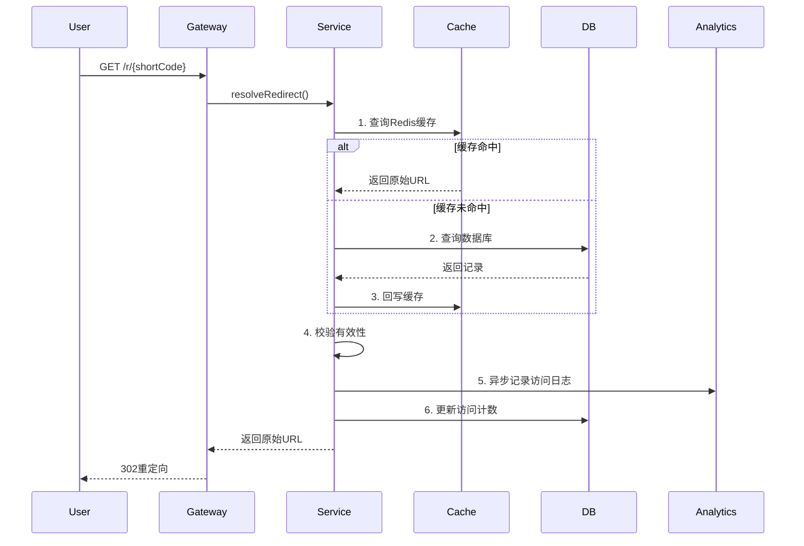

# 短链系统完整指南 - 从零到一完整实现

## 📚 目录

1. [系统概述](#1-系统概述)
2. [核心概念](#2-核心概念)
3. [架构设计](#3-架构设计)
4. [技术栈详解](#4-技术栈详解)
5. [数据库设计](#5-数据库设计)
6. [核心功能实现](#6-核心功能实现)
7. [性能优化](#7-性能优化)
8. [安全设计](#8-安全设计)
9. [运维监控](#9-运维监控)
10. [测试策略](#10-测试策略)
11. [部署上线](#11-部署上线)
12. [常见问题](#12-常见问题)

---

## 1. 系统概述

### 1.1 什么是短链系统？

短链系统是一个将长URL转换为短URL的服务，类似于`bit.ly`、`tinyurl.com`等服务。用户输入一个长URL，系统生成一个短代码，通过访问`短域名/短代码`的形式重定向到原始URL。

### 1.2 业务价值

- **节省空间**: 在社交媒体、短信等字符限制场景下节省空间
- **美化链接**: 隐藏复杂的URL参数，提供更友好的链接
- **数据分析**: 追踪链接点击量、用户行为分析
- **链接管理**: 统一管理、批量操作、过期控制

### 1.3 系统特点

本项目的短链系统具备以下特点：

- **高性能**: 支持每秒200+重定向请求
- **高可用**: Redis缓存 + 数据库分片 + 布隆过滤器
- **可扩展**: 分库分表设计，支持水平扩展
- **企业级**: 完整的监控、限流、安全控制

---

## 2. 核心概念

### 2.1 基本术语

- **原始URL**: 用户要缩短的长链接
- **短代码**: 生成的唯一标识符（如: `aBc123`）
- **短链接**: 完整的短URL（如: `http://s.com/aBc123`）
- **重定向**: 访问短链接时跳转到原始URL的过程

### 2.2 核心算法

**MurmurHash + Base62编码**
```
长URL + 用户ID + 时间戳 → MurmurHash → Base62编码 → 短代码
```

### 2.3 关键指标

- **TPS**: 每秒事务处理数
- **QPS**: 每秒查询数
- **冲突率**: 短代码重复的概率
- **存储效率**: 数据压缩比

---

## 3. 架构设计

### 3.1 整体架构



### 3.2 分层架构

```
┌─────────────────────┐
│   表现层 (Controller) │  ← API接口、参数验证
├─────────────────────┤
│   业务层 (Service)    │  ← 核心业务逻辑
├─────────────────────┤
│   数据层 (Repository) │  ← 数据访问抽象
├─────────────────────┤
│   基础设施层          │  ← Redis、DB、MQ
└─────────────────────┘
```

### 3.3 核心组件

| 组件 | 职责 | 技术选型 |
|------|------|----------|
| 代码生成器 | 生成唯一短代码 | MurmurHash + Base62 |
| 缓存层 | 热点数据缓存 | Redis |
| 数据层 | 持久化存储 | PostgreSQL + 分片 |
| 布隆过滤器 | 快速存在性检查 | Redis Bitmap |
| 限流组件 | 流量控制 | Sentinel |
| 监控系统 | 实时监控 | Redis Stream |

---

## 4. 技术栈详解

### 4.1 后端技术栈

```yaml
核心框架:
  - Spring Boot 3.2.0
  - Spring Security (JWT认证)
  - Spring Data JPA

数据存储:
  - PostgreSQL 15 (主存储)
  - Redis 7 (缓存 + 布隆过滤器)
  - Sharding-JDBC (分库分表)

性能优化:
  - Redisson (分布式锁)
  - Sentinel (限流)
  - Redis Stream (消息队列)

工具库:
  - Google Guava (MurmurHash)
  - Jackson (JSON序列化)
  - Swagger (API文档)
```

### 4.2 核心依赖

```xml
<!-- 分库分表 -->
<dependency>
    <groupId>org.apache.shardingsphere</groupId>
    <artifactId>shardingsphere-jdbc-core-spring-boot-starter</artifactId>
</dependency>

<!-- 分布式锁 -->
<dependency>
    <groupId>org.redisson</groupId>
    <artifactId>redisson-spring-boot-starter</artifactId>
</dependency>

<!-- 限流组件 -->
<dependency>
    <groupId>com.alibaba.csp</groupId>
    <artifactId>sentinel-core</artifactId>
</dependency>

<!-- 哈希算法 -->
<dependency>
    <groupId>com.google.guava</groupId>
    <artifactId>guava</artifactId>
</dependency>
```

---

## 5. 数据库设计

### 5.1 核心表结构

#### 短链记录表 (short_links_*)
```sql
CREATE TABLE short_links_0 (
    id BIGSERIAL PRIMARY KEY,
    short_code VARCHAR(32) NOT NULL UNIQUE,
    shard_key VARCHAR(16) NOT NULL,       -- 分片键
    original_url TEXT NOT NULL,
    user_id BIGINT NOT NULL,
    expiration_at TIMESTAMP,
    active BOOLEAN DEFAULT true,
    access_count BIGINT DEFAULT 0,
    created_at TIMESTAMP DEFAULT NOW(),
    updated_at TIMESTAMP DEFAULT NOW(),
    last_access_at TIMESTAMP
);

-- 索引优化
CREATE INDEX idx_short_code ON short_links_0(short_code);
CREATE INDEX idx_user_id ON short_links_0(user_id);
CREATE INDEX idx_shard_key ON short_links_0(shard_key);
```

#### 路由表 (short_link_routes)
```sql
CREATE TABLE short_link_routes (
    id BIGSERIAL PRIMARY KEY,
    short_code VARCHAR(32) NOT NULL UNIQUE,
    table_name VARCHAR(32) NOT NULL,      -- 目标分片表
    created_at TIMESTAMP DEFAULT NOW()
);

CREATE INDEX idx_short_code_route ON short_link_routes(short_code);
```

#### 访问日志表 (short_link_access_logs)
```sql
CREATE TABLE short_link_access_logs (
    id BIGSERIAL PRIMARY KEY,
    short_code VARCHAR(32) NOT NULL,
    ip_address INET,
    user_agent TEXT,
    referer TEXT,
    access_time TIMESTAMP DEFAULT NOW()
);

-- 按时间分区
CREATE INDEX idx_access_time ON short_link_access_logs(access_time);
CREATE INDEX idx_short_code_access ON short_link_access_logs(short_code);
```

### 5.2 分片策略

**权重分片算法**:
```
表名              权重    数据分布
short_links_0  →   4    →  40%
short_links_1  →   3    →  30%
short_links_2  →   2    →  20%
short_links_3  →   1    →  10%
```

**分片键生成**:
```java
String shardKey = shortCode.substring(0, 2); // 前2位作为分片键
```

### 5.3 索引优化

```sql
-- 1. 主查询索引 (短代码查找)
CREATE INDEX idx_short_code_active ON short_links_0(short_code, active);

-- 2. 用户查询索引 (用户管理)
CREATE INDEX idx_user_created ON short_links_0(user_id, created_at DESC);

-- 3. 过期清理索引
CREATE INDEX idx_expiration ON short_links_0(expiration_at) WHERE expiration_at IS NOT NULL;

-- 4. 热点数据索引
CREATE INDEX idx_access_count ON short_links_0(access_count DESC) WHERE access_count > 100;
```

---

## 6. 核心功能实现

### 6.1 短代码生成算法

#### 算法选择对比

| 算法 | 优点 | 缺点 | 适用场景 |
|------|------|------|----------|
| 自增ID + Base62 | 简单、无冲突 | 可预测、安全性低 | 内部系统 |
| UUID + 截取 | 全局唯一 | 长度不固定、性能差 | 分布式系统 |
| **MurmurHash + Base62** | **高性能、分布均匀** | **低概率冲突** | **生产环境** |

#### 实现代码

```java
@Component
public class ShortLinkCodeGenerator {

    private static final HashFunction HASH_FUNCTION = Hashing.murmur3_32_fixed();
    private final SecureRandom secureRandom = new SecureRandom();

    public String generate(String originalUrl, long userId, int attempt) {
        // 1. 构建负载字符串
        String payload = userId + "|" + originalUrl + "|" + attempt + "|"
                        + System.nanoTime() + "|" + secureRandom.nextInt();

        // 2. MurmurHash计算
        int hash = HASH_FUNCTION.hashString(payload, StandardCharsets.UTF_8).asInt();
        long positive = Integer.toUnsignedLong(hash);

        // 3. Base62编码
        String code = Base62Encoder.encode(positive);

        // 4. 长度规范化
        int minLength = 6;
        if (code.length() < minLength) {
            StringBuilder sb = new StringBuilder(code);
            while (sb.length() < minLength) {
                sb.append(Base62Encoder.encode(
                    Integer.toUnsignedLong(secureRandom.nextInt(62))));
            }
            code = sb.substring(0, minLength);
        }

        return code;
    }
}
```

#### Base62编码器

```java
public class Base62Encoder {

    private static final String BASE62_CHARS =
        "0123456789ABCDEFGHIJKLMNOPQRSTUVWXYZabcdefghijklmnopqrstuvwxyz";

    public static String encode(long number) {
        if (number == 0) return "0";

        StringBuilder sb = new StringBuilder();
        while (number > 0) {
            sb.append(BASE62_CHARS.charAt((int) (number % 62)));
            number /= 62;
        }
        return sb.reverse().toString();
    }

    public static long decode(String base62) {
        long result = 0;
        for (char c : base62.toCharArray()) {
            result = result * 62 + BASE62_CHARS.indexOf(c);
        }
        return result;
    }
}
```

### 6.2 创建短链流程



#### 核心实现代码

```java
@Service
@Transactional
public class ShortLinkServiceImpl implements ShortLinkService {

    @Override
    public ShortLinkResponse createShortLink(Long userId, ShortLinkCreateRequest request) {
        // 1. 参数验证
        validateRequest(request);

        // 2. 生成短代码(最多重试10次)
        String shortCode = null;
        for (int attempt = 0; attempt < 10; attempt++) {
            String candidate = codeGenerator.generate(request.getOriginalUrl(), userId, attempt);

            // 3. 冲突检查
            if (!isCodeExists(candidate)) {
                shortCode = candidate;
                break;
            }
        }

        if (shortCode == null) {
            throw new ShortLinkServiceException("无法生成唯一短代码");
        }

        // 4. 创建记录
        ShortLinkRecord record = buildRecord(userId, shortCode, request);

        // 5. 保存到数据库
        String tableName = shardUtils.selectTable(shortCode);
        repository.save(record, tableName);

        // 6. 保存路由信息
        routeRepository.save(new ShortLinkRouteRecord(shortCode, tableName));

        // 7. 缓存预热
        cacheShortLink(shortCode, record);

        // 8. 更新布隆过滤器
        bloomFilter.add(shortCode);

        // 9. 异步记录监控数据
        publishCreateEvent(record);

        return mapToResponse(record);
    }

    private boolean isCodeExists(String shortCode) {
        // 1. 布隆过滤器快速检查
        if (!bloomFilter.mightContain(shortCode)) {
            return false; // 绝对不存在
        }

        // 2. Redis缓存检查
        String cacheKey = "shortlink:" + shortCode;
        if (redisTemplate.hasKey(cacheKey)) {
            return true;
        }

        // 3. 数据库最终检查
        return repository.existsByShortCode(shortCode);
    }
}
```

### 6.3 短链重定向流程



#### 实现代码

```java
@RestController
public class ShortLinkRedirectController {

    @GetMapping("/r/{shortCode}")
    public ResponseEntity<Void> redirect(@PathVariable String shortCode,
                                       HttpServletRequest request) {
        try {
            String originalUrl = shortLinkService.resolveRedirect(shortCode, request);

            return ResponseEntity.status(HttpStatus.FOUND)
                    .header("Location", originalUrl)
                    .header("Cache-Control", "no-cache")
                    .build();

        } catch (ShortLinkNotFoundException e) {
            return ResponseEntity.notFound().build();
        }
    }
}

@Service
public class ShortLinkServiceImpl implements ShortLinkService {

    @Override
    public String resolveRedirect(String shortCode, HttpServletRequest request) {
        // 1. 缓存查询
        String cacheKey = "shortlink:" + shortCode;
        String cachedUrl = (String) redisTemplate.opsForValue().get(cacheKey);

        if (cachedUrl != null) {
            if ("NOT_FOUND".equals(cachedUrl)) {
                throw new ShortLinkNotFoundException(shortCode);
            }
            // 异步更新访问信息
            asyncUpdateAccess(shortCode, request);
            return cachedUrl;
        }

        // 2. 数据库查询
        ShortLinkRecord record = findByShortCode(shortCode);

        if (record == null || !record.isActive() || isExpired(record)) {
            // 缓存负结果，避免缓存穿透
            redisTemplate.opsForValue().set(cacheKey, "NOT_FOUND", Duration.ofMinutes(5));
            throw new ShortLinkNotFoundException(shortCode);
        }

        // 3. 缓存原始URL
        redisTemplate.opsForValue().set(cacheKey, record.getOriginalUrl(), Duration.ofHours(1));

        // 4. 异步更新访问信息
        asyncUpdateAccess(shortCode, request);

        return record.getOriginalUrl();
    }

    @Async
    private void asyncUpdateAccess(String shortCode, HttpServletRequest request) {
        // 更新访问计数
        incrementAccessCount(shortCode);

        // 记录访问日志
        logAccess(shortCode, request);

        // 发送监控事件
        publishAccessEvent(shortCode, request);
    }
}
```

---

## 7. 性能优化

### 7.1 缓存策略

#### 多级缓存架构

```
应用层缓存 (Caffeine) → Redis缓存 → 数据库
```

#### Redis缓存设计

```java
@Component
public class ShortLinkCacheManager {

    // 1. 热点数据缓存 (TTL: 1小时)
    public void cacheHotLinks(String shortCode, String originalUrl) {
        String key = "shortlink:hot:" + shortCode;
        redisTemplate.opsForValue().set(key, originalUrl, Duration.ofHours(1));
    }

    // 2. 普通数据缓存 (TTL: 30分钟)
    public void cacheRegularLinks(String shortCode, String originalUrl) {
        String key = "shortlink:" + shortCode;
        redisTemplate.opsForValue().set(key, originalUrl, Duration.ofMinutes(30));
    }

    // 3. 负缓存 (防止缓存穿透, TTL: 5分钟)
    public void cacheNotFound(String shortCode) {
        String key = "shortlink:" + shortCode;
        redisTemplate.opsForValue().set(key, "NOT_FOUND", Duration.ofMinutes(5));
    }

    // 4. 预热策略
    @EventListener
    public void onShortLinkCreated(ShortLinkCreatedEvent event) {
        // 新创建的链接预热到缓存
        cacheRegularLinks(event.getShortCode(), event.getOriginalUrl());
    }
}
```

#### 缓存更新策略

```java
// 1. Cache-Aside模式
public String getOriginalUrl(String shortCode) {
    // 先查缓存
    String cached = getFromCache(shortCode);
    if (cached != null) {
        return cached;
    }

    // 查数据库
    String url = getFromDatabase(shortCode);
    if (url != null) {
        // 回写缓存
        setToCache(shortCode, url);
    }
    return url;
}

// 2. Write-Through模式
public void updateShortLink(String shortCode, String newUrl) {
    // 同时更新数据库和缓存
    updateDatabase(shortCode, newUrl);
    updateCache(shortCode, newUrl);
}
```

### 7.2 数据库优化

#### 分片策略

```yaml
# Sharding-JDBC配置
spring:
  shardingsphere:
    datasource:
      names: ds0
      ds0:
        type: com.zaxxer.hikari.HikariDataSource
        url: jdbc:postgresql://localhost:5432/ups_db

    rules:
      sharding:
        tables:
          short_links:
            actual-data-nodes: ds0.short_links_$->{0..3}
            table-strategy:
              standard:
                sharding-column: shard_key
                sharding-algorithm-name: weighted-table-algorithm

        sharding-algorithms:
          weighted-table-algorithm:
            type: CLASS_BASED
            props:
              algorithmClassName: com.miniups.shortlink.sharding.WeightedTableShardingAlgorithm
              table-weights: "short_links_0:4,short_links_1:3,short_links_2:2,short_links_3:1"
```

#### 权重分片算法

```java
public class WeightedTableShardingAlgorithm implements StandardShardingAlgorithm<String> {

    private final Map<String, Integer> tableWeights = new HashMap<>();
    private final List<String> tables = new ArrayList<>();
    private int totalWeight;

    @Override
    public String doSharding(Collection<String> availableTargetNames,
                           PreciseShardingValue<String> shardingValue) {
        String shardKey = shardingValue.getValue();

        // 使用一致性哈希算法
        int hash = Math.abs(shardKey.hashCode());
        int weightedHash = hash % totalWeight;

        int currentWeight = 0;
        for (String table : tables) {
            currentWeight += tableWeights.get(table);
            if (weightedHash < currentWeight) {
                return table;
            }
        }

        return tables.get(0); // 默认表
    }
}
```

#### 连接池优化

```yaml
spring:
  datasource:
    hikari:
      maximum-pool-size: 20          # 最大连接数
      minimum-idle: 5                # 最小空闲连接
      connection-timeout: 20000      # 连接超时(20s)
      idle-timeout: 300000           # 空闲超时(5min)
      max-lifetime: 1200000          # 最大生命周期(20min)
      leak-detection-threshold: 60000 # 连接泄漏检测(1min)
```

### 7.3 布隆过滤器优化

#### Redis Bitmap实现

```java
@Component
public class RedisBloomFilterService {

    private final RedisTemplate<String, String> redisTemplate;
    private final List<Integer> hashSeeds; // [17, 31, 73, 127, 191]
    private final int bitSize = 1_048_576; // 1MB bitmap

    public void add(String element) {
        for (int seed : hashSeeds) {
            int hash = hash(element, seed);
            int bitIndex = Math.abs(hash) % bitSize;
            redisTemplate.opsForValue().setBit("shortlink:bloom:codes", bitIndex, true);
        }
    }

    public boolean mightContain(String element) {
        for (int seed : hashSeeds) {
            int hash = hash(element, seed);
            int bitIndex = Math.abs(hash) % bitSize;
            Boolean bit = redisTemplate.opsForValue().getBit("shortlink:bloom:codes", bitIndex);
            if (bit == null || !bit) {
                return false; // 绝对不存在
            }
        }
        return true; // 可能存在
    }

    private int hash(String element, int seed) {
        return Hashing.murmur3_32_fixed(seed)
                     .hashString(element, StandardCharsets.UTF_8)
                     .asInt();
    }
}
```

#### 性能指标

```
位图大小: 1MB (1,048,576 bits)
哈希函数: 5个 (MurmurHash with different seeds)
预期容量: 100,000 短链接
误判率: ~0.1%
查询时间: O(1)
```

### 7.4 异步处理

#### Redis Stream事件处理

```java
@Component
public class ShortLinkStreamPublisher {

    public void publishAccessEvent(String shortCode, String ipAddress, String userAgent) {
        Map<String, String> eventData = Map.of(
            "shortCode", shortCode,
            "ipAddress", ipAddress,
            "userAgent", userAgent,
            "timestamp", String.valueOf(System.currentTimeMillis())
        );

        redisTemplate.opsForStream()
                    .add("stream:shortlink:monitor", eventData);
    }
}

@Component
public class ShortLinkStreamConsumer {

    @EventListener
    @Async
    public void handleStreamEvents() {
        while (true) {
            try {
                List<MapRecord<String, Object, Object>> records =
                    redisTemplate.opsForStream()
                                .read(Consumer.from("shortlink-monitor", "backend-consumer"),
                                     StreamReadOptions.empty().count(100).block(Duration.ofSeconds(5)),
                                     StreamOffset.create("stream:shortlink:monitor", ReadOffset.lastConsumed()));

                for (MapRecord<String, Object, Object> record : records) {
                    processAccessEvent(record.getValue());
                }

                Thread.sleep(5000); // 5秒轮询
            } catch (Exception e) {
                log.error("Stream消费异常", e);
            }
        }
    }
}
```

---

## 8. 安全设计

### 8.1 访问控制

#### JWT认证

```java
@RestController
@RequestMapping("/api/short-links")
public class ShortLinkController {

    @PostMapping
    @PreAuthorize("isAuthenticated()")
    public ResponseEntity<ApiResponse<ShortLinkResponse>> createShortLink(
            @Valid @RequestBody ShortLinkCreateRequest request) {
        Long userId = getCurrentUserId();
        ShortLinkResponse response = shortLinkService.createShortLink(userId, request);
        return ResponseEntity.status(HttpStatus.CREATED)
                .body(ApiResponse.success("短链创建成功", response));
    }

    @GetMapping
    @PreAuthorize("hasRole('ADMIN')")
    public ResponseEntity<ApiResponse<ShortLinkPageResponse>> listShortLinks(
            @RequestParam(defaultValue = "0") int page,
            @RequestParam(defaultValue = "20") int size) {
        // 管理员可查看所有短链
        ShortLinkPageResponse response = shortLinkService.listShortLinks(page, size);
        return ResponseEntity.ok(ApiResponse.success("短链列表", response));
    }
}
```

#### 权限设计

```
角色权限矩阵:
                  创建  查看自己的  修改  删除  查看全部
USER (普通用户)    ✓      ✓       ✓    ✓      ✗
ADMIN (管理员)     ✓      ✓       ✓    ✓      ✓
GUEST (访客)       ✗      ✗       ✗    ✗      ✗
```

### 8.2 限流保护

#### Sentinel限流配置

```java
@Component
public class ShortLinkSentinelConfig {

    @PostConstruct
    public void initFlowRules() {
        List<FlowRule> rules = new ArrayList<>();

        // 1. 创建短链限流: 每秒20个
        FlowRule createRule = new FlowRule();
        createRule.setResource("shortlink-create");
        createRule.setGrade(RuleConstant.FLOW_GRADE_QPS);
        createRule.setCount(20);
        rules.add(createRule);

        // 2. 重定向限流: 每秒200个
        FlowRule redirectRule = new FlowRule();
        redirectRule.setResource("shortlink-redirect");
        redirectRule.setGrade(RuleConstant.FLOW_GRADE_QPS);
        redirectRule.setCount(200);
        rules.add(redirectRule);

        FlowRuleManager.loadRules(rules);
    }
}

@Service
public class ShortLinkServiceImpl {

    @SentinelResource(value = "shortlink-create",
                     blockHandler = "handleCreateBlock",
                     fallback = "createFallback")
    public ShortLinkResponse createShortLink(Long userId, ShortLinkCreateRequest request) {
        // 业务逻辑
    }

    public ShortLinkResponse handleCreateBlock(Long userId,
                                             ShortLinkCreateRequest request,
                                             BlockException ex) {
        throw new ShortLinkRateLimitException("创建频率过高，请稍后重试");
    }
}
```

### 8.3 安全防护

#### 防恶意访问

```java
@Component
public class SecurityProtectionService {

    // 1. IP限流
    public boolean checkIpLimit(String ipAddress) {
        String key = "rate_limit:ip:" + ipAddress;
        String current = redisTemplate.opsForValue().get(key);

        if (current == null) {
            redisTemplate.opsForValue().set(key, "1", Duration.ofMinutes(1));
            return true;
        }

        int count = Integer.parseInt(current);
        if (count >= 100) { // 每分钟最多100次
            return false;
        }

        redisTemplate.opsForValue().increment(key);
        return true;
    }

    // 2. URL安全检查
    public boolean isSafeUrl(String url) {
        // 检查恶意URL
        List<String> blacklist = Arrays.asList(
            "javascript:", "data:", "vbscript:",
            "malware.com", "phishing.com"
        );

        String lowerUrl = url.toLowerCase();
        for (String dangerous : blacklist) {
            if (lowerUrl.contains(dangerous)) {
                return false;
            }
        }

        return true;
    }

    // 3. 防SQL注入
    @PreAuthorize("hasPermission(#shortCode, 'SHORTLINK', 'READ')")
    public ShortLinkResponse getShortLink(String shortCode) {
        // 参数验证
        if (!shortCode.matches("^[A-Za-z0-9]{6,32}$")) {
            throw new IllegalArgumentException("无效的短代码格式");
        }

        return shortLinkService.getShortLinkDetails(getCurrentUserId(), shortCode);
    }
}
```

#### 数据加密

```java
@Component
public class EncryptionService {

    private final AESUtil aesUtil;

    // 敏感数据加密存储
    public String encryptUrl(String originalUrl) {
        return aesUtil.encrypt(originalUrl);
    }

    public String decryptUrl(String encryptedUrl) {
        return aesUtil.decrypt(encryptedUrl);
    }

    // 用户数据脱敏
    public String maskEmail(String email) {
        if (email == null || !email.contains("@")) {
            return email;
        }

        String[] parts = email.split("@");
        String name = parts[0];
        String domain = parts[1];

        if (name.length() <= 2) {
            return "*".repeat(name.length()) + "@" + domain;
        }

        return name.substring(0, 2) + "*".repeat(name.length() - 2) + "@" + domain;
    }
}
```

---

## 9. 运维监控

### 9.1 实时监控

#### 关键指标

```java
@Component
public class ShortLinkMetrics {

    private final MeterRegistry meterRegistry;

    // 1. QPS监控
    public void recordCreateQps() {
        meterRegistry.counter("shortlink.create.count").increment();
    }

    public void recordRedirectQps() {
        meterRegistry.counter("shortlink.redirect.count").increment();
    }

    // 2. 延迟监控
    public void recordCreateLatency(long latencyMs) {
        meterRegistry.timer("shortlink.create.latency")
                    .record(latencyMs, TimeUnit.MILLISECONDS);
    }

    // 3. 错误率监控
    public void recordError(String errorType) {
        meterRegistry.counter("shortlink.error.count", "type", errorType).increment();
    }

    // 4. 缓存命中率
    public void recordCacheHit(boolean hit) {
        meterRegistry.counter("shortlink.cache.access",
                            "result", hit ? "hit" : "miss").increment();
    }
}
```

#### 健康检查

```java
@Component
public class ShortLinkHealthIndicator implements HealthIndicator {

    @Override
    public Health health() {
        Health.Builder builder = new Health.Builder();

        try {
            // 1. 数据库连接检查
            boolean dbHealthy = checkDatabase();

            // 2. Redis连接检查
            boolean redisHealthy = checkRedis();

            // 3. 布隆过滤器检查
            boolean bloomHealthy = checkBloomFilter();

            if (dbHealthy && redisHealthy && bloomHealthy) {
                return builder.up()
                            .withDetail("database", "OK")
                            .withDetail("redis", "OK")
                            .withDetail("bloom_filter", "OK")
                            .build();
            } else {
                return builder.down()
                            .withDetail("database", dbHealthy ? "OK" : "FAIL")
                            .withDetail("redis", redisHealthy ? "OK" : "FAIL")
                            .withDetail("bloom_filter", bloomHealthy ? "OK" : "FAIL")
                            .build();
            }
        } catch (Exception e) {
            return builder.down(e).build();
        }
    }
}
```

### 9.2 日志管理

#### 日志配置

```yaml
logging:
  level:
    com.miniups.shortlink: INFO
    org.springframework.data.jpa: DEBUG
  pattern:
    console: "%d{yyyy-MM-dd HH:mm:ss} [%thread] %-5level %logger{36} - %msg%n"
    file: "%d{yyyy-MM-dd HH:mm:ss} [%thread] %-5level %logger{36} - %msg%n"
  file:
    name: logs/shortlink.log
    max-size: 100MB
    max-history: 30
```

#### 关键日志记录

```java
@Service
public class ShortLinkServiceImpl {

    private static final Logger log = LoggerFactory.getLogger(ShortLinkServiceImpl.class);

    public ShortLinkResponse createShortLink(Long userId, ShortLinkCreateRequest request) {
        log.info("创建短链请求: userId={}, originalUrl={}", userId, request.getOriginalUrl());

        try {
            ShortLinkResponse response = doCreateShortLink(userId, request);
            log.info("短链创建成功: userId={}, shortCode={}, originalUrl={}",
                    userId, response.getShortCode(), request.getOriginalUrl());
            return response;
        } catch (Exception e) {
            log.error("短链创建失败: userId={}, originalUrl={}, error={}",
                     userId, request.getOriginalUrl(), e.getMessage(), e);
            throw e;
        }
    }

    public String resolveRedirect(String shortCode, HttpServletRequest request) {
        String clientIp = getClientIp(request);
        log.info("短链访问: shortCode={}, clientIp={}, userAgent={}",
                shortCode, clientIp, request.getHeader("User-Agent"));

        try {
            String originalUrl = doResolveRedirect(shortCode);
            log.info("短链重定向成功: shortCode={}, originalUrl={}, clientIp={}",
                    shortCode, originalUrl, clientIp);
            return originalUrl;
        } catch (ShortLinkNotFoundException e) {
            log.warn("短链不存在: shortCode={}, clientIp={}", shortCode, clientIp);
            throw e;
        }
    }
}
```

### 9.3 告警配置

#### 监控告警规则

```yaml
# Prometheus告警规则
groups:
  - name: shortlink_alerts
    rules:
      # 1. QPS异常告警
      - alert: ShortLinkHighQPS
        expr: rate(shortlink_redirect_count[1m]) > 300
        for: 2m
        labels:
          severity: warning
        annotations:
          summary: "短链重定向QPS过高"
          description: "短链重定向QPS超过300/s，当前值: {{ $value }}"

      # 2. 错误率告警
      - alert: ShortLinkHighErrorRate
        expr: rate(shortlink_error_count[5m]) / rate(shortlink_total_count[5m]) > 0.1
        for: 2m
        labels:
          severity: critical
        annotations:
          summary: "短链错误率过高"
          description: "短链错误率超过10%，当前值: {{ $value }}"

      # 3. 延迟告警
      - alert: ShortLinkHighLatency
        expr: histogram_quantile(0.95, shortlink_create_latency) > 1000
        for: 1m
        labels:
          severity: warning
        annotations:
          summary: "短链创建延迟过高"
          description: "95%的短链创建延迟超过1s，当前值: {{ $value }}ms"

      # 4. 缓存命中率告警
      - alert: ShortLinkLowCacheHit
        expr: rate(shortlink_cache_access{result="hit"}[5m]) / rate(shortlink_cache_access[5m]) < 0.8
        for: 5m
        labels:
          severity: warning
        annotations:
          summary: "短链缓存命中率过低"
          description: "缓存命中率低于80%，当前值: {{ $value }}"
```

---

## 10. 测试策略

### 10.1 单元测试

#### 核心组件测试

```java
@ExtendWith(MockitoExtension.class)
class ShortLinkCodeGeneratorTest {

    @Mock
    private ShortLinkProperties properties;

    @InjectMocks
    private ShortLinkCodeGenerator generator;

    @Test
    void shouldGenerateUniqueCodesForSameInput() {
        // Given
        when(properties.getCode()).thenReturn(new ShortLinkProperties.Code());

        String originalUrl = "https://example.com/very/long/url";
        long userId = 123L;

        // When
        String code1 = generator.generate(originalUrl, userId, 0);
        String code2 = generator.generate(originalUrl, userId, 1);

        // Then
        assertThat(code1).isNotEqualTo(code2);
        assertThat(code1).hasSize(6);
        assertThat(code2).hasSize(6);
        assertThat(code1).matches("^[A-Za-z0-9]+$");
        assertThat(code2).matches("^[A-Za-z0-9]+$");
    }

    @Test
    void shouldGenerateMinimumLengthCode() {
        // Given
        ShortLinkProperties.Code codeConfig = new ShortLinkProperties.Code();
        codeConfig.setMinLength(8);
        when(properties.getCode()).thenReturn(codeConfig);

        // When
        String code = generator.generate("https://test.com", 1L, 0);

        // Then
        assertThat(code).hasSizeGreaterThanOrEqualTo(8);
    }
}

@ExtendWith(MockitoExtension.class)
class RedisBloomFilterServiceTest {

    @Mock
    private RedisTemplate<String, String> redisTemplate;

    @Mock
    private ValueOperations<String, String> valueOps;

    @InjectMocks
    private RedisBloomFilterService bloomFilter;

    @BeforeEach
    void setUp() {
        when(redisTemplate.opsForValue()).thenReturn(valueOps);
    }

    @Test
    void shouldReturnFalseForDefinitelyNotExisting() {
        // Given
        String element = "test123";
        when(valueOps.getBit(any(), anyLong())).thenReturn(false);

        // When
        boolean result = bloomFilter.mightContain(element);

        // Then
        assertThat(result).isFalse();
    }

    @Test
    void shouldReturnTrueForPossiblyExisting() {
        // Given
        String element = "test123";
        when(valueOps.getBit(any(), anyLong())).thenReturn(true);

        // When
        boolean result = bloomFilter.mightContain(element);

        // Then
        assertThat(result).isTrue();
    }
}
```

### 10.2 集成测试

#### 数据库集成测试

```java
@DataJpaTest
@AutoConfigureTestDatabase(replace = AutoConfigureTestDatabase.Replace.NONE)
@TestPropertySource(properties = {
    "spring.jpa.hibernate.ddl-auto=create-drop",
    "spring.datasource.url=jdbc:h2:mem:testdb"
})
class ShortLinkRepositoryTest {

    @Autowired
    private TestEntityManager entityManager;

    @Autowired
    private ShortLinkRepository repository;

    @Test
    void shouldSaveAndFindShortLink() {
        // Given
        ShortLinkRecord record = new ShortLinkRecord();
        record.setShortCode("abc123");
        record.setShardKey("ab");
        record.setOriginalUrl("https://example.com");
        record.setUserId(1L);
        record.setActive(true);
        record.setAccessCount(0L);
        record.setCreatedAt(LocalDateTime.now());
        record.setUpdatedAt(LocalDateTime.now());

        // When
        repository.save(record, "short_links_0");
        entityManager.flush();

        // Then
        Optional<ShortLinkRecord> found = repository.findByShortCode("abc123");
        assertThat(found).isPresent();
        assertThat(found.get().getOriginalUrl()).isEqualTo("https://example.com");
    }

    @Test
    void shouldUpdateAccessCount() {
        // Given
        ShortLinkRecord record = createAndSaveRecord("def456");

        // When
        repository.incrementAccessCount("def456");
        entityManager.flush();
        entityManager.clear();

        // Then
        Optional<ShortLinkRecord> updated = repository.findByShortCode("def456");
        assertThat(updated).isPresent();
        assertThat(updated.get().getAccessCount()).isEqualTo(1L);
    }
}
```

#### Redis集成测试

```java
@SpringBootTest
@TestPropertySource(properties = {
    "spring.redis.host=localhost",
    "spring.redis.port=6379",
    "spring.redis.database=15"
})
class ShortLinkCacheIntegrationTest {

    @Autowired
    private RedisTemplate<String, String> redisTemplate;

    @Autowired
    private ShortLinkService shortLinkService;

    @AfterEach
    void cleanup() {
        redisTemplate.getConnectionFactory().getConnection().flushDb();
    }

    @Test
    void shouldCacheShortLinkAfterCreation() {
        // Given
        ShortLinkCreateRequest request = new ShortLinkCreateRequest();
        request.setOriginalUrl("https://example.com/test");

        // When
        ShortLinkResponse response = shortLinkService.createShortLink(1L, request);

        // Then
        String cacheKey = "shortlink:" + response.getShortCode();
        String cachedUrl = redisTemplate.opsForValue().get(cacheKey);
        assertThat(cachedUrl).isEqualTo("https://example.com/test");
    }

    @Test
    void shouldReturnCachedUrlOnRedirect() {
        // Given
        String shortCode = "cached123";
        String originalUrl = "https://cached.example.com";
        redisTemplate.opsForValue().set("shortlink:" + shortCode, originalUrl);

        // When
        MockHttpServletRequest request = new MockHttpServletRequest();
        String result = shortLinkService.resolveRedirect(shortCode, request);

        // Then
        assertThat(result).isEqualTo(originalUrl);
    }
}
```

### 10.3 性能测试

#### 压力测试

```java
@SpringBootTest(webEnvironment = SpringBootTest.WebEnvironment.RANDOM_PORT)
class ShortLinkPerformanceTest {

    @Autowired
    private TestRestTemplate restTemplate;

    @LocalServerPort
    private int port;

    @Test
    void shouldHandleHighConcurrentRedirects() throws InterruptedException {
        // Given
        String shortCode = createTestShortLink();
        int threadCount = 100;
        int requestsPerThread = 10;
        CountDownLatch latch = new CountDownLatch(threadCount);
        List<Long> responseTimes = Collections.synchronizedList(new ArrayList<>());

        // When
        ExecutorService executor = Executors.newFixedThreadPool(threadCount);

        for (int i = 0; i < threadCount; i++) {
            executor.submit(() -> {
                try {
                    for (int j = 0; j < requestsPerThread; j++) {
                        long startTime = System.currentTimeMillis();

                        ResponseEntity<Void> response = restTemplate.getForEntity(
                            "http://localhost:" + port + "/r/" + shortCode,
                            Void.class);

                        long endTime = System.currentTimeMillis();
                        responseTimes.add(endTime - startTime);

                        assertThat(response.getStatusCode()).isEqualTo(HttpStatus.FOUND);
                    }
                } finally {
                    latch.countDown();
                }
            });
        }

        // Then
        boolean finished = latch.await(30, TimeUnit.SECONDS);
        assertThat(finished).isTrue();

        // 性能断言
        double avgResponseTime = responseTimes.stream()
                                            .mapToLong(Long::longValue)
                                            .average()
                                            .orElse(0.0);

        assertThat(avgResponseTime).isLessThan(100.0); // 平均响应时间小于100ms

        long maxResponseTime = responseTimes.stream()
                                          .mapToLong(Long::longValue)
                                          .max()
                                          .orElse(0L);

        assertThat(maxResponseTime).isLessThan(500L); // 最大响应时间小于500ms
    }
}
```

#### 基准测试

```java
@State(Scope.Benchmark)
@BenchmarkMode(Mode.Throughput)
@OutputTimeUnit(TimeUnit.SECONDS)
@Warmup(iterations = 3, time = 1, timeUnit = TimeUnit.SECONDS)
@Measurement(iterations = 5, time = 1, timeUnit = TimeUnit.SECONDS)
@Fork(1)
public class ShortLinkBenchmark {

    private ShortLinkCodeGenerator generator;
    private RedisBloomFilterService bloomFilter;
    private ShortLinkProperties properties;

    @Setup
    public void setup() {
        properties = new ShortLinkProperties();
        generator = new ShortLinkCodeGenerator(properties);

        RedisTemplate<String, String> redisTemplate = Mockito.mock(RedisTemplate.class);
        ValueOperations<String, String> valueOps = Mockito.mock(ValueOperations.class);
        when(redisTemplate.opsForValue()).thenReturn(valueOps);
        when(valueOps.getBit(any(), anyLong())).thenReturn(false);

        bloomFilter = new RedisBloomFilterService(redisTemplate, properties.getBloom());
    }

    @Benchmark
    public String benchmarkCodeGeneration() {
        return generator.generate("https://example.com/test", 123L, 0);
    }

    @Benchmark
    public boolean benchmarkBloomFilterCheck() {
        return bloomFilter.mightContain("test123");
    }

    public static void main(String[] args) throws Exception {
        Options opt = new OptionsBuilder()
                .include(ShortLinkBenchmark.class.getSimpleName())
                .build();

        new Runner(opt).run();
    }
}
```

---

## 11. 部署上线

### 11.1 环境配置

#### 生产环境配置

```yaml
# application-prod.yml
spring:
  profiles: prod

  datasource:
    url: jdbc:postgresql://prod-db:5432/ups_db
    username: ${DB_USERNAME}
    password: ${DB_PASSWORD}
    hikari:
      maximum-pool-size: 50
      minimum-idle: 10
      connection-timeout: 30000
      idle-timeout: 600000
      max-lifetime: 1800000

  redis:
    host: ${REDIS_HOST}
    port: ${REDIS_PORT}
    password: ${REDIS_PASSWORD}
    lettuce:
      pool:
        max-active: 20
        max-idle: 10
        min-idle: 5

  jpa:
    hibernate:
      ddl-auto: none
    show-sql: false
    properties:
      hibernate:
        format_sql: false
        use_sql_comments: false

shortlink:
  code:
    min-length: 6
  bloom:
    redis-key: "shortlink:bloom:codes"
    bit-size: 8388608  # 8MB bitmap for production
    hash-seeds: [17, 31, 73, 127, 191, 251, 257, 263]
  sentinel:
    create-threshold-per-second: 50
    redirect-threshold-per-second: 500
  stream:
    key: "stream:shortlink:monitor"
    group: "shortlink-monitor"
    batch-size: 200
    poll-delay-millis: 3000

logging:
  level:
    com.miniups.shortlink: INFO
    org.springframework.web: WARN
  pattern:
    file: "%d{yyyy-MM-dd HH:mm:ss.SSS} [%thread] %-5level %logger{36} - %msg%n"
  file:
    name: /app/logs/shortlink.log
    max-size: 200MB
    max-history: 7
```

#### Docker容器化

```dockerfile
# Dockerfile
FROM eclipse-temurin:17-jre-alpine

WORKDIR /app

# 添加应用JAR
COPY target/mini-ups-0.0.1-SNAPSHOT.jar app.jar

# 创建日志目录
RUN mkdir -p /app/logs

# 创建非root用户
RUN addgroup -g 1001 shortlink && \
    adduser -D -s /bin/sh -u 1001 -G shortlink shortlink

# 修改文件权限
RUN chown -R shortlink:shortlink /app

USER shortlink

# JVM优化参数
ENV JAVA_OPTS="-Xms512m -Xmx2g -XX:+UseG1GC -XX:G1HeapRegionSize=16m -XX:+PrintGCDetails -XX:+PrintGCTimeStamps -Xloggc:/app/logs/gc.log"

EXPOSE 8081

ENTRYPOINT ["sh", "-c", "java $JAVA_OPTS -jar app.jar"]
```

#### Docker Compose生产配置

```yaml
# docker-compose.prod.yml
version: '3.8'

services:
  shortlink-app:
    build: .
    image: miniups/shortlink:latest
    ports:
      - "8081:8081"
    environment:
      - SPRING_PROFILES_ACTIVE=prod
      - DB_USERNAME=${DB_USERNAME}
      - DB_PASSWORD=${DB_PASSWORD}
      - REDIS_HOST=redis
      - REDIS_PORT=6379
      - REDIS_PASSWORD=${REDIS_PASSWORD}
    depends_on:
      - postgres
      - redis
    volumes:
      - ./logs:/app/logs
    restart: unless-stopped
    networks:
      - shortlink-network
    deploy:
      resources:
        limits:
          memory: 2G
          cpus: '1.0'

  postgres:
    image: postgres:15-alpine
    environment:
      - POSTGRES_DB=ups_db
      - POSTGRES_USER=${DB_USERNAME}
      - POSTGRES_PASSWORD=${DB_PASSWORD}
    volumes:
      - postgres_data:/var/lib/postgresql/data
      - ./scripts/init.sql:/docker-entrypoint-initdb.d/init.sql
    ports:
      - "5432:5432"
    restart: unless-stopped
    networks:
      - shortlink-network
    deploy:
      resources:
        limits:
          memory: 1G
          cpus: '0.5'

  redis:
    image: redis:7-alpine
    command: redis-server --requirepass ${REDIS_PASSWORD} --maxmemory 512mb --maxmemory-policy allkeys-lru
    ports:
      - "6379:6379"
    volumes:
      - redis_data:/data
    restart: unless-stopped
    networks:
      - shortlink-network
    deploy:
      resources:
        limits:
          memory: 512M
          cpus: '0.5'

  nginx:
    image: nginx:alpine
    ports:
      - "80:80"
      - "443:443"
    volumes:
      - ./nginx/nginx.conf:/etc/nginx/nginx.conf
      - ./nginx/ssl:/etc/nginx/ssl
    depends_on:
      - shortlink-app
    restart: unless-stopped
    networks:
      - shortlink-network

volumes:
  postgres_data:
  redis_data:

networks:
  shortlink-network:
    driver: bridge
```

### 11.2 负载均衡配置

#### Nginx配置

```nginx
# nginx/nginx.conf
upstream shortlink_backend {
    least_conn;
    server shortlink-app-1:8081 weight=1 max_fails=3 fail_timeout=30s;
    server shortlink-app-2:8081 weight=1 max_fails=3 fail_timeout=30s;
    server shortlink-app-3:8081 weight=1 max_fails=3 fail_timeout=30s;
}

# 限流配置
limit_req_zone $binary_remote_addr zone=create_limit:10m rate=10r/s;
limit_req_zone $binary_remote_addr zone=redirect_limit:10m rate=50r/s;

server {
    listen 80;
    server_name yourdomain.com;

    # 重定向到HTTPS
    return 301 https://$server_name$request_uri;
}

server {
    listen 443 ssl http2;
    server_name yourdomain.com;

    # SSL配置
    ssl_certificate /etc/nginx/ssl/cert.pem;
    ssl_certificate_key /etc/nginx/ssl/key.pem;
    ssl_protocols TLSv1.2 TLSv1.3;
    ssl_ciphers ECDHE-RSA-AES256-GCM-SHA512:DHE-RSA-AES256-GCM-SHA512;
    ssl_prefer_server_ciphers off;

    # 安全头
    add_header X-Frame-Options DENY;
    add_header X-Content-Type-Options nosniff;
    add_header X-XSS-Protection "1; mode=block";
    add_header Strict-Transport-Security "max-age=31536000" always;

    # API接口
    location /api/ {
        limit_req zone=create_limit burst=20 nodelay;

        proxy_pass http://shortlink_backend;
        proxy_set_header Host $host;
        proxy_set_header X-Real-IP $remote_addr;
        proxy_set_header X-Forwarded-For $proxy_add_x_forwarded_for;
        proxy_set_header X-Forwarded-Proto $scheme;

        # 超时配置
        proxy_connect_timeout 5s;
        proxy_send_timeout 10s;
        proxy_read_timeout 10s;
    }

    # 短链重定向
    location /r/ {
        limit_req zone=redirect_limit burst=100 nodelay;

        proxy_pass http://shortlink_backend;
        proxy_set_header Host $host;
        proxy_set_header X-Real-IP $remote_addr;
        proxy_set_header X-Forwarded-For $proxy_add_x_forwarded_for;
        proxy_set_header X-Forwarded-Proto $scheme;

        # 缓存配置
        proxy_cache_bypass $http_cache_control;
        add_header X-Cache-Status $upstream_cache_status;

        # 超时配置
        proxy_connect_timeout 3s;
        proxy_send_timeout 5s;
        proxy_read_timeout 5s;
    }

    # 健康检查
    location /health {
        proxy_pass http://shortlink_backend;
        access_log off;
    }
}
```

### 11.3 CI/CD流水线

#### GitHub Actions配置

```yaml
# .github/workflows/deploy.yml
name: Deploy Short Link System

on:
  push:
    branches: [ main ]
  pull_request:
    branches: [ main ]

env:
  REGISTRY: ghcr.io
  IMAGE_NAME: ${{ github.repository }}/shortlink

jobs:
  test:
    runs-on: ubuntu-latest

    services:
      postgres:
        image: postgres:15
        env:
          POSTGRES_PASSWORD: test123
          POSTGRES_DB: test_db
        options: >-
          --health-cmd pg_isready
          --health-interval 10s
          --health-timeout 5s
          --health-retries 5
        ports:
          - 5432:5432

      redis:
        image: redis:7
        options: >-
          --health-cmd "redis-cli ping"
          --health-interval 10s
          --health-timeout 5s
          --health-retries 5
        ports:
          - 6379:6379

    steps:
    - uses: actions/checkout@v3

    - name: Set up JDK 17
      uses: actions/setup-java@v3
      with:
        java-version: '17'
        distribution: 'temurin'

    - name: Cache Maven dependencies
      uses: actions/cache@v3
      with:
        path: ~/.m2
        key: ${{ runner.os }}-m2-${{ hashFiles('**/pom.xml') }}
        restore-keys: ${{ runner.os }}-m2

    - name: Run tests
      run: |
        cd backend
        mvn clean test -Dspring.profiles.active=test

    - name: Run integration tests
      run: |
        cd backend
        mvn verify -Dspring.profiles.active=test

    - name: Generate test report
      uses: dorny/test-reporter@v1
      if: success() || failure()
      with:
        name: Maven Tests
        path: backend/target/surefire-reports/*.xml
        reporter: java-junit

  build-and-push:
    needs: test
    runs-on: ubuntu-latest
    if: github.ref == 'refs/heads/main'

    steps:
    - uses: actions/checkout@v3

    - name: Set up JDK 17
      uses: actions/setup-java@v3
      with:
        java-version: '17'
        distribution: 'temurin'

    - name: Build application
      run: |
        cd backend
        mvn clean package -DskipTests

    - name: Log in to Container Registry
      uses: docker/login-action@v2
      with:
        registry: ${{ env.REGISTRY }}
        username: ${{ github.actor }}
        password: ${{ secrets.GITHUB_TOKEN }}

    - name: Extract metadata
      id: meta
      uses: docker/metadata-action@v4
      with:
        images: ${{ env.REGISTRY }}/${{ env.IMAGE_NAME }}
        tags: |
          type=ref,event=branch
          type=ref,event=pr
          type=sha,prefix={{branch}}-
          type=raw,value=latest,enable={{is_default_branch}}

    - name: Build and push Docker image
      uses: docker/build-push-action@v4
      with:
        context: ./backend
        push: true
        tags: ${{ steps.meta.outputs.tags }}
        labels: ${{ steps.meta.outputs.labels }}

  deploy:
    needs: build-and-push
    runs-on: ubuntu-latest
    if: github.ref == 'refs/heads/main'

    steps:
    - uses: actions/checkout@v3

    - name: Deploy to production
      uses: appleboy/ssh-action@v0.1.5
      with:
        host: ${{ secrets.PROD_HOST }}
        username: ${{ secrets.PROD_USER }}
        key: ${{ secrets.PROD_SSH_KEY }}
        script: |
          cd /opt/shortlink
          docker-compose pull
          docker-compose up -d --remove-orphans
          docker system prune -f
```

---

## 12. 常见问题

### 12.1 性能问题

#### Q: 短链重定向响应慢怎么办？

**A: 多层优化策略**

1. **缓存优化**
```java
// 添加本地缓存
@Cacheable(value = "shortlinks", key = "#shortCode")
public String getOriginalUrl(String shortCode) {
    return repository.findByShortCode(shortCode)
                    .map(ShortLinkRecord::getOriginalUrl)
                    .orElse(null);
}
```

2. **数据库优化**
```sql
-- 添加复合索引
CREATE INDEX idx_shortcode_active ON short_links_0(short_code, active)
WHERE active = true;

-- 分区表优化
CREATE TABLE short_links_hot PARTITION OF short_links_0
FOR VALUES FROM ('aa') TO ('zz');
```

3. **连接池调优**
```yaml
spring:
  datasource:
    hikari:
      maximum-pool-size: 50      # 增加连接池大小
      minimum-idle: 20           # 提高最小空闲连接
      connection-timeout: 10000   # 缩短连接超时
```

#### Q: 创建短链时出现大量冲突怎么办？

**A: 冲突处理优化**

1. **改进哈希算法**
```java
// 使用更强的哈希算法
private static final HashFunction HASH_FUNCTION = Hashing.sha256();

// 添加更多随机因子
String payload = userId + "|" + originalUrl + "|" + attempt + "|"
                + System.nanoTime() + "|" + UUID.randomUUID().toString();
```

2. **预生成短码池**
```java
@Component
public class ShortCodePreGenerator {

    @Scheduled(fixedRate = 60000) // 每分钟执行
    public void preGenerateCodes() {
        List<String> codes = generateBatch(1000);
        redisTemplate.opsForList().leftPushAll("shortcode:pool", codes);
    }

    public String getPreGeneratedCode() {
        return (String) redisTemplate.opsForList().rightPop("shortcode:pool");
    }
}
```

### 12.2 数据一致性问题

#### Q: 缓存和数据库数据不一致怎么办？

**A: 缓存更新策略**

1. **Cache-Aside + TTL**
```java
@Transactional
public void updateShortLink(String shortCode, String newUrl) {
    // 1. 更新数据库
    repository.updateUrl(shortCode, newUrl);

    // 2. 删除缓存，下次查询时重新加载
    redisTemplate.delete("shortlink:" + shortCode);

    // 3. 可选：立即预热缓存
    redisTemplate.opsForValue().set(
        "shortlink:" + shortCode,
        newUrl,
        Duration.ofHours(1)
    );
}
```

2. **基于版本的乐观锁**
```java
@Entity
public class ShortLinkRecord {
    @Version
    private Long version;

    // 其他字段...
}

@Service
public class ShortLinkService {

    @Retryable(value = OptimisticLockingFailureException.class, maxAttempts = 3)
    public void updateWithOptimisticLock(String shortCode, String newUrl) {
        ShortLinkRecord record = repository.findByShortCode(shortCode)
                                          .orElseThrow();
        record.setOriginalUrl(newUrl);
        repository.save(record);
    }
}
```

### 12.3 安全问题

#### Q: 如何防止恶意短链？

**A: 多层安全防护**

1. **URL安全检查**
```java
@Component
public class UrlSecurityChecker {

    private final Set<String> blacklistedDomains = Set.of(
        "malware.com", "phishing.com", "spam.com"
    );

    private final Pattern dangerousProtocols = Pattern.compile(
        "^(javascript|data|vbscript):", Pattern.CASE_INSENSITIVE
    );

    public boolean isSafeUrl(String url) {
        // 1. 协议检查
        if (dangerousProtocols.matcher(url).find()) {
            return false;
        }

        // 2. 域名黑名单检查
        try {
            URL parsedUrl = new URL(url);
            String host = parsedUrl.getHost().toLowerCase();
            return !blacklistedDomains.contains(host);
        } catch (MalformedURLException e) {
            return false;
        }
    }
}
```

2. **访问频率限制**
```java
@Component
public class IpRateLimiter {

    public boolean isAllowed(String ipAddress) {
        String key = "rate_limit:ip:" + ipAddress;
        String current = redisTemplate.opsForValue().get(key);

        if (current == null) {
            redisTemplate.opsForValue().set(key, "1", Duration.ofMinutes(1));
            return true;
        }

        int count = Integer.parseInt(current);
        if (count >= 60) { // 每分钟最多60次
            return false;
        }

        redisTemplate.opsForValue().increment(key);
        return true;
    }
}
```

### 12.4 运维问题

#### Q: 如何监控系统健康状态？

**A: 全方位监控**

1. **自定义健康检查**
```java
@Component
public class ShortLinkHealthIndicator implements HealthIndicator {

    @Override
    public Health health() {
        try {
            // 检查关键组件
            checkDatabase();
            checkRedis();
            checkBloomFilter();

            return Health.up()
                        .withDetail("database", "OK")
                        .withDetail("redis", "OK")
                        .withDetail("bloom_filter", "OK")
                        .withDetail("timestamp", Instant.now())
                        .build();
        } catch (Exception e) {
            return Health.down()
                        .withDetail("error", e.getMessage())
                        .withDetail("timestamp", Instant.now())
                        .build();
        }
    }
}
```

2. **Prometheus监控指标**
```java
@Component
public class ShortLinkMetrics {

    private final Counter createCounter;
    private final Counter redirectCounter;
    private final Timer createTimer;
    private final Gauge cacheHitRate;

    public ShortLinkMetrics(MeterRegistry meterRegistry) {
        this.createCounter = Counter.builder("shortlink_create_total")
                                   .description("Total short links created")
                                   .register(meterRegistry);

        this.redirectCounter = Counter.builder("shortlink_redirect_total")
                                     .description("Total redirects processed")
                                     .register(meterRegistry);

        this.createTimer = Timer.builder("shortlink_create_duration")
                               .description("Time taken to create short link")
                               .register(meterRegistry);

        this.cacheHitRate = Gauge.builder("shortlink_cache_hit_rate")
                                .description("Cache hit rate percentage")
                                .register(meterRegistry, this, ShortLinkMetrics::calculateCacheHitRate);
    }

    private double calculateCacheHitRate(ShortLinkMetrics metrics) {
        // 计算缓存命中率逻辑
        return 0.85; // 示例值
    }
}
```

#### Q: 如何优雅停机？

**A: 优雅停机实现**

```java
@Component
public class GracefulShutdownHandler {

    private static final Logger log = LoggerFactory.getLogger(GracefulShutdownHandler.class);

    @PreDestroy
    public void shutdown() {
        log.info("开始优雅停机...");

        // 1. 停止接收新请求
        // 2. 等待现有请求处理完成
        // 3. 关闭数据库连接
        // 4. 清理资源

        log.info("优雅停机完成");
    }
}

# 配置文件
server:
  shutdown: graceful
spring:
  lifecycle:
    timeout-per-shutdown-phase: 30s
```

---

## 总结

这个短链系统指南涵盖了从基础概念到生产部署的全流程。通过学习本指南，你将掌握：

### ✅ 核心技能
- 分布式系统设计思维
- 高性能缓存策略
- 数据库分片技术
- 微服务架构实践

### ✅ 技术栈掌握
- Spring Boot企业级开发
- Redis高级应用
- PostgreSQL优化
- Docker容器化

### ✅ 工程实践
- 完整的测试策略
- CI/CD流水线
- 监控告警体系
- 安全防护措施

### 📚 进阶学习建议

1. **深入学习分布式理论**
   - CAP定理和BASE理论
   - 分布式一致性算法
   - 微服务治理

2. **性能优化专题**
   - JVM调优技巧
   - 数据库调优
   - 网络优化

3. **扩展功能实现**
   - 数据分析报表
   - A/B测试平台
   - 多租户支持

### 🔗 相关资源

- [项目源码](https://github.com/your-repo/mini-ups)
- [在线演示](https://demo.shortlink.com)
- [API文档](https://docs.shortlink.com)

---

**恭喜！** 你已经完成了短链系统的完整学习之旅。现在开始动手实践，构建属于自己的短链系统吧！ 🚀