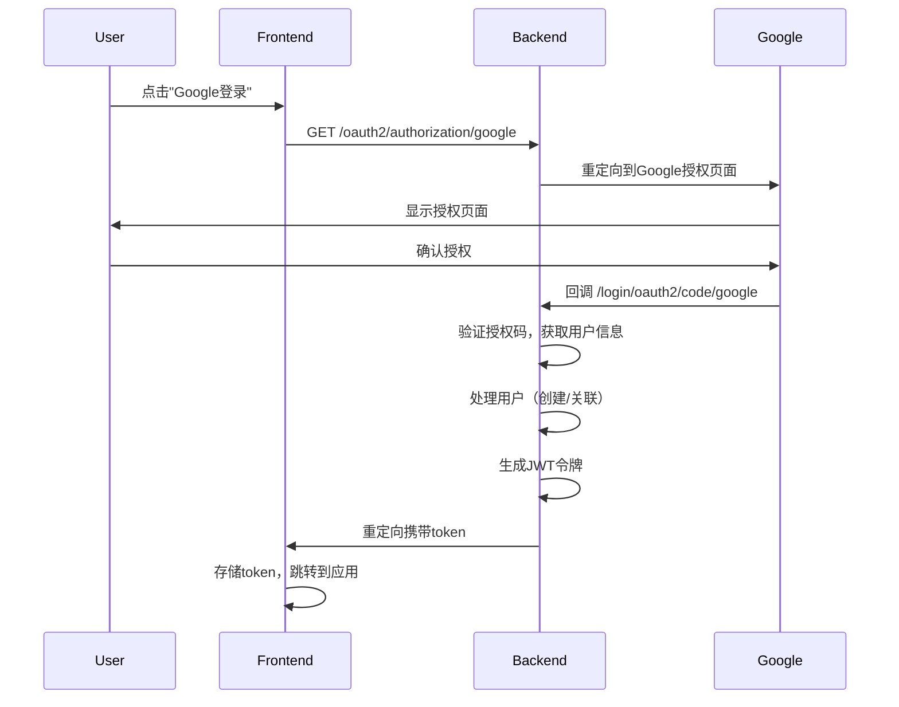
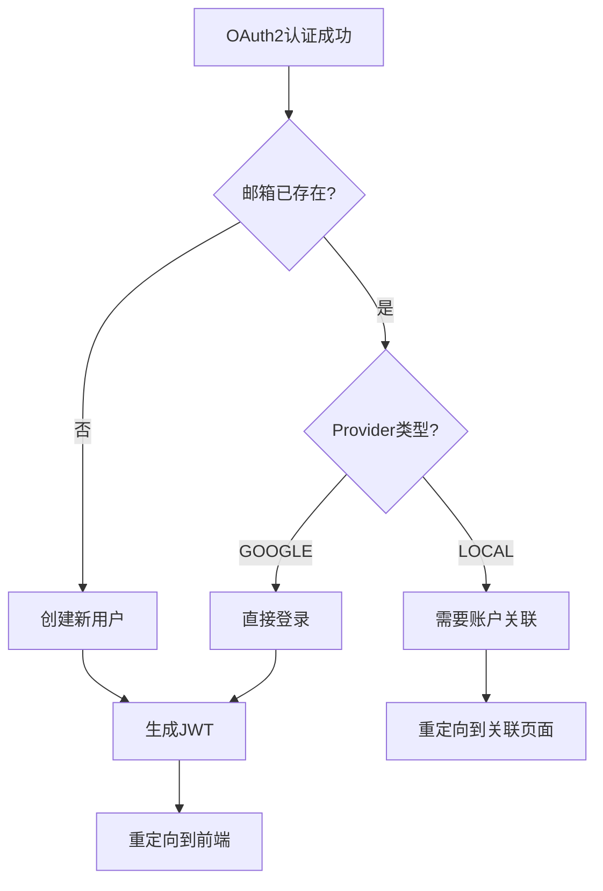

# Google OAuth 集成技术方案设计

## 架构概述

采用Spring Security 6的OAuth2 Client支持，将Google OAuth2作为"预认证"步骤，最终仍使用现有JWT系统，确保与现有架构的无缝集成。

### 核心设计原则

1. **最小侵入性**：不破坏现有认证流程
2. **安全优先**：防止账户劫持，采用安全的账户关联策略  
3. **渐进实施**：分阶段实现，降低风险
4. **用户体验**：简化注册流程，提升用户便利性

## 技术栈选择

- **Spring Boot 3.2+** + **Spring Security 6**
- **OAuth2 Client Starter** - 标准OAuth2实现
- **现有JWT系统** - 保持令牌一致性
- **PostgreSQL** - 数据模型扩展

## 数据库设计

### User实体扩展

```sql
-- 新增字段
ALTER TABLE users ADD COLUMN auth_provider VARCHAR(20) NOT NULL DEFAULT 'LOCAL';
ALTER TABLE users ADD COLUMN provider_id VARCHAR(255);
ALTER TABLE users ALTER COLUMN password DROP NOT NULL;
ALTER TABLE users ADD CONSTRAINT uk_provider_id UNIQUE (auth_provider, provider_id);

-- 数据迁移
UPDATE users SET auth_provider = 'LOCAL' WHERE auth_provider IS NULL;
```

### AuthProvider枚举
```java
public enum AuthProvider {
    LOCAL,   // 传统用户名密码
    GOOGLE   // Google OAuth2
}
```

## 认证流程设计

### OAuth2登录流程



### 账户处理逻辑



## 核心组件设计

### 1. OAuth2AuthenticationSuccessHandler
**职责**：处理OAuth2认证成功后的用户处理和JWT生成

```java
@Component
public class OAuth2AuthenticationSuccessHandler extends SimpleUrlAuthenticationSuccessHandler {
    // 处理OAuth2登录结果
    // 生成JWT令牌
    // 重定向到前端
}
```

### 2. OAuth2AuthenticationFailureHandler  
**职责**：处理OAuth2认证失败情况

```java
@Component
public class OAuth2AuthenticationFailureHandler extends SimpleUrlAuthenticationFailureHandler {
    // 处理各种OAuth2错误
    // 重定向到错误页面
}
```

### 3. AuthService扩展
**职责**：OAuth2用户处理逻辑

```java
// 新增方法
public User processOAuth2PostLogin(OidcUser oidcUser)
public boolean requiresAccountLinking(String email)
public void linkGoogleAccount(String username, String providerId)
```

## 安全策略

### 账户关联安全机制

1. **自动检测**：检查邮箱是否已存在本地账户
2. **手动关联**：要求用户输入本地密码验证
3. **防护机制**：防止Google账户被盗用后的账户劫持

### JWT令牌一致性

- OAuth2用户生成的JWT与传统用户完全相同
- 包含相同的用户信息和权限声明
- 使用现有的JwtTokenProvider

## 配置管理

### application.yml
```yaml
spring:
  security:
    oauth2:
      client:
        registration:
          google:
            client-id: ${GOOGLE_CLIENT_ID}
            client-secret: ${GOOGLE_CLIENT_SECRET}
            scope: openid,profile,email

app:
  oauth2:
    redirect-uri: ${FRONTEND_URL}/auth/callback
    failure-redirect-uri: ${FRONTEND_URL}/login?error=oauth_failed
```

### SecurityConfig更新
```java
@Bean
public SecurityFilterChain securityFilterChain(HttpSecurity http) throws Exception {
    return http
        // 现有配置保持不变
        .oauth2Login(oauth2 -> oauth2
            .successHandler(oAuth2AuthenticationSuccessHandler)
            .failureHandler(oAuth2AuthenticationFailureHandler)
        )
        .build();
}
```

## 前端集成

### 登录按钮
```html
<a href="/oauth2/authorization/google" class="google-login-btn">
  使用Google登录
</a>
```

### 回调处理
```javascript
// /auth/callback 页面处理
const urlParams = new URLSearchParams(window.location.search);
const token = urlParams.get('token');
if (token) {
    localStorage.setItem('authToken', token);
    window.location.href = '/dashboard';
}
```

## 错误处理机制

### OAuth2异常分类
1. **网络错误**：Google API不可达
2. **配置错误**：client-id/secret错误
3. **用户拒绝**：用户取消授权
4. **账户冲突**：需要手动关联

### 统一错误响应
```java
// 自定义异常
public class OAuth2AuthenticationProcessingException extends RuntimeException
public class AccountLinkingRequiredException extends RuntimeException
```

## 测试策略

### 单元测试
- `AuthService.processOAuth2PostLogin()` - 模拟各种用户场景
- `OAuth2AuthenticationSuccessHandler` - 验证重定向逻辑
- `OAuth2AuthenticationFailureHandler` - 验证错误处理

### 集成测试  
```java
@SpringBootTest
@AutoConfigureMockMvc
class OAuth2IntegrationTest {
    @Test
    @WithMockOAuth2User(
        attributes = {@Attribute(key = "email", value = "test@gmail.com")}
    )
    void shouldCreateNewUserForFirstTimeGoogleLogin() {
        // 测试首次Google登录
    }
}
```

### 端到端测试
- 使用Testcontainers模拟完整的OAuth2流程
- 测试前端回调处理逻辑

## 性能考虑

### 数据库优化
- `users.email` 字段已有索引
- 新增 `(auth_provider, provider_id)` 复合唯一索引
- OAuth2查询不会显著影响性能

### 缓存策略
- Google用户信息可短期缓存（减少重复请求）
- JWT生成逻辑复用现有实现

## 部署配置

### 环境变量
```bash
# Google OAuth2配置
GOOGLE_CLIENT_ID=your-google-client-id
GOOGLE_CLIENT_SECRET=your-google-client-secret

# 前端URL配置
FRONTEND_URL=http://localhost:3000  # 开发环境
FRONTEND_URL=https://your-domain.com  # 生产环境
```

### Google Cloud Console设置
1. 创建OAuth2客户端ID
2. 配置授权回调URI：
   - 开发：`http://localhost:8081/login/oauth2/code/google`
   - 生产：`https://api.your-domain.com/login/oauth2/code/google`

## 监控和维护

### 审计日志
- OAuth2登录成功/失败事件
- 账户关联操作记录
- 异常情况详细日志

### 监控指标
- OAuth2登录成功率
- 新用户注册转化率
- 账户关联操作频率

## 实施计划

### 阶段1：基础实现（当前阶段）
- [ ] 数据库模型更新
- [ ] OAuth2基础配置
- [ ] 新用户自动注册
- [ ] JWT令牌生成

### 阶段2：安全增强
- [ ] 账户关联检测
- [ ] 手动关联流程
- [ ] 安全审计日志

### 阶段3：用户体验优化  
- [ ] 前端UI改进
- [ ] 错误处理优化
- [ ] 性能监控

## 风险评估

### 技术风险
- **中等**：Spring Security配置复杂性
- **低**：JWT系统集成兼容性
- **低**：数据库迁移风险

### 安全风险
- **高**：账户关联安全机制（已通过手动关联缓解）
- **中等**：OAuth2配置暴露（通过环境变量管理）
- **低**：JWT令牌安全性（复用现有机制）

### 业务风险
- **低**：用户体验影响（渐进式实施）
- **低**：系统可用性影响（现有功能不受影响）