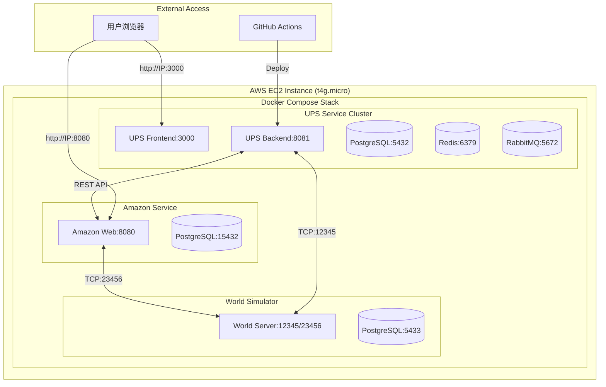
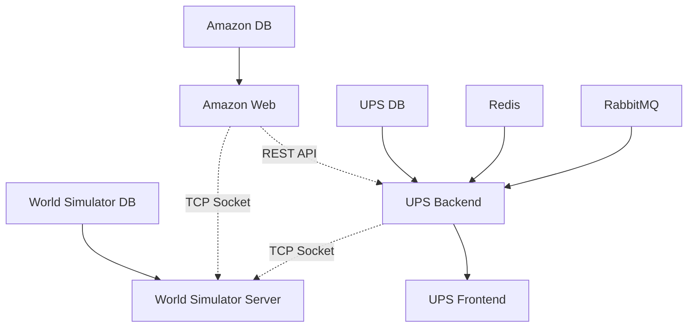
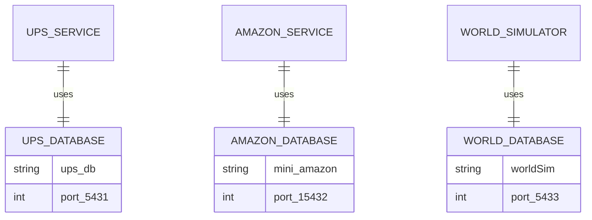
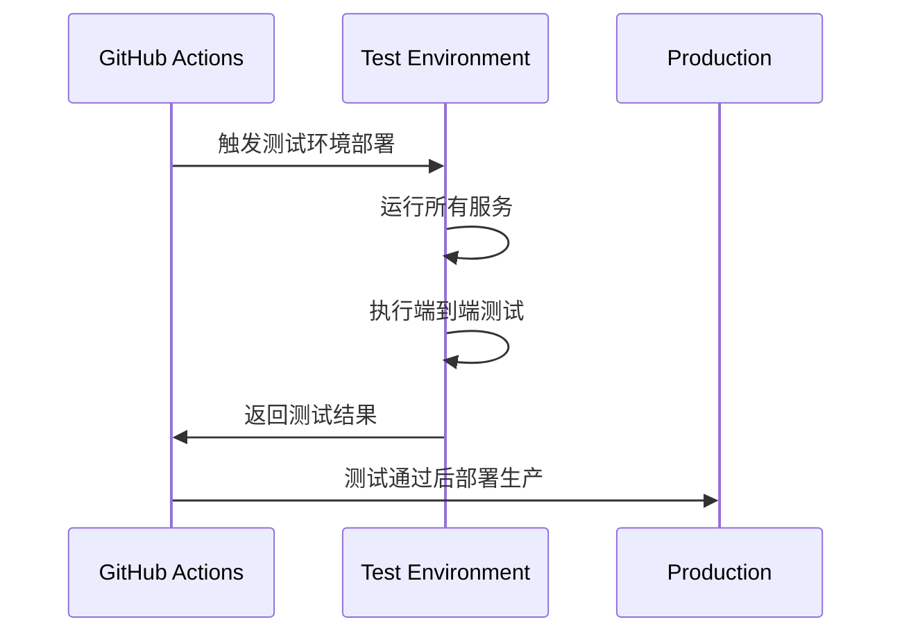

# 技术方案设计

## 系统架构概览

### 整体架构图



## 技术栈选择

### 容器化技术
- **Docker Engine**: 容器运行时
- **Docker Compose**: 多服务编排
- **Multi-stage Build**: 优化镜像大小

### CI/CD技术栈
- **GitHub Actions**: 自动化流水线
- **Docker Hub**: 镜像仓库
- **SSH Deploy**: 远程部署方案

### AWS基础设施
- **EC2 t4g.micro**: ARM64架构,Free Tier符合
- **Security Groups**: 网络安全控制  
- **Elastic IP**: 固定公网访问
- **单AZ部署**: 成本优化设计

## Docker编排设计

### 统一网络架构

```yaml
# 核心网络设计
networks:
  mini-ups-network:
    driver: bridge
    ipam:
      config:
        - subnet: 172.20.0.0/16
```

### 服务端口映射策略

| 服务 | 内部端口 | 外部端口 | 协议 | 用途 |
|------|----------|----------|------|------|
| UPS Frontend | 80 | 3000 | HTTP | Web界面 |
| UPS Backend | 8081 | 8081 | HTTP | REST API |
| Amazon Web | 8080 | 8080 | HTTP | Web界面 |
| World Simulator | 12345/23456 | 12345/23456 | TCP | Socket通信 |
| PostgreSQL (UPS) | 5432 | 5431 | TCP | 数据库 |
| PostgreSQL (Amazon) | 5432 | 15432 | TCP | 数据库 |
| PostgreSQL (World) | 5432 | 5433 | TCP | 数据库 |
| Redis | 6379 | 6380 | TCP | 缓存 |
| RabbitMQ | 5672 | 5672 | AMQP | 消息队列 |
| RabbitMQ Management | 15672 | 15672 | HTTP | 管理界面 |

### 依赖关系设计



## GitHub Actions CI/CD流水线

### 工作流架构


### 关键流水线步骤

1. **代码质量检查**
   - Java后端: Maven + JUnit 5测试
   - React前端: Vitest + TypeScript检查
   - 代码覆盖率报告

2. **Docker镜像构建策略**
   ```dockerfile
   # Multi-stage build example
   FROM maven:3.9.6-eclipse-temurin-17 AS backend-build
   FROM node:18-alpine AS frontend-build
   FROM eclipse-temurin:17-jre-alpine AS backend-runtime
   FROM nginx:alpine AS frontend-runtime
   ```

3. **部署验证**
   - 服务健康检查
   - API端点测试
   - 服务间通信验证

## AWS部署架构

### EC2实例配置

```bash
# 实例规格
Instance Type: t4g.micro
Architecture: arm64
RAM: 1GB
Storage: 8GB gp3
Network: 单个公共子网
```

### 成本优化策略

| 资源类型 | 配置 | 月成本估算 |
|----------|------|------------|
| EC2 t4g.micro | Free Tier (12个月) | $0 |
| EBS Storage | 8GB gp3 | $0.80 |
| Elastic IP | 固定IP | $3.65 |
| 数据传输 | <1GB/月 | $0 |
| **总计** | | **~$4.45/月** |

### 网络安全配置

```yaml
# Security Groups配置
SecurityGroup:
  Ingress:
    - Port: 22 (SSH管理)
    - Port: 3000 (UPS Frontend) 
    - Port: 8080 (Amazon Web)
    - Port: 8081 (UPS API)
    - Port: 12345/23456 (World Simulator)
  Egress: All traffic allowed
```

## 数据库设计策略

### 数据隔离方案



### 数据持久化方案

- **Docker Volumes**: 本地持久化存储
- **定期备份**: 每日自动备份脚本
- **数据恢复**: 一键恢复机制

## 监控和日志架构

### 日志收集策略

```bash
# 日志目录结构
/var/log/mini-ups/
├── ups-backend/
├── amazon-web/
├── world-simulator/
├── database/
└── docker-compose/
```

### 健康检查设计

```yaml
# 健康检查配置示例
healthcheck:
  test: ["CMD", "curl", "-f", "http://localhost:8081/actuator/health"]
  interval: 30s
  timeout: 10s
  retries: 3
  start_period: 60s
```

## 安全性设计

### 应用层安全
- **JWT认证**: 无状态认证机制
- **HTTPS可选**: SSL证书配置(Let's Encrypt)
- **输入验证**: 防止SQL注入和XSS

### 基础设施安全
- **SSH密钥**: 禁用密码登录
- **防火墙**: 最小化端口暴露
- **容器隔离**: Docker网络隔离

### 数据安全
- **数据加密**: 静态数据加密选项
- **备份加密**: 备份文件加密存储
- **访问控制**: 数据库用户权限控制

## 测试策略

### 测试层次设计

1. **单元测试**
   - Spring Boot: JUnit 5 + Mockito
   - React: Vitest + React Testing Library

2. **集成测试**  
   - API接口测试: REST Assured
   - 数据库测试: H2内存数据库

3. **端到端测试**
   - 跨服务通信测试
   - 用户业务流程测试

### 自动化测试流程



## 扩展性考虑

### 水平扩展策略
- **负载均衡**: Nginx反向代理
- **数据库分离**: 读写分离架构
- **缓存层**: Redis集群化

### 微服务演进
- **API Gateway**: 统一入口管理
- **服务注册**: Spring Cloud集成
- **配置中心**: 统一配置管理

## 部署流程设计

### 初始部署流程

1. **AWS资源准备** (5分钟)
   - EC2实例启动
   - Security Group配置
   - SSH密钥配置

2. **环境初始化** (10分钟)
   - Docker Engine安装
   - 必要依赖安装
   - 防火墙配置

3. **应用部署** (15分钟)
   - 代码克隆
   - Docker Compose启动
   - 健康检查验证

### 持续部署流程

1. **自动化更新** (3分钟)
   - 新镜像拉取
   - 滚动更新部署
   - 服务健康验证

## 预期性能指标

| 指标 | 目标值 | 监控方式 |
|------|--------|----------|
| 应用启动时间 | < 2分钟 | Docker健康检查 |
| API响应时间 | < 500ms | Spring Boot Actuator |
| 页面加载时间 | < 3秒 | Browser DevTools |
| 数据库查询 | < 100ms | PostgreSQL慢查询日志 |
| 系统可用性 | > 99% | Uptime监控 |

## 风险评估与缓解

| 风险点 | 影响级别 | 缓解方案 |
|--------|----------|----------|
| 单点故障 | 高 | 健康检查+自动重启 |
| 资源不足 | 中 | 监控+告警机制 |
| 网络延迟 | 中 | 本地化部署 |
| 数据丢失 | 高 | 定期备份+恢复测试 |
| 安全漏洞 | 高 | 依赖更新+安全扫描 |