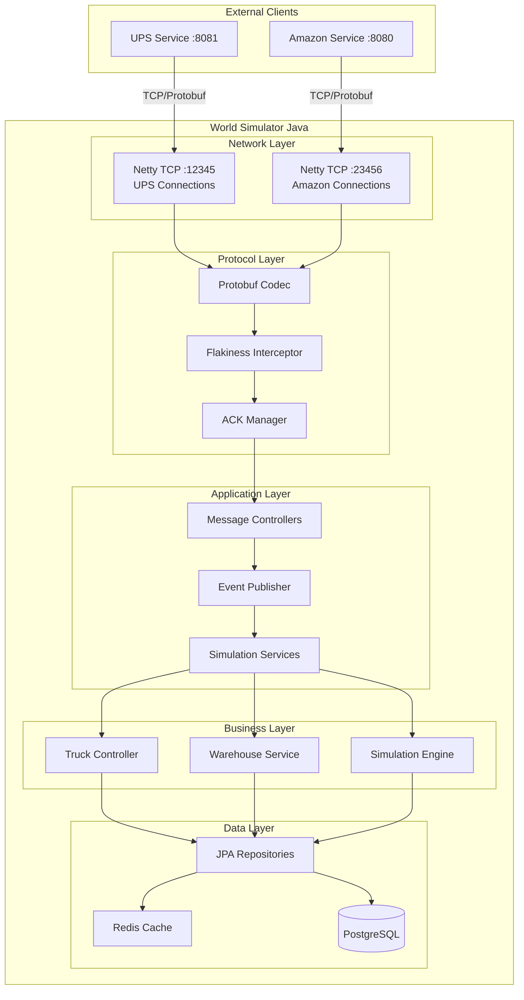

# World Simulator Java Version - Technical Design Document

## Architecture Overview

The Java World Simulator will be implemented as a Spring Boot application with embedded Netty TCP servers. It follows the existing Mini-UPS layered architecture pattern while providing high-performance network I/O and real-time simulation capabilities.



## Technology Stack

### Core Framework
- **Spring Boot 3.2+**: Main application framework, consistent with Mini-UPS backend
- **Java 17**: Language version, matching existing project
- **Maven**: Build system, following project conventions

### Network & Protocol
- **Netty 4.1+**: High-performance TCP server implementation  
- **Protocol Buffers 3**: Message serialization using existing world_ups.proto
- **Custom Framing**: Length-prefixed message framing for reliable TCP communication

### Data & Persistence
- **Spring Data JPA**: Database abstraction layer
- **HikariCP**: Connection pooling
- **PostgreSQL**: Primary data store (existing worldSim database)
- **Redis**: Caching and session management
- **Flyway**: Database migration management

### Monitoring & Operations
- **Spring Boot Actuator**: Health checks and metrics
- **Micrometer**: Application metrics with Prometheus support
- **SLF4J + Logback**: Logging framework
- **Docker**: Containerization

## Module Design

### 1. Network Module (`com.miniups.worldsim.network`)

#### Netty Configuration
```java
@Configuration
@EnableConfigurationProperties(WorldSimNetworkProperties.class)
public class NettyConfig {
    
    @Bean(destroyMethod = "shutdownGracefully")
    public EventLoopGroup bossGroup() {
        return new NioEventLoopGroup(1);
    }
    
    @Bean(destroyMethod = "shutdownGracefully") 
    public EventLoopGroup workerGroup() {
        return new NioEventLoopGroup();
    }
    
    @Bean
    public ServerBootstrap upsServer() {
        // TCP server for UPS connections on port 12345
    }
    
    @Bean
    public ServerBootstrap amazonServer() {
        // TCP server for Amazon connections on port 23456  
    }
}
```

#### Channel Pipeline
```
[TCP Socket] → [LengthFieldBasedFrameDecoder] → [ProtobufDecoder] → 
[FlakinessInterceptor] → [MessageHandler] → [Spring Event Publisher]
```

### 2. Protocol Module (`com.miniups.worldsim.protocol`)

#### Message Processing Flow
1. **Codec Layer**: Protobuf serialization/deserialization
2. **ACK Management**: Sequence number tracking and retry logic  
3. **Flakiness Injection**: Configurable message dropping/delay
4. **Event Publishing**: Convert network messages to Spring events

```java
@Component
public class ProtocolMessageHandler extends ChannelInboundHandlerAdapter {
    
    @Autowired
    private ApplicationEventPublisher eventPublisher;
    
    @Override
    public void channelRead(ChannelHandlerContext ctx, Object msg) {
        // Convert protobuf message to Spring ApplicationEvent
        // Publish event for business logic processing
    }
}
```

### 3. Simulation Module (`com.miniups.worldsim.simulation`)

#### Core Components

**Simulation Engine**
- Real-time truck movement calculation
- Warehouse state management
- Event scheduling and processing
- State synchronization with database

**Truck Controller**  
- Individual truck state machines
- Route calculation and navigation
- Loading/unloading operations
- Position updates

**Warehouse Service**
- Inventory management
- Truck dispatch coordination
- Package handling operations

### 4. Data Model

#### Entity Design
```java
@Entity
@Table(name = "trucks")
public class Truck extends BaseEntity {
    private Long id;
    private String status; // IDLE, TRAVELING, LOADING, etc.
    private Integer currentX;
    private Integer currentY; 
    private Integer targetX;
    private Integer targetY;
    private Long estimatedArrival;
    private Long sequenceNumber;
    // Additional fields...
}

@Entity  
@Table(name = "warehouses")
public class Warehouse extends BaseEntity {
    private Long id;
    private Integer x;
    private Integer y;
    private Integer capacity;
    private Set<Package> inventory;
    // Additional fields...
}
```

## Protocol Implementation

### Message Framing
- **Length-prefixed framing**: 4-byte length header + protobuf payload
- **Sequence numbering**: Monotonically increasing per-connection sequence
- **ACK mechanism**: Explicit acknowledgment for reliable delivery

### Flakiness Implementation  
```java
@Component
public class FlakinessInterceptor extends ChannelDuplexHandler {
    
    private final WorldSimNetworkProperties properties;
    private final Random random = new Random();
    
    @Override
    public void write(ChannelHandlerContext ctx, Object msg, ChannelPromise promise) {
        if (shouldDropMessage()) {
            logger.debug("Dropping message due to flakiness: {}", msg);
            return;
        }
        
        if (shouldDelayMessage()) {
            scheduleDelayedWrite(ctx, msg, promise);
            return;
        }
        
        ctx.write(msg, promise);
    }
    
    private boolean shouldDropMessage() {
        return random.nextInt(100) < properties.getFlakiness();
    }
}
```

## Configuration Management

### Application Properties
```yaml
world-sim:
  network:
    ups-port: 12345
    amazon-port: 23456
    flakiness: ${WORLD_SIM_FLAKINESS:0}
    ack-timeout: 5000
    max-retries: 3
  simulation:
    tick-interval: 100
    truck-speed: 50
    update-interval: 1000
  database:
    batch-size: 100
    connection-timeout: 30000
```

### Environment Configuration
- **Local Development**: Direct database connections
- **Docker**: Container-aware networking with service discovery
- **Production**: External database and Redis clusters

## Performance Considerations

### Threading Model
- **Netty Event Loop**: Non-blocking I/O operations
- **Spring @Async**: Business logic processing on separate thread pool
- **Database Operations**: Dedicated connection pool for blocking operations

### Caching Strategy
- **Redis**: Session state and frequently accessed data
- **Local Cache**: Hot simulation data (truck positions, warehouse states)
- **Write-through**: Immediate persistence for critical state changes

### Optimization Techniques
- **Connection Pooling**: HikariCP with optimized settings
- **Batch Operations**: Bulk database updates for position changes
- **Event Batching**: Group similar events for efficient processing

## Error Handling & Resilience

### Network Resilience
- **Connection Management**: Automatic reconnection with exponential backoff
- **Circuit Breakers**: Prevent cascade failures
- **Graceful Degradation**: Continue simulation during partial outages

### Data Consistency
- **Transaction Boundaries**: Clear ACID boundaries for state changes
- **Idempotency**: Sequence-based duplicate detection
- **Conflict Resolution**: Last-writer-wins with timestamp comparison

## Deployment Architecture

### Docker Configuration
```yaml
version: '3.8'
services:
  world-simulator:
    build: ./world-simulator
    ports:
      - "12345:12345"  # UPS port
      - "23456:23456"  # Amazon port
      - "8082:8080"    # Management/Health port
    environment:
      - SPRING_DATASOURCE_URL=jdbc:postgresql://postgres:5432/worldSim
      - WORLD_SIM_FLAKINESS=0
    depends_on:
      - postgres
      - redis
    networks:
      - projectnet
```

### Integration Points
- **Database**: Shared PostgreSQL instance with Mini-UPS
- **Networking**: Docker network `projectnet` for service communication
- **Monitoring**: Prometheus metrics exposure for observability
- **Health Checks**: Actuator endpoints for container orchestration

## Security Considerations

### Network Security
- **Input Validation**: Strict protobuf message validation
- **Connection Limits**: Maximum concurrent connection enforcement
- **Rate Limiting**: Message rate throttling per connection

### Data Security  
- **SQL Injection Prevention**: Parameterized queries only
- **Audit Logging**: All state-changing operations logged
- **Access Control**: Service-to-service authentication

## Testing Strategy

### Unit Testing
- **Service Layer**: Business logic with mocked dependencies
- **Protocol Layer**: Message handling with embedded channels
- **Simulation Logic**: Deterministic testing with fixed time/randomness

### Integration Testing
- **Database**: Testcontainers with PostgreSQL
- **Network**: Embedded test servers for protocol validation
- **End-to-End**: Full system testing with mock UPS/Amazon clients

### Performance Testing
- **Load Testing**: High-concurrency connection testing
- **Stress Testing**: Resource exhaustion scenarios
- **Flakiness Testing**: Reliability under simulated network issues

## Migration Strategy

### Compatibility Requirements
- **Protocol Compatibility**: Identical protobuf message handling
- **State Migration**: Database schema alignment with existing simulator
- **Behavioral Equivalence**: Identical simulation logic and timing

### Rollout Plan
1. **Parallel Deployment**: Run alongside existing simulator
2. **Shadow Mode**: Process messages without affecting state
3. **Canary Deployment**: Gradual traffic migration
4. **Full Cutover**: Complete replacement of original simulator

This design ensures seamless integration with the existing Mini-UPS ecosystem while providing improved maintainability, observability, and performance through modern Java and Spring Boot practices.